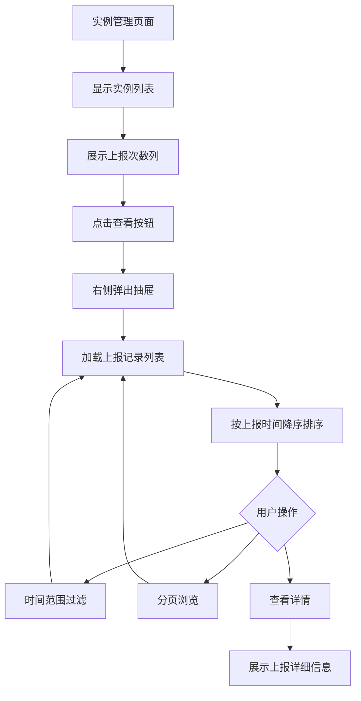
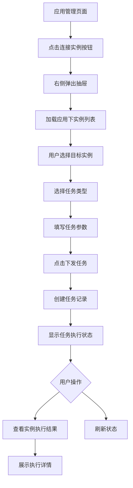
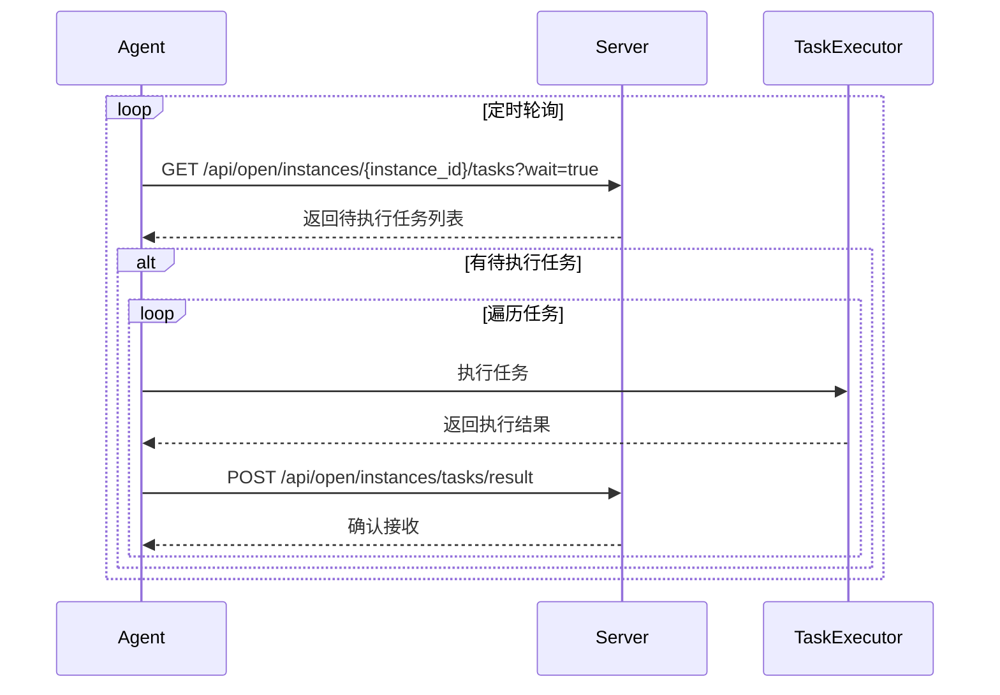

# 实例日志与任务管理前端界面设计

## 需求概述

为实例监控系统补充前端交互界面，包括实例数据上报记录查看和实例任务下发管理功能，同时完善Java Agent端的任务处理能力。

### 核心目标

1. **实例上报记录查看**：在实例管理页面查看实例的数据上报历史记录
2. **实例任务下发管理**：在应用管理页面批量下发任务到多个实例
3. **Java Agent任务处理**：完善Agent端的任务拉取和结果上报功能

## 功能设计

### 一、实例上报记录查看功能

#### 功能描述

在实例管理页面展示每个实例的上报次数，并提供抽屉式弹窗查看详细的上报历史记录。

#### 交互流程



#### 数据结构

**实例上报记录列表**

| 字段名称 | 数据类型 | 说明 | 示例 |
|---------|---------|------|------|
| id | String | 记录唯一标识 | "1234567890" |
| instance_id | String | 实例ID | "inst_001" |
| agent_type | String | Agent类型 | "java" |
| agent_version | String | Agent版本 | "1.0.0" |
| cpu_usage_percent | String | CPU使用率 | "45.2" |
| memory_usage_percent | String | 内存使用率 | "68.5" |
| disk_usage_percent | String | 磁盘使用率 | "72.3" |
| ip_address | String | 内网IP | "192.168.1.100" |
| public_ip | String | 公网IP | "123.45.67.89" |
| os_type | String | 操作系统类型 | "linux" |
| report_timestamp | String | 上报时间戳 | "2024-01-15T10:30:00Z" |
| received_at | String | 接收时间戳 | "2024-01-15T10:30:01Z" |

**查询参数**

| 参数名称 | 数据类型 | 必填 | 说明 |
|---------|---------|------|------|
| instance_id | String | 是 | 实例ID |
| start_time | String | 否 | 开始时间（ISO 8601格式） |
| end_time | String | 否 | 结束时间（ISO 8601格式） |
| page | Number | 否 | 页码，默认1 |
| limit | Number | 否 | 每页数量，默认20 |

#### 界面元素设计

**实例列表页新增元素**

- 在实例列表表格中已存在"上报次数"列（report_count字段）
- 在操作列添加"查看上报"按钮图标

**上报记录抽屉组件**

组件结构：
- 抽屉标题：显示"实例上报记录 - {实例名称}"
- 时间过滤器：日期范围选择器，支持快捷选项（今天、最近7天、最近30天）
- 记录列表：以卡片或表格形式展示
- 分页控件：底部分页导航

记录卡片包含信息：
- 上报时间
- Agent类型和版本
- 系统资源使用率（CPU、内存、磁盘）
- 网络信息（IP地址）
- 系统信息（操作系统类型、版本）
- 查看详情按钮

详情弹窗展示完整字段：
- 基础信息：上报时间、接收时间、Agent信息
- 系统信息：操作系统、主机名
- 网络信息：内网IP、公网IP、MAC地址、网络类型
- 硬件信息：CPU型号、核心数、使用率
- 内存信息：总量、已用、使用率
- 磁盘信息：总量、已用、使用率
- 运行时信息：进程ID、运行时长、线程数
- 自定义指标（如有）

### 二、应用任务下发管理功能

#### 功能描述

在应用管理页面提供批量任务下发能力，可选择多个实例并下发指定任务，实时查看执行结果。

#### 交互流程



#### 数据结构

**任务创建请求**

| 字段名称 | 数据类型 | 必填 | 说明 |
|---------|---------|------|------|
| task_name | String | 是 | 任务名称 |
| task_type | String | 是 | 任务类型 |
| target_instances | Array<String> | 是 | 目标实例ID列表 |
| task_content | Object | 是 | 任务参数（JSON对象） |
| priority | Number | 否 | 优先级（1-10），默认5 |
| timeout_seconds | Number | 否 | 超时时间（秒），默认300 |
| retry_count | Number | 否 | 重试次数，默认0 |

**任务类型定义**

| 任务类型 | 类型值 | 说明 | 参数示例 |
|---------|--------|------|---------|
| 执行命令 | execute_command | 在实例上执行Shell命令 | `{"command": "ls -la"}` |
| 重启服务 | restart_service | 重启指定服务 | `{"service_name": "nginx"}` |
| 采集日志 | collect_logs | 采集指定日志文件 | `{"log_path": "/var/log/app.log", "lines": 100}` |
| 更新配置 | update_config | 更新配置文件 | `{"config_path": "/etc/app/config.json", "content": "..."}` |
| 文件传输 | file_transfer | 上传或下载文件 | `{"action": "upload", "source": "...", "target": "..."}` |

**任务执行记录**

| 字段名称 | 数据类型 | 说明 |
|---------|---------|------|
| id | String | 记录ID |
| task_id | String | 任务ID |
| instance_id | String | 实例ID |
| status | String | 状态：pending/dispatched/running/success/failed/timeout/cancelled |
| dispatch_time | String | 下发时间 |
| start_time | String | 开始执行时间 |
| end_time | String | 结束时间 |
| duration_ms | Number | 执行耗时（毫秒） |
| result_code | Number | 结果码（0表示成功） |
| result_message | String | 结果消息 |
| result_data | Object | 结果数据 |
| error_message | String | 错误信息 |
| retry_attempt | Number | 重试次数 |

#### 界面元素设计

**应用管理页新增元素**

- 在应用列表操作列添加"连接实例"按钮

**任务下发抽屉组件**

组件结构：
- 抽屉标题："任务下发 - {应用名称}"
- 分步操作区：
  - 步骤1：选择实例（多选列表）
  - 步骤2：配置任务（任务类型选择器、参数表单）
  - 步骤3：查看结果（执行状态列表）

实例选择器：
- 显示应用下所有实例
- 多选框支持全选/反选
- 显示实例基本信息：名称、状态、IP地址
- 只允许选择状态为"active"的实例

任务配置表单：
- 任务名称输入框
- 任务类型下拉选择器
- 根据任务类型动态显示参数表单
- 高级选项：优先级、超时时间、重试次数

执行结果列表：
- 以卡片形式展示每个实例的执行状态
- 状态标识：待执行、执行中、成功、失败、超时、已取消
- 进度指示器
- 点击卡片展开详细结果

执行详情弹窗：
- 基本信息：实例名称、任务类型、任务名称
- 时间信息：下发时间、开始时间、结束时间、执行耗时
- 执行结果：状态、结果码、结果消息
- 结果数据：JSON格式展示
- 错误信息：如有失败则显示详细错误
- 操作按钮：重试、查看日志

### 三、Java Agent任务处理功能

#### 功能描述

Java Agent定期拉取待执行任务，执行后将结果回传到服务端。

#### 处理流程



#### 任务拉取机制

**拉取接口**

- 端点：`GET /api/open/instances/{instance_id}/tasks`
- 查询参数：
  - wait: Boolean，是否启用长轮询，默认false
  - timeout: Number，长轮询超时时间（秒），默认30，最大60

**长轮询策略**

当启用长轮询时（wait=true）：
- 如果有待执行任务，立即返回
- 如果无待执行任务，保持连接等待
- 超过timeout时间后返回空列表
- 每2秒检查一次是否有新任务

**响应数据结构**

| 字段名称 | 数据类型 | 说明 |
|---------|---------|------|
| tasks | Array | 任务列表 |
| timestamp | Number | 响应时间戳 |

任务项结构：

| 字段名称 | 数据类型 | 说明 |
|---------|---------|------|
| task_id | String | 任务ID |
| record_id | String | 执行记录ID |
| task_type | String | 任务类型 |
| task_content | Object | 任务参数 |
| timeout_seconds | Number | 超时时间 |
| priority | Number | 优先级 |

#### 任务执行机制

**执行器设计**

创建任务执行服务：
- 定时轮询任务（默认每30秒）
- 支持并发执行多个任务
- 超时控制和异常处理
- 执行结果缓存

**任务类型处理器**

为每种任务类型实现处理器接口：
- 命令执行处理器：调用系统命令执行
- 服务重启处理器：调用系统服务管理API
- 日志采集处理器：读取日志文件并上传
- 配置更新处理器：更新本地配置文件
- 文件传输处理器：处理文件上传下载

处理器接口规范：

```
任务处理器接口方法
- 输入：任务内容（JSON对象）
- 输出：执行结果对象
- 异常：执行失败时抛出异常
```

执行结果对象结构：

| 字段 | 类型 | 说明 |
|------|------|------|
| code | Number | 结果码，0表示成功 |
| message | String | 结果消息 |
| data | Object | 结果数据 |

#### 结果回传机制

**回传接口**

- 端点：`POST /api/open/instances/tasks/result`
- 请求体结构：

| 字段名称 | 数据类型 | 必填 | 说明 |
|---------|---------|------|------|
| record_id | String | 是 | 执行记录ID |
| instance_id | String | 是 | 实例ID |
| status | String | 是 | 执行状态 |
| result_code | Number | 是 | 结果码 |
| result_message | String | 否 | 结果消息 |
| result_data | Object | 否 | 结果数据 |
| error_message | String | 否 | 错误信息 |
| start_time | String | 是 | 开始时间（ISO 8601） |
| end_time | String | 是 | 结束时间（ISO 8601） |
| duration_ms | Number | 是 | 执行耗时 |

**重试策略**

结果回传失败时的处理：
- 最大重试次数：3次
- 重试间隔：指数退避（1秒、2秒、4秒）
- 失败后保存到本地队列
- 下次启动时重新尝试发送

**状态映射规则**

| 执行情况 | 状态值 | 结果码范围 |
|---------|--------|-----------|
| 执行成功 | success | 0 |
| 执行失败 | failed | 非0 |
| 执行超时 | timeout | -1 |
| 任务取消 | cancelled | -2 |

## 前端实现要点

### API接口定义

#### 实例上报记录API

**获取实例上报记录列表**

```
端点：GET /api/instances/{instance_id}/reports
查询参数：start_time, end_time, page, limit
响应：InstanceRecordListResponse
```

#### 实例任务API

**创建任务**

```
端点：POST /api/instances/tasks
请求体：TaskCreateRequest
响应：TaskResponse
```

**获取任务列表**

```
端点：GET /api/instances/tasks
查询参数：page, limit, status, task_type
响应：TaskListResponse
```

**获取任务执行记录**

```
端点：GET /api/instances/tasks/{task_id}/records
查询参数：page, limit, status
响应：TaskRecordListResponse
```

**取消任务**

```
端点：POST /api/instances/tasks/{task_id}/cancel
响应：操作结果
```

**重试任务记录**

```
端点：POST /api/instances/task-records/{record_id}/retry
响应：操作结果
```

### 组件结构设计

#### 实例上报记录组件

**目录结构**

```
features/instances/
  components/
    instances-report-drawer.tsx          # 上报记录抽屉组件
    instances-report-list.tsx            # 上报记录列表
    instances-report-detail-dialog.tsx   # 上报详情弹窗
    instances-columns.tsx                # 修改：添加查看上报按钮
  api/
    instances-api.ts                     # 修改：添加上报记录API
  data/
    api-schema.ts                        # 修改：添加上报记录类型定义
  hooks/
    use-instance-reports.ts              # 新增：上报记录数据查询Hook
```

**组件职责**

- `instances-report-drawer.tsx`：抽屉容器，管理时间过滤和分页状态
- `instances-report-list.tsx`：记录列表渲染，支持卡片和表格视图切换
- `instances-report-detail-dialog.tsx`：详情对话框，展示完整上报数据
- `use-instance-reports.ts`：封装上报记录查询、缓存和状态管理

#### 应用任务下发组件

**目录结构**

```
features/applications/
  components/
    applications-task-drawer.tsx         # 任务下发抽屉组件
    applications-instance-selector.tsx   # 实例选择器
    applications-task-form.tsx           # 任务配置表单
    applications-task-result-list.tsx    # 任务执行结果列表
    applications-task-result-dialog.tsx  # 执行详情弹窗
    applications-columns.tsx             # 修改：添加连接实例按钮
  api/
    applications-api.ts                  # 修改：添加任务相关API
  data/
    api-schema.ts                        # 修改：添加任务类型定义
    task-types.ts                        # 新增：任务类型配置
  hooks/
    use-application-tasks.ts             # 新增：任务管理Hook
    use-application-instances.ts         # 新增：应用实例查询Hook
```

**组件职责**

- `applications-task-drawer.tsx`：抽屉容器，管理分步流程状态
- `applications-instance-selector.tsx`：实例多选组件，支持搜索和过滤
- `applications-task-form.tsx`：动态任务表单，根据任务类型渲染不同参数
- `applications-task-result-list.tsx`：实时展示各实例执行状态
- `applications-task-result-dialog.tsx`：详情对话框，展示执行结果和错误信息
- `task-types.ts`：定义任务类型配置、表单schema、验证规则

### 状态管理方案

#### 实例上报记录状态

使用React Query进行数据管理：
- 查询缓存：上报记录列表缓存5分钟
- 自动重新获取：窗口聚焦时刷新
- 乐观更新：时间过滤后保留之前数据直到新数据加载

#### 任务下发流程状态

使用Context API + useState管理：
- 当前步骤：选择实例 -> 配置任务 -> 查看结果
- 选中实例列表
- 任务配置数据
- 执行结果轮询状态

任务执行状态轮询：
- 创建任务后启动轮询
- 每3秒查询一次任务记录状态
- 所有实例执行完成后停止轮询
- 支持手动刷新

### UI/UX设计要点

#### 视觉反馈

- 加载状态：骨架屏、加载指示器
- 成功反馈：Toast提示、状态徽章变色
- 错误提示：Alert组件、表单验证错误
- 空状态：无数据时显示引导文案和图标

#### 响应式设计

- 抽屉组件：移动端全屏，桌面端固定宽度
- 表格布局：移动端卡片视图，桌面端表格视图
- 表单布局：自适应列数，移动端单列

#### 无障碍支持

- 键盘导航：Tab键顺序合理
- ARIA标签：为交互元素添加语义标签
- 对比度：确保文字和背景对比度符合WCAG标准

## Java Agent实现要点

### 新增服务类

**任务拉取服务（InstanceTaskService）**

职责：
- 定时从服务端拉取待执行任务
- 管理任务执行队列
- 调度任务执行器
- 管理结果回传

配置参数：
- 拉取间隔：默认30秒
- 长轮询启用：默认true
- 并发执行数：默认3
- 结果重试次数：默认3

**任务执行器（TaskExecutor）**

职责：
- 根据任务类型分发到对应处理器
- 超时控制
- 异常捕获和转换
- 执行结果标准化

**任务处理器接口（TaskHandler）**

定义统一的处理器接口：
- 方法：execute(taskContent) 返回 TaskResult
- 每种任务类型实现一个处理器
- 支持注册自定义处理器

### 新增模型类

**任务下发响应（TaskDispatchResponse）**

字段：
- tasks: List<TaskDispatchItem>
- timestamp: Long

**任务下发项（TaskDispatchItem）**

字段：
- taskId: String
- recordId: String
- taskType: String
- taskContent: Map<String, Object>
- timeoutSeconds: Integer
- priority: Integer

**任务结果提交请求（TaskResultSubmitRequest）**

字段：
- recordId: String
- instanceId: String
- status: String
- resultCode: Integer
- resultMessage: String
- resultData: Map<String, Object>
- errorMessage: String
- startTime: String (ISO 8601)
- endTime: String (ISO 8601)
- durationMs: Long

### 配置文件扩展

在application.yml中添加任务相关配置：

```
任务配置项
- enabled: 是否启用任务功能
- poll-interval-seconds: 拉取间隔
- long-polling-enabled: 是否启用长轮询
- max-concurrent-tasks: 最大并发任务数
- result-retry-max-attempts: 结果回传最大重试次数
```

## 错误处理策略

### 前端错误处理

**网络错误**
- API调用失败时显示Toast错误提示
- 支持重试操作
- 超时提示并建议检查网络

**数据验证错误**
- 表单验证：实时验证，提交时二次验证
- 参数格式错误：高亮错误字段，显示错误信息

**业务逻辑错误**
- 实例不存在：提示并返回列表页
- 任务下发失败：显示具体失败原因
- 权限不足：跳转登录或显示无权限提示

### Java Agent错误处理

**任务拉取错误**
- 网络异常：自动重试，记录日志
- 服务端错误：延长下次拉取间隔

**任务执行错误**
- 超时：标记为timeout状态
- 异常：捕获堆栈信息，设置为failed状态
- 参数错误：返回参数验证失败信息

**结果回传错误**
- 网络失败：重试机制
- 服务端拒绝：记录错误日志
- 持久化到本地队列，等待恢复

## 性能优化考虑

### 前端性能优化

**数据加载优化**
- 上报记录列表分页加载
- 任务结果列表虚拟滚动
- 图表数据按需加载

**渲染优化**
- 使用React.memo减少不必要渲染
- 大列表使用虚拟化（react-virtual）
- 防抖和节流控制高频操作

**缓存策略**
- React Query缓存API响应
- 本地存储用户偏好设置（时间范围、视图模式）
- 任务类型配置静态化

### Java Agent性能优化

**资源使用优化**
- 使用线程池管理任务执行
- 限制并发任务数量
- 任务队列大小限制

**网络优化**
- 启用HTTP连接池复用
- 长轮询减少请求频率
- 批量回传结果（如支持）

**内存管理**
- 及时清理已完成任务结果
- 限制本地队列大小
- 避免大对象长期持有

## 安全性考虑

### 认证与授权

**前端安全**
- API调用携带认证token
- 敏感操作二次确认
- 按钮权限控制显示

**Agent安全**
- 实例ID验证：确保只拉取分配给自己的任务
- 结果回传时验证record_id和instance_id匹配

### 数据安全

**传输安全**
- HTTPS加密传输
- 敏感参数加密存储

**执行安全**
- 命令执行白名单
- 文件操作路径限制
- 用户权限验证

### 输入验证

**前端验证**
- 任务参数格式验证
- 特殊字符转义
- SQL注入防护（如涉及）

**后端验证**
- 参数类型和范围验证
- 业务规则验证
- 防止重放攻击

## 测试策略

### 前端测试

**单元测试**
- 组件渲染测试
- 工具函数测试
- API Schema验证测试

**集成测试**
- 抽屉组件完整交互流程
- 任务下发端到端流程
- 状态管理逻辑测试

**E2E测试**
- 实例上报记录查看流程
- 任务下发完整流程
- 错误场景处理

### Java Agent测试

**单元测试**
- 任务处理器单独测试
- 结果构建逻辑测试
- 异常处理测试

**集成测试**
- 任务拉取服务测试
- 执行器调度测试
- 结果回传测试

**模拟测试**
- 使用MockServer模拟服务端
- 测试长轮询机制
- 测试重试逻辑

## 部署和配置

### 前端部署

**构建配置**
- 确保API端点配置正确
- 环境变量配置（开发/测试/生产）
- 静态资源CDN配置

**版本更新**
- 前端版本号管理
- 更新日志记录
- 浏览器缓存策略

### Java Agent部署

**配置文件**
- 任务功能默认启用
- 拉取间隔根据业务调整
- 长轮询超时时间配置

**升级策略**
- 平滑升级：先更新Agent代码
- 配置兼容性检查
- 回滚方案准备

**监控告警**
- 任务执行失败率监控
- 结果回传失败告警
- 性能指标采集

## 后续优化方向

### 功能增强

**实例上报记录**
- 数据可视化图表（资源使用趋势）
- 导出功能（CSV、Excel）
- 上报异常检测和告警

**任务管理**
- 定时任务支持
- 任务模板管理
- 批量操作（暂停、恢复）
- 任务依赖关系

**Agent能力**
- 更多任务类型支持
- 插件化架构
- 动态配置更新

### 性能优化

**前端优化**
- 实时WebSocket推送任务状态
- 离线数据缓存
- PWA支持

**Agent优化**
- 增量数据上报
- 压缩传输数据
- 本地任务结果持久化

### 用户体验

**交互优化**
- 拖拽排序任务优先级
- 快捷键支持
- 暗黑模式适配

**智能化**
- 任务执行建议
- 异常自动诊断
- 智能重试策略
