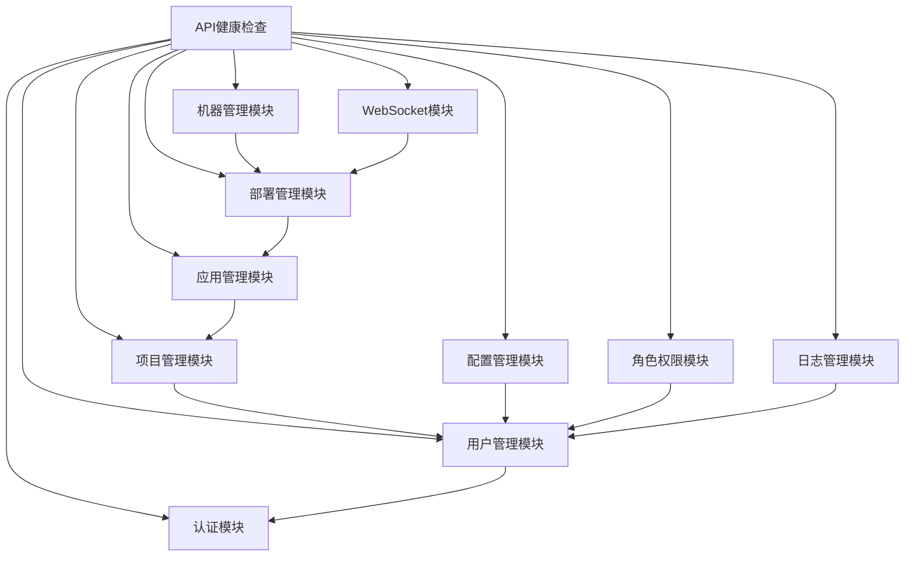
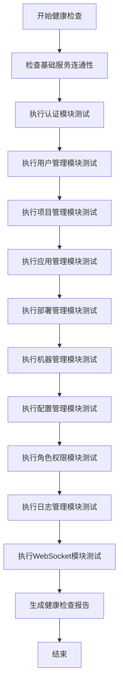

# API健康检查设计文档

## 1. 概述

本文档详细描述了对AiOne MoniHub平台后端API进行全面健康检查的设计方案。该检查将验证所有API端点的功能性、业务逻辑正确性以及模块间的依赖关系。

### 1.1 系统背景
AiOne MoniHub是一个集成化监控和管理平台，提供远程应用管理解决方案。系统采用Rust + Actix Web构建高性能后端服务，包含多个功能模块。

### 1.2 检查目标
- 验证所有API端点是否可以正常运行
- 确保业务逻辑满足设计要求
- 检查模块间的依赖关系和调用顺序
- 提供完整的API健康状态报告

## 2. 系统架构

### 2.1 技术栈
- 后端: Rust + Actix Web
- 数据库: PostgreSQL (通过SeaORM访问)
- API文档: Swagger UI + OpenAPI 3.0
- 认证: JWT Token

### 2.2 模块结构


## 3. API端点参考

### 3.1 健康检查端点
| 端点 | 方法 | 描述 |
|------|------|------|
| `/health` | GET | 服务器健康状态检查 |

### 3.2 认证模块端点
| 端点 | 方法 | 描述 | 认证要求 |
|------|------|------|---------|
| `/api/auth/login` | POST | 用户登录 | 无 |
| `/api/auth/forgot-password` | POST | 忘记密码 | 无 |
| `/api/auth/reset-password` | POST | 重置密码 | 无 |

### 3.3 用户管理模块端点
| 端点 | 方法 | 描述 | 认证要求 |
|------|------|------|---------|
| `/api/users` | GET | 获取用户列表 | 需要认证 |
| `/api/users` | POST | 创建用户 | 需要认证 |
| `/api/users/{id}` | GET | 获取用户详情 | 需要认证 |
| `/api/users/{id}` | PUT | 更新用户 | 需要认证 |
| `/api/users/{id}` | DELETE | 删除用户 | 需要认证 |
| `/api/users/{id}/disable` | POST | 禁用用户 | 需要认证 |
| `/api/users/{id}/enable` | POST | 启用用户 | 需要认证 |

### 3.4 项目管理模块端点
| 端点 | 方法 | 描述 | 认证要求 |
|------|------|------|---------|
| `/api/projects` | GET | 获取项目列表 | 需要认证 |
| `/api/projects` | POST | 创建项目 | 需要认证 |
| `/api/projects/{id}` | GET | 获取项目详情 | 需要认证 |
| `/api/projects/{id}` | PUT | 更新项目 | 需要认证 |
| `/api/projects/{id}` | DELETE | 删除项目 | 需要认证 |

### 3.5 应用管理模块端点
| 端点 | 方法 | 描述 | 认证要求 |
|------|------|------|---------|
| `/api/applications` | GET | 获取应用列表 | 需要认证 |
| `/api/applications` | POST | 创建应用 | 需要认证 |
| `/api/applications/{id}` | GET | 获取应用详情 | 需要认证 |
| `/api/applications/{id}` | PUT | 更新应用 | 需要认证 |
| `/api/applications/{id}` | DELETE | 删除应用 | 需要认证 |

### 3.6 部署管理模块端点
| 端点 | 方法 | 描述 | 认证要求 |
|------|------|------|---------|
| `/api/deployments` | GET | 获取部署列表 | 需要认证 |
| `/api/deployments` | POST | 创建部署 | 需要认证 |
| `/api/deployments/{id}` | GET | 获取部署详情 | 需要认证 |
| `/api/deployments/{id}` | PUT | 更新部署 | 需要认证 |
| `/api/deployments/{id}` | DELETE | 删除部署 | 需要认证 |
| `/api/deployments/{id}/monitoring` | GET | 获取部署监控数据 | 需要认证 |
| `/api/deployments/{id}/files` | GET | 获取部署文件列表 | 需要认证 |
| `/api/deployments/{id}/files/upload` | POST | 上传部署文件 | 需要认证 |
| `/api/deployments/{id}/files/{file_path}` | GET | 下载部署文件 | 需要认证 |
| `/api/deployments/{id}/files/{file_path}` | DELETE | 删除部署文件 | 需要认证 |

### 3.7 机器管理模块端点
| 端点 | 方法 | 描述 | 认证要求 |
|------|------|------|---------|
| `/api/machines` | GET | 获取机器列表 | 需要认证 |
| `/api/machines` | POST | 创建机器 | 需要认证 |
| `/api/machines/{id}` | GET | 获取机器详情 | 需要认证 |
| `/api/machines/{id}` | PUT | 更新机器 | 需要认证 |
| `/api/machines/{id}` | DELETE | 删除机器 | 需要认证 |
| `/api/machines/{id}/monitoring-data` | GET | 获取机器监控数据 | 需要认证 |

### 3.8 配置管理模块端点
| 端点 | 方法 | 描述 | 认证要求 |
|------|------|------|---------|
| `/api/configs` | GET | 获取配置列表 | 需要认证 |
| `/api/configs` | POST | 创建配置 | 需要认证 |
| `/api/configs/code/{code}` | GET | 根据代码获取配置 | 需要认证 |
| `/api/configs/code/{code}/environment/{environment}` | GET | 根据代码和环境获取配置 | 需要认证 |
| `/api/configs/code/{code}/environment/{environment}/version/{version}` | GET | 根据代码、环境和版本获取配置 | 需要认证 |
| `/api/configs/{id}` | DELETE | 删除配置 | 需要认证 |

### 3.9 角色权限模块端点
| 端点 | 方法 | 描述 | 认证要求 |
|------|------|------|---------|
| `/api/roles` | GET | 获取角色列表 | 需要认证 |
| `/api/roles` | POST | 创建角色 | 需要认证 |
| `/api/roles/{id}` | GET | 获取角色详情 | 需要认证 |
| `/api/roles/{id}` | PUT | 更新角色 | 需要认证 |
| `/api/roles/{id}` | DELETE | 删除角色 | 需要认证 |
| `/api/permissions` | GET | 获取权限列表 | 需要认证 |
| `/api/permissions/assign` | POST | 分配权限 | 需要认证 |
| `/api/permissions/revoke` | POST | 撤销权限 | 需要认证 |

### 3.10 日志管理模块端点
| 端点 | 方法 | 描述 | 认证要求 |
|------|------|------|---------|
| `/api/v1/logs` | GET | 获取日志列表 | 需要认证 |
| `/api/v1/logs/export` | GET | 导出日志 | 需要认证 |

### 3.11 WebSocket模块端点
| 端点 | 方法 | 描述 | 认证要求 |
|------|------|------|---------|
| `/api/websocket/terminal/{deployment_id}` | GET | 终端WebSocket连接 | 需要认证 |

## 4. 数据模型

### 4.1 用户模型
```rust
struct User {
    id: String,
    username: String,
    email: String,
    status: String,
    created_at: String,
    updated_at: String,
}
```

### 4.2 项目模型
```rust
struct Project {
    id: String,
    name: String,
    code: String,
    status: String,
    description: String,
    created_at: String,
    updated_at: String,
}
```

### 4.3 应用模型
```rust
struct Application {
    id: String,
    project_id: String,
    name: String,
    code: String,
    status: String,
    description: String,
    authorization: Authorization,
    created_at: String,
    updated_at: String,
}
```

### 4.4 部署模型
```rust
struct Deployment {
    id: String,
    application_id: String,
    private_ip: String,
    public_ip: String,
    network_interface: String,
    hostname: String,
    environment_vars: HashMap<String, String>,
    service_port: u16,
    process_name: String,
    status: String,
    created_at: String,
    updated_at: String,
}
```

### 4.5 配置模型
```rust
struct Config {
    id: String,
    code: String,
    environment: String,
    name: String,
    type_: String,
    content: String,
    description: String,
    version: u32,
    created_at: String,
    updated_at: String,
}
```

### 4.6 角色模型
```rust
struct Role {
    id: String,
    name: String,
    description: String,
    permissions: Vec<String>,
    created_at: String,
    updated_at: String,
}
```

### 4.7 权限模型
```rust
struct Permission {
    id: String,
    name: String,
    description: String,
    resource: String,
    action: String,
    created_at: String,
    updated_at: String,
}
```

### 4.8 日志模型
```rust
struct Log {
    id: String,
    type_: String,
    user_id: String,
    action: String,
    ip_address: String,
    user_agent: String,
    timestamp: String,
    created_at: String,
    updated_at: String,
}
```

### 4.9 机器模型
```rust
struct Machine {
    id: String,
    name: String,
    type_: String,
    status: String,
    deployment_id: String,
    application_id: String,
    created_at: String,
    updated_at: String,
}
```

## 5. 业务逻辑层

### 5.1 检查流程设计


### 5.2 模块依赖关系
1. **认证模块**: 独立模块，为其他模块提供认证服务
2. **用户管理模块**: 依赖认证模块，是系统基础模块
3. **项目管理模块**: 依赖用户管理模块
4. **应用管理模块**: 依赖项目管理模块
5. **部署管理模块**: 依赖应用管理模块
6. **机器管理模块**: 依赖部署管理模块
7. **配置管理模块**: 依赖用户管理模块
8. **角色权限模块**: 依赖用户管理模块
9. **日志管理模块**: 依赖用户管理模块
10. **WebSocket模块**: 依赖部署管理模块

### 5.3 测试用例设计

#### 5.3.1 认证模块测试
- 登录成功测试
- 登录失败测试（错误凭证）
- 忘记密码测试
- 重置密码测试

#### 5.3.2 用户管理模块测试
- 获取用户列表测试
- 创建用户测试
- 获取用户详情测试
- 更新用户测试
- 删除用户测试
- 禁用用户测试
- 启用用户测试

#### 5.3.3 项目管理模块测试
- 获取项目列表测试
- 创建项目测试
- 获取项目详情测试
- 更新项目测试
- 删除项目测试

#### 5.3.4 应用管理模块测试
- 获取应用列表测试
- 创建应用测试
- 获取应用详情测试
- 更新应用测试
- 删除应用测试

#### 5.3.5 部署管理模块测试
- 获取部署列表测试
- 创建部署测试
- 获取部署详情测试
- 更新部署测试
- 删除部署测试
- 获取部署监控数据测试
- 文件管理测试（上传、下载、删除）

#### 5.3.6 机器管理模块测试
- 获取机器列表测试
- 创建机器测试
- 获取机器详情测试
- 更新机器测试
- 删除机器测试
- 获取机器监控数据测试

#### 5.3.7 配置管理模块测试
- 获取配置列表测试
- 创建配置测试
- 根据代码获取配置测试
- 根据代码和环境获取配置测试
- 根据代码、环境和版本获取配置测试
- 删除配置测试

#### 5.3.8 角色权限模块测试
- 获取角色列表测试
- 创建角色测试
- 获取角色详情测试
- 更新角色测试
- 删除角色测试
- 获取权限列表测试
- 分配权限测试
- 撤销权限测试

#### 5.3.9 日志管理模块测试
- 获取日志列表测试
- 导出日志测试

#### 5.3.10 WebSocket模块测试
- WebSocket连接测试
- 消息发送接收测试

## 6. 测试策略

### 6.1 测试环境
- 开发环境: 本地Docker容器
- 测试环境: 专用测试服务器
- 生产环境: 正式部署环境

### 6.2 测试工具
- Postman/Newman: API功能测试
- Jest: 单元测试
- k6: 性能测试
- curl: 基础连通性测试

### 6.3 测试数据准备
- 预置测试用户数据
- 预置测试项目数据
- 预置测试应用数据
- 预置测试部署数据

### 6.4 测试执行顺序
1. 基础连通性测试
2. 认证模块测试
3. 用户管理模块测试
4. 项目管理模块测试
5. 应用管理模块测试
6. 部署管理模块测试
7. 机器管理模块测试
8. 配置管理模块测试
9. 角色权限模块测试
10. 日志管理模块测试
11. WebSocket模块测试

## 7. 健康检查执行

### 7.1 检查前置条件
- 确保服务器已启动并监听9080端口
- 确保数据库连接正常
- 确保.env配置文件正确设置
- 确保必要的测试数据已初始化

### 7.2 检查步骤

#### 7.2.1 基础服务检查
1. 发送GET请求到`/health`端点
2. 验证返回状态码为200
3. 验证返回数据包含`status: "ok"`

#### 7.2.2 认证模块检查
1. 发送POST请求到`/api/auth/login`端点，使用预置的测试用户凭证
2. 验证返回状态码为200
3. 验证返回数据包含JWT token
4. 保存token用于后续认证测试

#### 7.2.3 用户管理模块检查
1. 使用认证token发送GET请求到`/api/users`端点
2. 验证返回状态码为200
3. 验证返回数据结构符合UserListResponse模型
4. 发送POST请求到`/api/users`端点创建新用户
5. 验证返回状态码为200
6. 验证返回数据结构符合UserResponse模型

#### 7.2.4 项目管理模块检查
1. 使用认证token发送GET请求到`/api/projects`端点
2. 验证返回状态码为200
3. 验证返回数据结构符合ProjectListResponse模型
4. 发送POST请求到`/api/projects`端点创建新项目
5. 验证返回状态码为200
6. 验证返回数据结构符合ProjectResponse模型

#### 7.2.5 应用管理模块检查
1. 使用认证token发送GET请求到`/api/applications`端点
2. 验证返回状态码为200
3. 验证返回数据结构符合ApplicationListResponse模型
4. 发送POST请求到`/api/applications`端点创建新应用
5. 验证返回状态码为200
6. 验证返回数据结构符合ApplicationResponse模型

#### 7.2.6 部署管理模块检查
1. 使用认证token发送GET请求到`/api/deployments`端点
2. 验证返回状态码为200
3. 验证返回数据结构符合DeploymentListResponse模型
4. 发送POST请求到`/api/deployments`端点创建新部署
5. 验证返回状态码为200
6. 验证返回数据结构符合DeploymentResponse模型

#### 7.2.7 机器管理模块检查
1. 使用认证token发送GET请求到`/api/machines`端点
2. 验证返回状态码为200
3. 验证返回数据结构符合MachineListResponse模型
4. 发送POST请求到`/api/machines`端点创建新机器
5. 验证返回状态码为200
6. 验证返回数据结构符合MachineResponse模型

#### 7.2.8 配置管理模块检查
1. 使用认证token发送GET请求到`/api/configs`端点
2. 验证返回状态码为200
3. 验证返回数据结构符合ConfigListResponse模型
4. 发送POST请求到`/api/configs`端点创建新配置
5. 验证返回状态码为200
6. 验证返回数据结构符合ConfigResponse模型

#### 7.2.9 角色权限模块检查
1. 使用认证token发送GET请求到`/api/roles`端点
2. 验证返回状态码为200
3. 验证返回数据结构符合RoleListResponse模型
4. 发送POST请求到`/api/roles`端点创建新角色
5. 验证返回状态码为200
6. 验证返回数据结构符合RoleResponse模型

#### 7.2.10 日志管理模块检查
1. 使用认证token发送GET请求到`/api/v1/logs`端点
2. 验证返回状态码为200
3. 验证返回数据结构符合LogListResponse模型

#### 7.2.11 WebSocket模块检查
1. 使用认证token建立到`/api/websocket/terminal/{deployment_id}`的WebSocket连接
2. 验证连接成功建立
3. 发送测试消息并验证响应

## 8. 验证结果与报告

### 8.1 结果收集
- 记录每个API端点的响应时间
- 记录每个API端点的HTTP状态码
- 记录每个API端点返回的数据结构
- 记录测试过程中出现的任何错误

### 8.2 报告生成
- 生成包含所有测试结果的详细报告
- 标识通过和失败的测试用例
- 提供失败测试的详细错误信息
- 统计整体通过率和各模块通过率
- 提供性能指标（响应时间、吞吐量等）

### 8.3 报告格式
```json
{
  "timestamp": "2023-01-01T00:00:00Z",
  "total_tests": 0,
  "passed_tests": 0,
  "failed_tests": 0,
  "pass_rate": 0.0,
  "modules": {
    "health": {
      "total": 0,
      "passed": 0,
      "failed": 0
    },
    "auth": {
      "total": 0,
      "passed": 0,
      "failed": 0
    },
    "users": {
      "total": 0,
      "passed": 0,
      "failed": 0
    }
    // ... 其他模块
  },
  "errors": [],
  "performance": {
    "average_response_time": 0.0,
    "max_response_time": 0.0,
    "min_response_time": 0.0
  }
}
```

## 9. 自动化测试

### 9.1 测试脚本
- 开发自动化测试脚本，定期执行健康检查
- 集成到CI/CD流程中，确保每次部署后自动运行
- 支持命令行参数配置，便于不同环境的测试

### 9.2 持续集成
- 在GitHub Actions中配置定期健康检查任务
- 配置失败通知机制，及时通知相关人员
- 集成到监控告警系统，实现自动化的服务监控

## 10. 维护与更新

### 10.1 文档维护
- 随着API的更新及时更新本健康检查文档
- 记录每次健康检查的结果和发现的问题
- 维护测试用例库，确保覆盖所有新增功能

### 10.2 测试用例更新
- 当API发生变化时，及时更新对应的测试用例
- 定期审查测试用例的有效性和完整性
- 根据实际使用情况优化测试策略

## 11. 预期结果

### 11.1 成功标准
- 所有API端点返回正确的HTTP状态码
- 所有API端点返回符合预期的数据结构
- 所有业务逻辑按设计要求正确执行
- 模块间依赖关系正确处理
- 数据库操作正确执行

### 11.2 失败处理
- 记录失败的API端点和错误信息
- 分析失败原因并分类（网络、认证、业务逻辑等）
- 提供详细的错误日志和调试信息
- 生成完整的健康检查报告

## 12. 风险与缓解措施

### 12.1 潜在风险
1. 网络连接问题导致测试中断
2. 认证令牌过期影响后续测试
3. 数据库连接失败导致测试无法进行
4. 并发访问导致数据不一致

### 12.2 缓解措施
1. 实现重试机制处理网络波动
2. 实现自动刷新令牌机制
3. 增加数据库连接状态检查
4. 控制测试并发数量，确保数据一致性

## 13. 总结

本文档提供了对AiOne MoniHub平台后端API进行全面健康检查的详细设计方案。通过按照模块逐个检查的方式，确保所有API端点都能正常运行，业务逻辑满足要求，并正确处理接口之间的依赖关系。

该健康检查方案具有以下特点：

1. **全面性**: 覆盖了系统的所有功能模块，从基础的健康检查到复杂的WebSocket通信
2. **有序性**: 按照模块依赖关系设计测试顺序，确保前置条件满足
3. **可执行性**: 提供了详细的测试步骤和预期结果，便于实际操作
4. **可扩展性**: 设计了自动化测试和持续集成方案，便于长期维护

通过实施本方案，可以有效保障AiOne MoniHub平台的稳定性和可靠性，为用户提供持续高质量的服务。