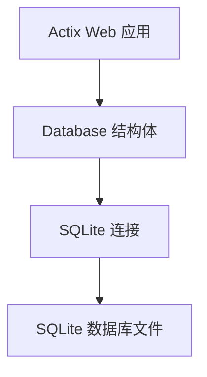
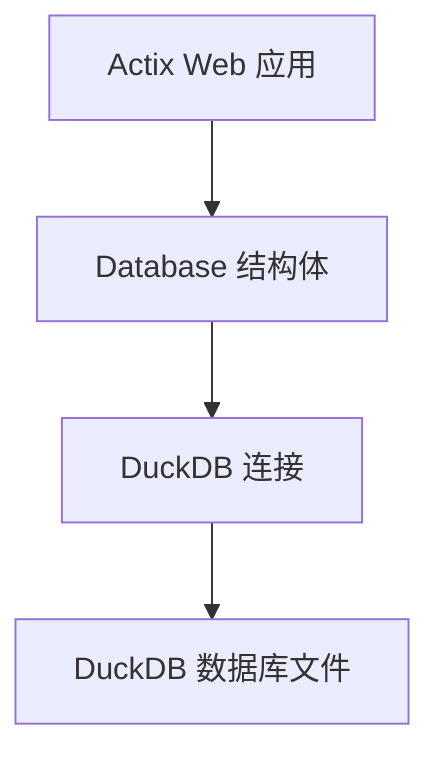
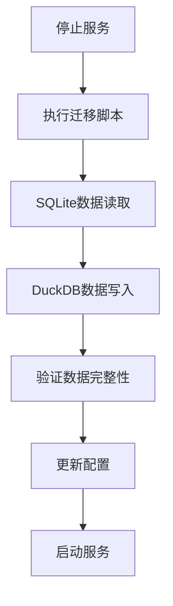

# 后端数据库迁移至 DuckDB 设计文档

## 1. 概述

### 1.1 项目背景
AiOne MoniHub 是由 AiOne 团队开发的集成化监控和管理平台，旨在提供高效、便捷的远程应用管理解决方案。当前后端服务使用 SQLite 作为数据库存储，为了提升数据分析和查询性能，计划将数据库迁移至 DuckDB。

### 1.2 迁移目标
将现有的 SQLite 数据库替换为 DuckDB 数据库，以获得更好的分析查询性能和更丰富的数据处理功能。

### 1.3 迁移范围
- 数据库驱动替换
- 数据库连接管理模块修改
- 数据访问层适配
- 数据迁移脚本实现
- 现有功能验证

## 2. 技术架构

### 2.1 当前架构

### 2.2 目标架构

### 2.3 技术选型
- **数据库**: DuckDB (替代 SQLite)
- **Rust 驱动**: duckdb crate (替代 rusqlite)
- **连接管理**: 保持现有的 Arc<Mutex<Connection>> 模式
- **异步支持**: 使用 tokio 进行异步操作

## 3. 数据库设计变更

### 3.1 数据库驱动变更
| 组件 | 当前实现 | 目标实现 |
|------|----------|----------|
| 驱动库 | rusqlite | duckdb |
| 连接对象 | rusqlite::Connection | duckdb::Connection |
| 错误类型 | rusqlite::Error | duckdb::Error |
| 结果类型 | rusqlite::Result | duckdb::Result |

### 3.2 表结构兼容性
DuckDB 与 SQLite 在表结构定义上基本兼容，现有的表结构可以保持不变：
- users 表
- projects 表
- applications 表
- deployments 表
- roles 表
- permissions 表
- logs 表
- machines 表
- configs 表

### 3.3 索引和约束
DuckDB 支持与 SQLite 类似的索引和约束机制，现有的索引定义可以保持不变。

## 4. 核心模块修改

### 4.1 数据库连接模块 (shared/database.rs)
- 替换 rusqlite 导入为 duckdb
- 修改 Connection 类型为 duckdb::Connection
- 保持现有的 Arc<Mutex<Connection>> 结构以确保线程安全
- 更新错误类型和结果类型
- 修改数据库文件路径创建逻辑，确保 DuckDB 数据库文件正确创建
- 调整表初始化逻辑，适配 DuckDB 语法（如果需要）

### 4.2 数据访问方法
- 保持现有的 CRUD 方法签名
- 调整 SQL 语句参数绑定方式（如果需要）
- 保持事务处理机制
- 更新时间戳处理逻辑，确保与 DuckDB 兼容
- 修改 JSON 数据处理方式（authorization、environment_vars、permissions等字段）

### 4.3 依赖配置 (Cargo.toml)
- 移除 rusqlite 依赖
- 添加 duckdb 依赖并启用 bundled 特性
- 确保 duckdb 版本与项目其他依赖兼容
- 更新相关特性配置

## 5. 数据迁移方案

### 5.1 迁移策略
采用离线迁移方式，在服务停机维护期间执行数据迁移。

### 5.2 迁移流程

### 5.3 迁移脚本实现
- 创建 DatabaseMigration 结构体
- 实现从 SQLite 读取数据的方法
- 实现向 DuckDB 写入数据的方法
- 添加数据完整性校验机制
- 实现批量数据迁移以提高效率
- 添加迁移进度监控和日志记录
- 实现断点续传功能，防止迁移过程中断后需要重新开始

## 6. 测试方案

### 6.1 单元测试
- 验证数据库连接功能
- 测试各实体的 CRUD 操作
- 验证事务处理机制
- 测试时间戳和 JSON 字段处理
- 验证索引和约束功能

### 6.2 集成测试
- 测试完整的 API 接口功能
- 验证数据一致性和完整性
- 性能基准测试对比
- 并发访问测试
- 大数据量查询测试

### 6.3 数据验证
- 校验迁移前后数据一致性
- 验证索引和约束功能
- 测试复杂查询性能

## 7. 部署方案

### 7.1 部署前准备
- 备份现有 SQLite 数据库
- 准备迁移脚本和验证工具
- 制定回滚方案

### 7.2 部署步骤
1. 停止当前服务
2. 执行数据迁移脚本
3. 验证数据迁移结果
4. 更新应用配置
5. 启动新版本服务
6. 监控系统运行状态
7. 进行功能验证测试
8. 逐步开放用户访问

### 7.3 回滚方案
如果迁移失败，可以回滚到 SQLite 版本：
1. 停止新服务
2. 恢复 SQLite 数据库备份
3. 回滚应用代码版本
4. 启动原版本服务

### 7.4 回滚测试
在正式迁移前，需要进行回滚测试以确保回滚方案的有效性：
1. 模拟迁移失败场景
2. 执行回滚操作
3. 验证原版本服务功能
4. 记录回滚时间成本

## 8. 风险评估与应对

### 8.1 技术风险
| 风险点 | 影响 | 应对措施 |
|--------|------|----------|
| DuckDB 兼容性问题 | 数据库功能异常 | 详细测试所有 SQL 语句 |
| 性能不达预期 | 查询响应慢 | 进行充分的性能测试 |
| 数据迁移失败 | 数据丢失 | 完善备份和回滚机制 |

### 8.2 运维风险
| 风险点 | 影响 | 应对措施 |
|--------|------|----------|
| 迁移时间过长 | 服务中断时间长 | 优化迁移脚本，分批迁移 |
| 配置错误 | 服务启动失败 | 准备配置模板和检查清单 |

## 9. 性能优化与监控

### 9.1 DuckDB 性能优化
- 利用 DuckDB 的列式存储特性优化查询性能
- 使用适当的索引策略提升查询效率
- 合理配置内存使用参数
- 利用 DuckDB 的并行处理能力

### 9.2 监控指标
- 数据库连接数监控
- 查询响应时间监控
- 数据库文件大小监控
- 内存使用情况监控
