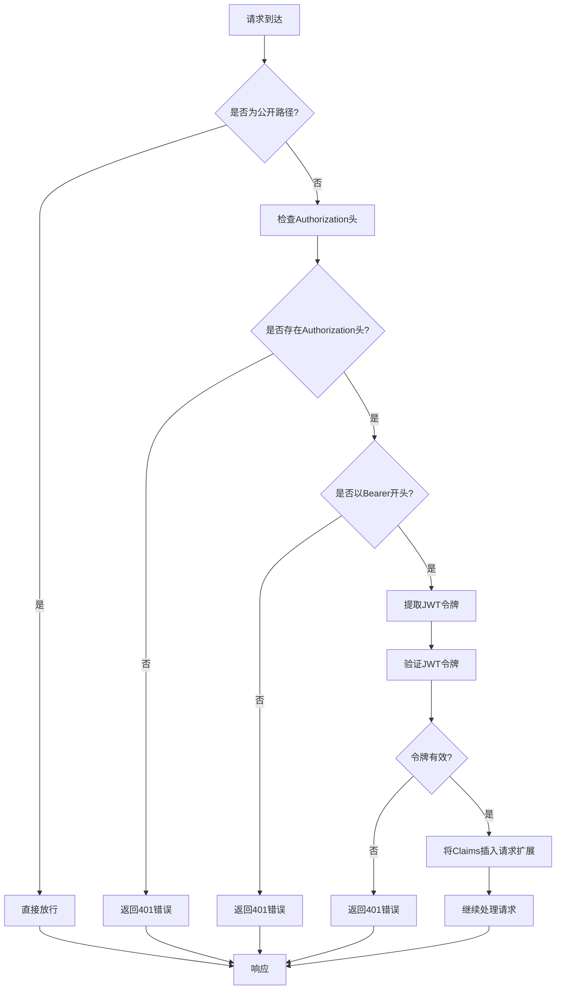

# Header用户凭证中间件设计文档

## 1. 概述

本设计文档描述了如何通过HTTP请求头获取用户凭证，并在请求扩展中设置用户信息，使得所有API都能从请求扩展中获取用户凭证，而无需单独解析。该设计旨在简化认证流程，提高代码复用性，并确保系统安全性。

## 2. 当前实现分析

### 2.1 现有认证中间件

当前系统已实现了一个JWT认证中间件 (`AuthMiddleware`)，位于 `apps/server/src/auth/middleware.rs`。该中间件：

1. 拦截所有非公开路径的请求
2. 从请求头中提取 `Authorization: Bearer <token>` 格式的JWT令牌
3. 验证令牌的有效性
4. 将解析出的Claims信息插入到请求扩展中

### 2.2 现有用户凭证获取方式

系统中已存在一个辅助函数 `get_user_id_from_request`，用于从请求扩展中获取用户ID：

```rust
pub fn get_user_id_from_request(req: &HttpRequest) -> Result<String, ApiError> {
    let extensions = req.extensions();
    let claims = extensions
        .get::<Claims>()
        .ok_or_else(|| ApiError::Unauthorized("User not authenticated".to_string()))?;

    Ok(claims.sub.clone())
}
```

### 2.3 现有使用模式

在各个模块的处理函数中，通过调用 `get_user_id_from_request` 函数来获取当前用户ID：

```rust
let user_id = get_user_id_from_request(&req)?;
```

## 3. 设计目标

1. 保持现有认证中间件的核心功能
2. 确保所有受保护的API端点都能通过统一方式获取用户凭证
3. 简化认证流程，避免在每个处理函数中重复解析JWT令牌
4. 提高代码可维护性和安全性

## 4. 设计方案

### 4.1 中间件增强

增强现有的 `AuthMiddleware`，确保在所有需要认证的请求中正确解析并设置用户凭证到请求扩展中。

### 4.2 请求扩展数据结构

继续使用现有的 `Claims` 结构体作为请求扩展中的用户凭证数据结构：

```rust
#[derive(Debug, Serialize, Deserialize, ToSchema)]
pub struct Claims {
    pub sub: String, // Subject (user ID)
    pub exp: usize,  // Expiration time (as UTC timestamp)
}
```

### 4.3 凭证获取函数

保留并优化 `get_user_id_from_request` 函数，确保其能正确从请求扩展中获取用户ID。

## 5. 实现细节

### 5.1 认证中间件流程



### 5.2 请求扩展使用

在处理函数中，通过以下方式获取用户凭证：

```rust
// 从请求扩展中获取用户ID
let user_id = get_user_id_from_request(&req)?;
```

## 6. 不符合项检查与修正

### 6.1 潜在问题

1. **重复验证**: 部分处理函数（如`validate_token`和`get_current_user`）仍在手动解析JWT令牌，而不是从请求扩展中获取
2. **错误处理**: 部分API可能没有正确处理未认证的情况
3. **公开路径配置**: 公开路径列表可能需要更新

### 6.2 修正方案

1. 确保所有需要认证的API都通过 `get_user_id_from_request` 获取用户ID
2. 修改`validate_token`和`get_current_user`等函数，移除其中手动解析JWT令牌的代码，改为直接从请求扩展中获取用户信息
3. 审查并更新公开路径列表

### 6.3 修正示例

以`validate_token`函数为例，当前实现手动解析JWT令牌：

```rust
// 当前实现 - 不符合要求
pub async fn validate_token(req: HttpRequest) -> Result<HttpResponse> {
    // Get the Authorization header
    let auth_header = req.headers().get("Authorization");

    if let Some(auth_header) = auth_header {
        if let Ok(auth_str) = auth_header.to_str() {
            // Check if it starts with "Bearer "
            if auth_str.starts_with("Bearer ") {
                let token = &auth_str[7..]; // Remove "Bearer " prefix

                // Validate the token
                let validation = Validation::new(Algorithm::HS256);
                match decode::<Claims>(
                    token,
                    &DecodingKey::from_secret(JWT_SECRET.as_ref()),
                    &validation,
                ) {
                    Ok(token_data) => {
                        // Token is valid
                        println!("Token is valid for user ID: {}", token_data.claims.sub);
                        Ok(HttpResponse::Ok().json("Token is valid"))
                    }
                    Err(_) => {
                        // Token is invalid
                        Ok(HttpResponse::Unauthorized().json("Invalid token"))
                    }
                }
            } else {
                Ok(HttpResponse::Unauthorized().json("Invalid authorization header format"))
            }
        } else {
            Ok(HttpResponse::Unauthorized().json("Invalid authorization header"))
        }
    } else {
        Ok(HttpResponse::Unauthorized().json("Missing authorization header"))
    }
}
```

修正后的实现应直接从请求扩展中获取用户信息：

```rust
// 修正后实现 - 符合要求
pub async fn validate_token(req: HttpRequest) -> Result<HttpResponse, ApiError> {
    // Get user ID from request extension (set by middleware)
    match get_user_id_from_request(&req) {
        Ok(user_id) => {
            // User is authenticated
            println!("Token is valid for user ID: {}", user_id);
            Ok(HttpResponse::Ok().json("Token is valid"))
        }
        Err(e) => {
            // User is not authenticated
            Err(e)
        }
    }
}
```

同样，`get_current_user`函数也应修正为直接从请求扩展中获取用户信息，然后查询数据库获取完整用户信息：

```rust
// 修正后实现 - 符合要求
pub async fn get_current_user(
    req: HttpRequest,
    db: web::Data<DatabaseConnection>,
) -> Result<HttpResponse, ApiError> {
    // Get user ID from request extension (set by middleware)
    let user_id = get_user_id_from_request(&req)?;

    // Fetch user data from database
    let users_module = UsersModule::new(db.get_ref().clone());

    match users_module.find_user_by_id(&user_id).await {
        Ok(Some(user)) => {
            // Get user roles
            let roles = match users_module.get_user_roles(&user.id).await {
                Ok(roles) => roles,
                Err(_) => vec![],
            };

            // Get token expiration from request extension
            let extensions = req.extensions();
            let claims = extensions.get::<Claims>().unwrap(); // Safe to unwrap as we already verified auth

            let user_response = CurrentUserResponse {
                id: user.id.to_string(),
                username: user.username,
                email: user.email,
                roles,
                exp: claims.exp,
            };
            Ok(HttpResponse::Ok().json(user_response))
        }
        Ok(None) => Ok(HttpResponse::NotFound().json("User not found")),
        Err(err) => {
            eprintln!("Database error: {:?}", err);
            Ok(HttpResponse::InternalServerError().json("Database error"))
        }
    }
}
```

## 7. 安全考虑

1. **令牌验证**: 确保JWT令牌在中间件中被正确验证
2. **请求扩展安全性**: 确保请求扩展中的用户信息不会被篡改
3. **错误信息**: 避免在错误响应中泄露敏感信息

## 8. 测试策略

### 8.1 单元测试

1. 测试认证中间件对有效令牌的处理
2. 测试认证中间件对无效令牌的处理
3. 测试公开路径的正确放行
4. 测试 `get_user_id_from_request` 函数的正确性

### 8.2 集成测试

1. 测试完整认证流程
2. 测试受保护API的访问控制
3. 测试公开API的可访问性

## 9. 部署与兼容性

该设计保持与现有系统的向后兼容性，不会破坏现有的认证流程。部署时只需更新认证中间件和相关辅助函数。

## 10. 结论

通过增强现有的认证中间件并标准化用户凭证的获取方式，可以简化系统中的认证流程，提高代码复用性，并确保安全性。该方案充分利用了现有架构的优势，只需进行少量修改即可实现目标。

## 11. 建议

1. **统一认证模式**: 所有需要用户认证的API端点都应通过`get_user_id_from_request`函数获取用户ID，避免重复解析JWT令牌
2. **代码审查**: 对所有处理函数进行代码审查，确保没有手动解析JWT令牌的代码
3. **测试覆盖**: 增加对认证中间件和凭证获取函数的单元测试，确保其正确性
4. **文档更新**: 更新相关开发文档，明确说明如何正确获取用户凭证
