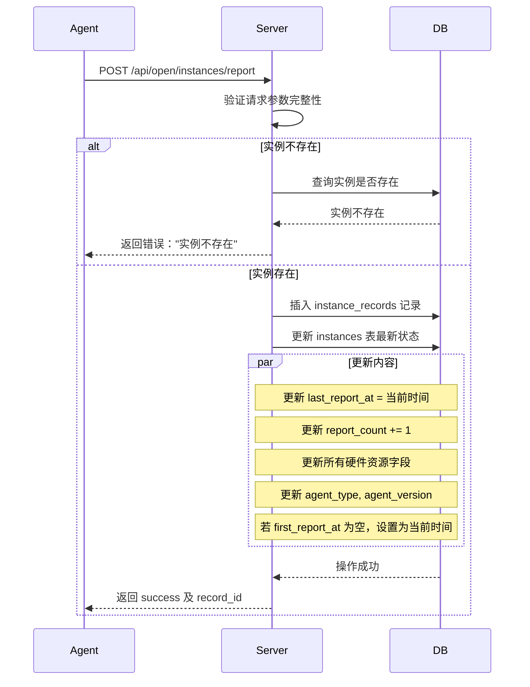
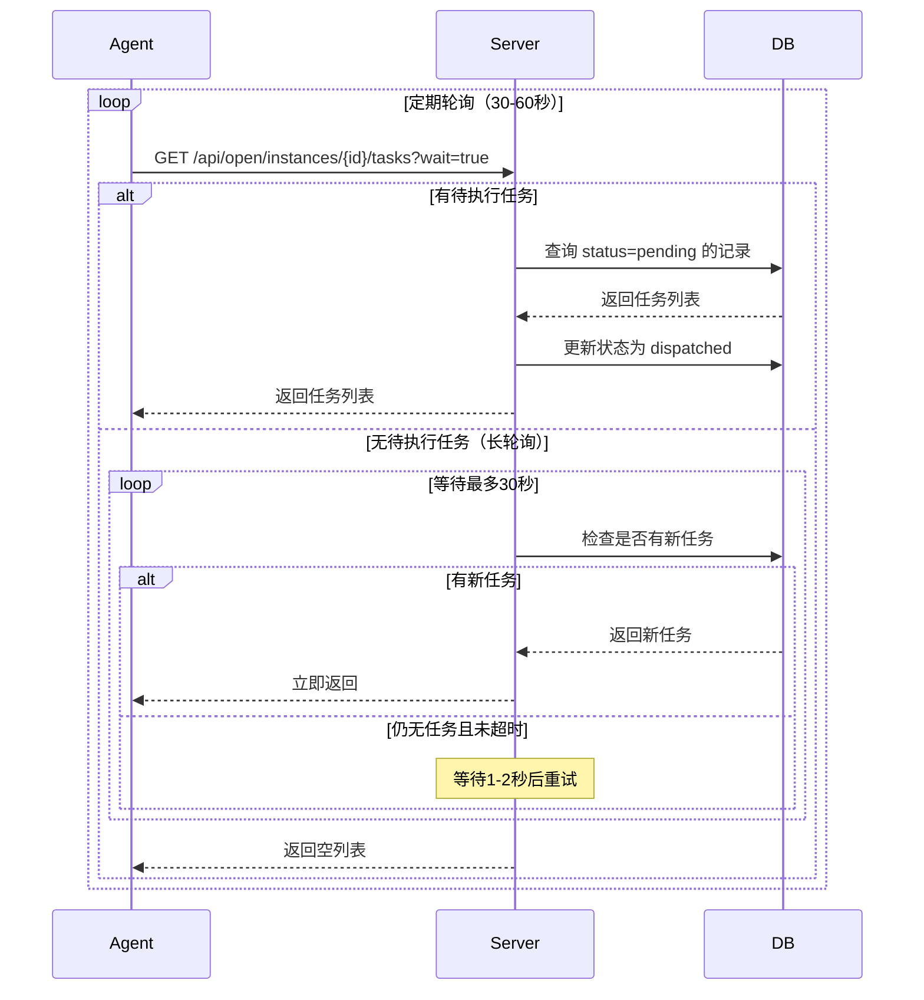
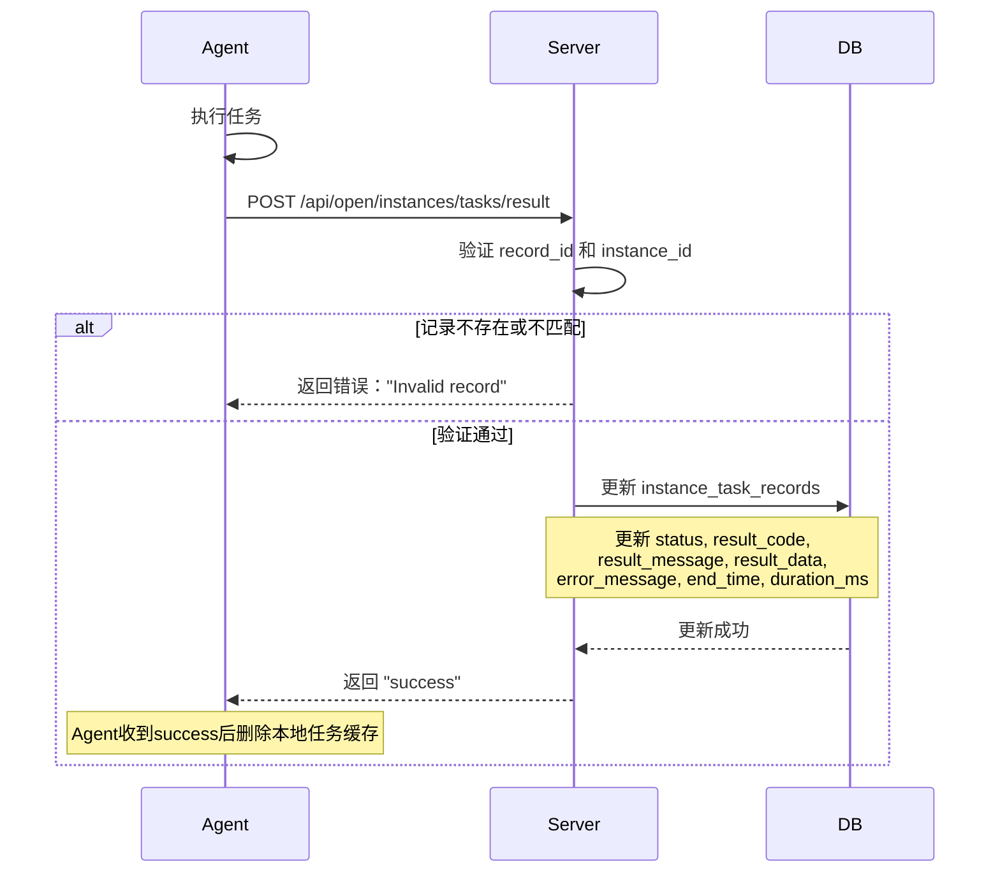
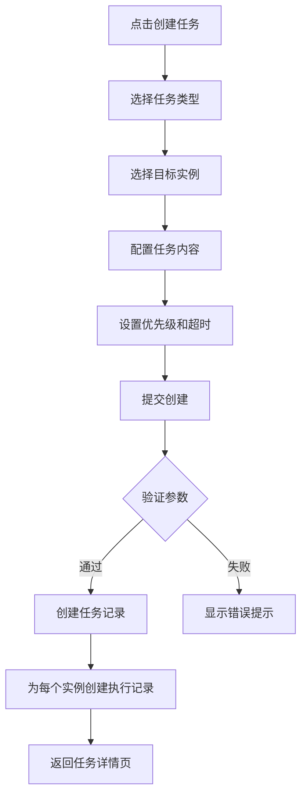
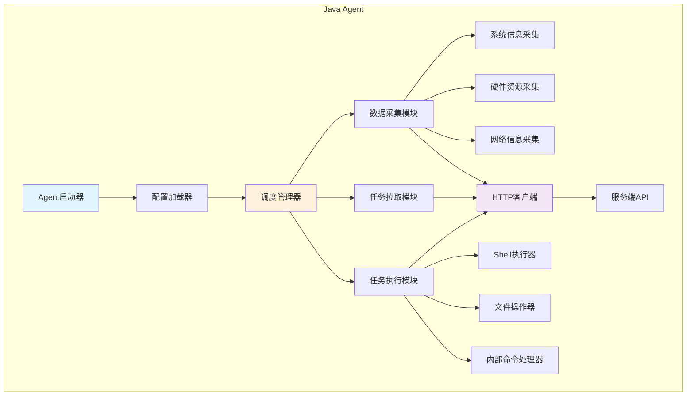
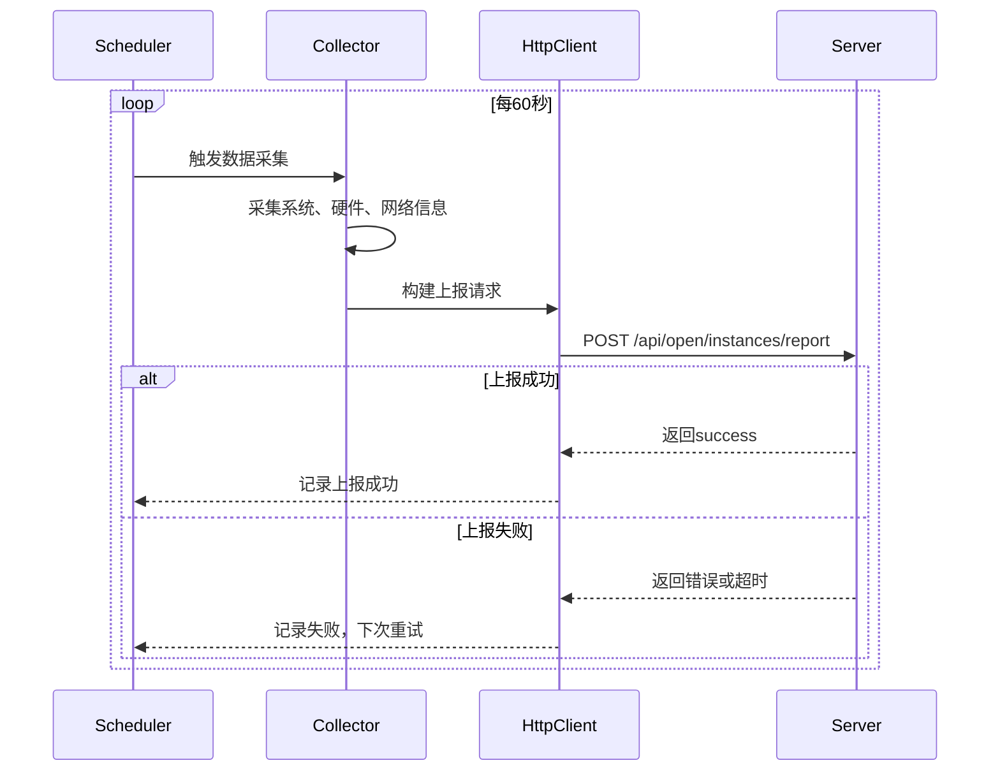
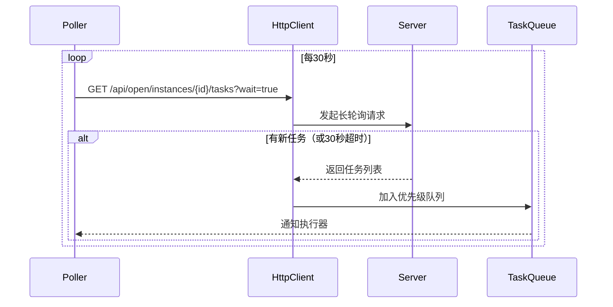
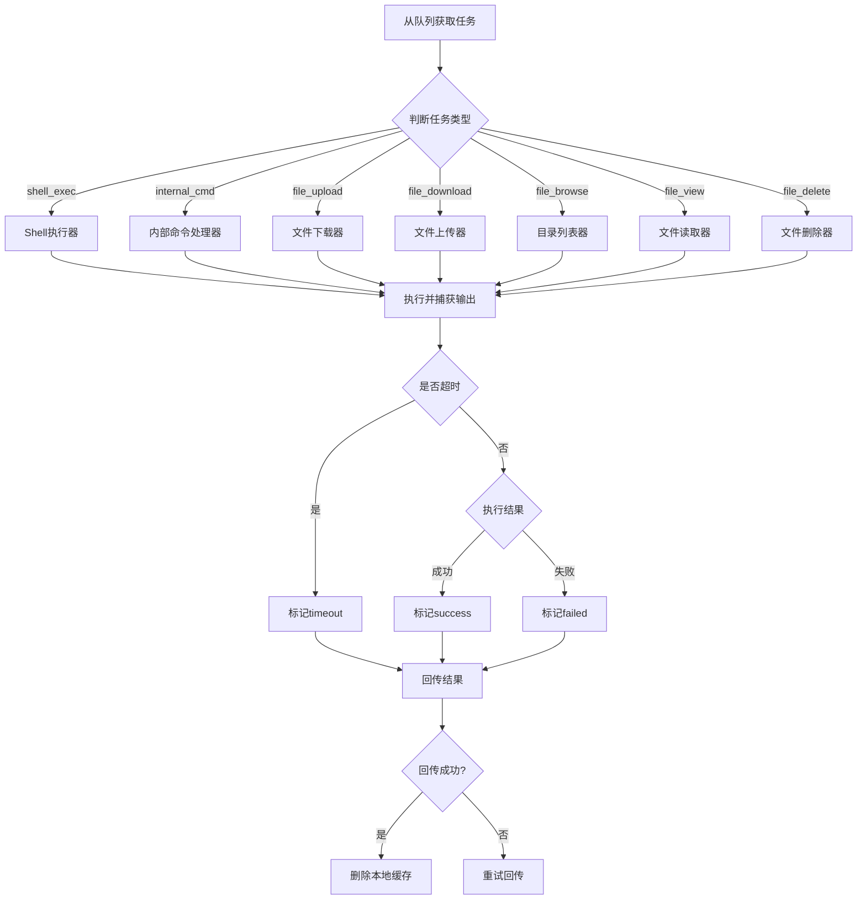
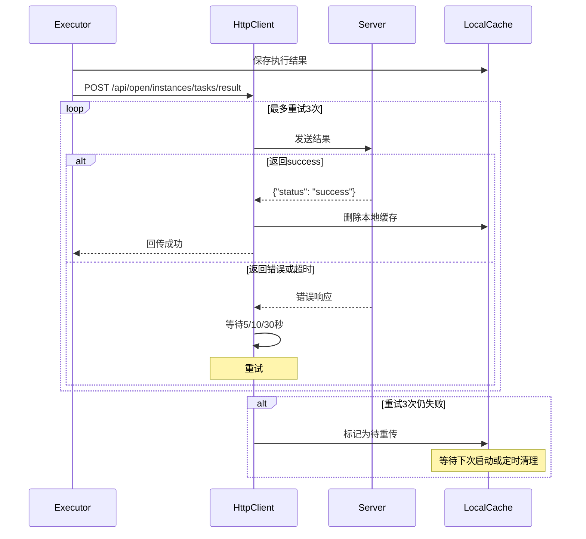
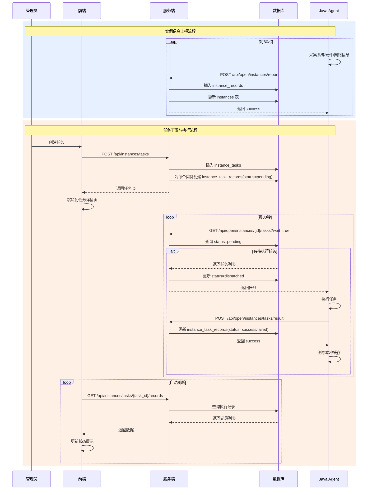

# 实例信息上报与远程控制功能设计

## 一、功能概述

本设计文档定义了 AiOne MoniHub 平台的实例信息上报与远程控制功能。该功能支持多语言 Agent（Java、Golang、Rust、JavaScript、App等）向服务端上报运行状态和硬件信息，并支持服务端向 Agent 下发任务指令并接收执行结果。

### 核心价值

- **实时监控**：实时收集各类 Agent 的运行状态和系统资源信息
- **历史追溯**：完整记录每次上报数据，支持历史查询和趋势分析
- **远程控制**：支持向多个实例批量下发任务并追踪执行状态
- **多语言支持**：统一的协议设计，适配多种编程语言的 Agent 实现

---

## 二、实例信息上报功能设计

### 2.1 业务目标

Agent 定时向服务端上报运行状态和环境信息，服务端记录所有上报历史并同步更新实例表的最新状态。

### 2.2 数据模型设计

#### 2.2.1 实例上报记录表 (instance_records)

用于存储每次上报的完整历史数据，支持时序分析和故障排查。

| 字段名 | 类型 | 约束 | 说明 |
|--------|------|------|------|
| id | VARCHAR(64) | PRIMARY KEY | 记录唯一标识（雪花ID） |
| instance_id | VARCHAR(64) | NOT NULL | 关联的实例ID |
| agent_type | VARCHAR(50) | NOT NULL | Agent类型：java, golang, rust, javascript, app |
| agent_version | VARCHAR(50) | | Agent版本号 |
| **系统信息** | | | |
| os_type | VARCHAR(100) | | 操作系统类型：Linux, Windows, macOS, Android, iOS |
| os_version | VARCHAR(100) | | 操作系统版本 |
| hostname | VARCHAR(255) | | 主机名 |
| **网络信息** | | | |
| ip_address | INET | | 内网IP地址 |
| public_ip | INET | | 公网IP地址 |
| mac_address | VARCHAR(255) | | MAC地址 |
| network_type | VARCHAR(50) | | 上网方式：wired(有线), wifi(无线), mobile(移动网络), vpn |
| **硬件资源信息** | | | |
| cpu_model | VARCHAR(255) | | CPU型号 |
| cpu_cores | INT | | CPU核心数 |
| cpu_usage_percent | DECIMAL(5,2) | | CPU使用率（0-100） |
| memory_total_mb | BIGINT | | 总内存（MB） |
| memory_used_mb | BIGINT | | 已用内存（MB） |
| memory_usage_percent | DECIMAL(5,2) | | 内存使用率（0-100） |
| disk_total_gb | BIGINT | | 总磁盘空间（GB） |
| disk_used_gb | BIGINT | | 已用磁盘空间（GB） |
| disk_usage_percent | DECIMAL(5,2) | | 磁盘使用率（0-100） |
| **运行状态** | | | |
| process_id | INT | | Agent进程ID |
| process_uptime_seconds | BIGINT | | Agent运行时长（秒） |
| thread_count | INT | | 线程数 |
| **扩展信息** | | | |
| custom_metrics | JSONB | DEFAULT '{}' | 自定义指标（JSON格式） |
| report_timestamp | TIMESTAMPTZ(3) | NOT NULL | Agent端上报时间戳 |
| received_at | TIMESTAMPTZ(3) | NOT NULL DEFAULT now() | 服务端接收时间 |
| created_at | TIMESTAMPTZ(3) | NOT NULL DEFAULT now() | 记录创建时间 |

**索引设计**：
- PRIMARY KEY: id
- INDEX: instance_id, report_timestamp（支持按实例查询历史）
- INDEX: agent_type（支持按Agent类型统计）
- INDEX: received_at（支持时间范围查询）

#### 2.2.2 实例表 (instances) 扩展字段

在现有实例表基础上，补充缺失的实时状态字段：

| 字段名 | 类型 | 约束 | 说明 |
|--------|------|------|------|
| agent_type | VARCHAR(50) | | 当前Agent类型 |
| agent_version | VARCHAR(50) | | 当前Agent版本 |
| cpu_usage_percent | DECIMAL(5,2) | | 最新CPU使用率 |
| memory_usage_percent | DECIMAL(5,2) | | 最新内存使用率 |
| disk_usage_percent | DECIMAL(5,2) | | 最新磁盘使用率 |
| process_uptime_seconds | BIGINT | | 最新运行时长 |
| network_type | VARCHAR(50) | | 最新上网方式 |

**注**：其他字段（如 mac_address, public_ip, os_type 等）已在迁移文件 002_extend_instances_table.sql 中定义。

### 2.3 API 接口设计

#### 2.3.1 实例信息上报接口

**端点定义**：

| 属性 | 值 |
|------|-----|
| 路径 | POST /api/open/instances/report |
| 认证 | 无需Token（开放接口） |
| 限流 | 建议：每个实例每分钟最多上报10次 |

**请求体结构**：

| 字段 | 类型 | 必填 | 说明 |
|------|------|------|------|
| instance_id | String | 是 | 实例唯一标识 |
| agent_type | String | 是 | Agent类型（java/golang/rust/javascript/app） |
| agent_version | String | 否 | Agent版本号 |
| system_info | Object | 是 | 系统信息对象 |
| ├─ os_type | String | 是 | 操作系统类型 |
| ├─ os_version | String | 否 | 操作系统版本 |
| ├─ hostname | String | 否 | 主机名 |
| network_info | Object | 是 | 网络信息对象 |
| ├─ ip_address | String | 否 | 内网IP |
| ├─ public_ip | String | 否 | 公网IP |
| ├─ mac_address | String | 否 | MAC地址 |
| ├─ network_type | String | 否 | 上网方式 |
| hardware_info | Object | 是 | 硬件信息对象 |
| ├─ cpu_model | String | 否 | CPU型号 |
| ├─ cpu_cores | Integer | 否 | CPU核心数 |
| ├─ cpu_usage_percent | Float | 是 | CPU使用率 |
| ├─ memory_total_mb | Long | 是 | 总内存 |
| ├─ memory_used_mb | Long | 是 | 已用内存 |
| ├─ memory_usage_percent | Float | 是 | 内存使用率 |
| ├─ disk_total_gb | Long | 是 | 总磁盘 |
| ├─ disk_used_gb | Long | 是 | 已用磁盘 |
| ├─ disk_usage_percent | Float | 是 | 磁盘使用率 |
| runtime_info | Object | 是 | 运行时信息 |
| ├─ process_id | Integer | 否 | 进程ID |
| ├─ process_uptime_seconds | Long | 是 | 运行时长 |
| ├─ thread_count | Integer | 否 | 线程数 |
| custom_metrics | Object | 否 | 自定义指标（JSON对象） |
| report_timestamp | String | 是 | 上报时间（ISO 8601格式） |

**响应结构**：

| 字段 | 类型 | 说明 |
|------|------|------|
| status | String | 状态码："success" / "error" |
| message | String | 响应消息 |
| record_id | String | 生成的上报记录ID |
| timestamp | Long | 服务器时间戳（Unix时间） |

**业务逻辑流程**：



**错误处理**：

| HTTP状态码 | 错误场景 | 返回消息 |
|-----------|----------|----------|
| 400 | 缺少必填字段 | "Missing required fields: {field_list}" |
| 404 | 实例ID不存在 | "Instance not found" |
| 422 | 数据格式错误 | "Invalid data format: {detail}" |
| 500 | 数据库写入失败 | "Failed to save report data" |

#### 2.3.2 查询实例上报历史接口

**端点定义**：

| 属性 | 值 |
|------|-----|
| 路径 | GET /api/instances/{instance_id}/reports |
| 认证 | 需要JWT Token |
| 权限 | instance_management.view_reports |

**查询参数**：

| 参数 | 类型 | 必填 | 说明 |
|------|------|------|------|
| start_time | String | 否 | 起始时间（ISO 8601） |
| end_time | String | 否 | 结束时间（ISO 8601） |
| page | Integer | 否 | 页码（默认1） |
| limit | Integer | 否 | 每页数量（默认20，最大100） |

**响应结构**：

| 字段 | 类型 | 说明 |
|------|------|------|
| data | Array | 上报记录数组 |
| pagination | Object | 分页信息 |
| ├─ page | Integer | 当前页码 |
| ├─ limit | Integer | 每页数量 |
| ├─ total | Integer | 总记录数 |

### 2.4 服务端开放端口配置

为支持 Agent 上报，需要在 Actix Web 路由中增加开放API路由组：

**路由配置策略**：

- **开放路由前缀**：/api/open/*
- **认证中间件策略**：该路径下的接口跳过JWT认证
- **安全措施**：
  - 通过 IP 白名单限制访问来源（可选）
  - 实施请求频率限制（Rate Limiting）
  - 记录所有开放接口的访问日志

**路由结构**：

```
/api/open/
  └─ instances/
      ├─ report (POST) - 实例信息上报
      └─ tasks (GET) - 获取待执行任务（远程控制功能）
```

---

## 三、实例远程控制功能设计

### 3.1 业务目标

支持管理员从平台创建任务，下发到指定实例执行，并追踪任务执行状态和结果。

### 3.2 数据模型设计

#### 3.2.1 实例任务表 (instance_tasks)

存储任务定义和目标实例列表。

| 字段名 | 类型 | 约束 | 说明 |
|--------|------|------|------|
| id | VARCHAR(64) | PRIMARY KEY | 任务唯一标识（雪花ID） |
| task_name | VARCHAR(255) | NOT NULL | 任务名称 |
| task_type | VARCHAR(50) | NOT NULL | 任务类型（见下方枚举） |
| target_instances | JSONB | NOT NULL | 目标实例ID数组 |
| task_content | JSONB | NOT NULL | 任务内容（结构见下） |
| priority | INT | DEFAULT 5 | 优先级（1-10，10最高） |
| timeout_seconds | INT | DEFAULT 300 | 超时时长（秒） |
| retry_count | INT | DEFAULT 0 | 重试次数 |
| created_by | VARCHAR(64) | NOT NULL | 创建人ID |
| created_at | TIMESTAMPTZ(3) | NOT NULL DEFAULT now() | 创建时间 |
| updated_at | TIMESTAMPTZ(3) | NOT NULL DEFAULT now() | 更新时间 |
| deleted_at | TIMESTAMPTZ(3) | | 软删除时间 |

**任务类型枚举**：

| 类型值 | 说明 |
|--------|------|
| shell_exec | Shell命令执行 |
| internal_cmd | 内部命令（Agent根据语言实现） |
| file_upload | 文件上传（Server → Agent） |
| file_download | 文件下载（Agent → Server） |
| file_browse | 文件浏览（列出目录内容） |
| file_view | 文件查看（读取文件内容） |
| file_delete | 文件删除 |

**task_content 结构示例**：

不同任务类型对应不同的 JSON 结构：

```json
// shell_exec
{
  "command": "ls -la /home",
  "working_dir": "/home",
  "env_vars": {"PATH": "/usr/bin"}
}

// internal_cmd
{
  "command_name": "restart",
  "parameters": {"graceful": true}
}

// file_upload
{
  "source_url": "http://server/files/config.yml",
  "target_path": "/etc/app/config.yml",
  "overwrite": true
}

// file_download
{
  "source_path": "/var/log/app.log",
  "target_url": "http://server/upload"
}

// file_browse
{
  "path": "/var/log",
  "recursive": false
}

// file_view
{
  "path": "/etc/app/config.yml",
  "encoding": "utf-8",
  "max_lines": 1000
}

// file_delete
{
  "path": "/tmp/cache/*",
  "recursive": true
}
```

**索引设计**：
- PRIMARY KEY: id
- INDEX: created_at（支持按创建时间排序）
- INDEX: task_type（支持按类型筛选）

#### 3.2.2 实例任务执行记录表 (instance_task_records)

存储每个实例对每个任务的执行情况。

| 字段名 | 类型 | 约束 | 说明 |
|--------|------|------|------|
| id | VARCHAR(64) | PRIMARY KEY | 记录唯一标识（雪花ID） |
| task_id | VARCHAR(64) | NOT NULL | 关联的任务ID |
| instance_id | VARCHAR(64) | NOT NULL | 关联的实例ID |
| status | VARCHAR(50) | NOT NULL | 执行状态（见下方枚举） |
| dispatch_time | TIMESTAMPTZ(3) | | 任务下发时间 |
| start_time | TIMESTAMPTZ(3) | | 开始执行时间 |
| end_time | TIMESTAMPTZ(3) | | 执行结束时间 |
| duration_ms | BIGINT | | 执行耗时（毫秒） |
| result_code | INT | | 结果代码（0成功，非0失败） |
| result_message | TEXT | | 结果消息 |
| result_data | JSONB | DEFAULT '{}' | 结果数据（JSON格式） |
| error_message | TEXT | | 错误信息（失败时） |
| retry_attempt | INT | DEFAULT 0 | 当前重试次数 |
| created_at | TIMESTAMPTZ(3) | NOT NULL DEFAULT now() | 记录创建时间 |
| updated_at | TIMESTAMPTZ(3) | NOT NULL DEFAULT now() | 记录更新时间 |

**执行状态枚举**：

| 状态值 | 说明 |
|--------|------|
| pending | 待下发（已创建，等待Agent拉取） |
| dispatched | 已下发（Agent已获取） |
| running | 执行中 |
| success | 执行成功 |
| failed | 执行失败 |
| timeout | 执行超时 |
| cancelled | 已取消 |

**索引设计**：
- PRIMARY KEY: id
- INDEX: task_id, instance_id（联合索引，支持按任务查询所有实例执行情况）
- INDEX: instance_id, status（支持查询实例待执行任务）
- INDEX: created_at（支持时间范围查询）

### 3.3 任务下发与回传机制设计

#### 3.3.1 技术方案选型

为保证任务下发和结果回传的及时性，对比以下方案：

| 方案 | 优势 | 劣势 | 适用场景 |
|------|------|------|----------|
| **短轮询** | 实现简单，兼容性好 | 延迟高（轮询间隔），服务器压力大 | Agent数量少，实时性要求低 |
| **长轮询** | 延迟较低，无需额外协议 | 连接保持成本，不适合大规模 | Agent数量中等 |
| **WebSocket** | 实时性最高，双向通信 | 需要维持长连接，实现复杂 | 需要实时交互的场景 |
| **Server-Sent Events (SSE)** | 单向推送简单，自动重连 | 仅服务端推送，回传仍需HTTP | 只需服务端推送 |

**推荐方案**：**短轮询 + 长轮询混合模式**

- **任务下发**：Agent 定期轮询（30-60秒间隔）获取待执行任务，使用长轮询（hold 30秒）提升实时性
- **结果回传**：Agent 执行完成后立即通过 HTTP POST 回传结果
- **优势**：
  - 实现简单，无需维持长连接
  - 适配所有语言的 HTTP 客户端
  - 服务端无状态，易于横向扩展
  - 对防火墙和代理友好

#### 3.3.2 任务下发接口设计

**端点定义**：

| 属性 | 值 |
|------|-----|
| 路径 | GET /api/open/instances/{instance_id}/tasks |
| 认证 | 无需Token（开放接口） |
| 超时 | 支持长轮询（最多hold 30秒） |

**查询参数**：

| 参数 | 类型 | 必填 | 说明 |
|------|------|------|------|
| wait | Boolean | 否 | 是否启用长轮询（默认false） |
| timeout | Integer | 否 | 长轮询超时秒数（默认30，最大60） |

**响应结构**：

| 字段 | 类型 | 说明 |
|------|------|------|
| tasks | Array | 待执行任务列表（按优先级降序） |
| ├─ task_id | String | 任务ID |
| ├─ record_id | String | 执行记录ID |
| ├─ task_type | String | 任务类型 |
| ├─ task_content | Object | 任务内容 |
| ├─ timeout_seconds | Integer | 超时时长 |
| ├─ priority | Integer | 优先级 |
| timestamp | Long | 服务器时间戳 |

**业务逻辑**：



#### 3.3.3 任务结果回传接口设计

**端点定义**：

| 属性 | 值 |
|------|-----|
| 路径 | POST /api/open/instances/tasks/result |
| 认证 | 无需Token（开放接口） |

**请求体结构**：

| 字段 | 类型 | 必填 | 说明 |
|------|------|------|------|
| record_id | String | 是 | 执行记录ID |
| instance_id | String | 是 | 实例ID |
| status | String | 是 | 执行状态（success/failed/timeout） |
| result_code | Integer | 是 | 结果代码（0成功） |
| result_message | String | 否 | 结果消息 |
| result_data | Object | 否 | 结果数据（JSON对象） |
| error_message | String | 否 | 错误信息（失败时必填） |
| start_time | String | 是 | 开始时间（ISO 8601） |
| end_time | String | 是 | 结束时间（ISO 8601） |
| duration_ms | Long | 是 | 执行耗时（毫秒） |

**响应结构**：

| 字段 | 类型 | 说明 |
|------|------|------|
| status | String | "success" / "error" |
| message | String | 响应消息 |
| timestamp | Long | 服务器时间戳 |

**业务逻辑**：



**Agent行为规范**：

- Agent 执行完任务后立即回传结果
- 只有收到服务端返回 "success" 后，才删除本地任务缓存
- 若回传失败（网络错误、服务端返回非success），Agent应重试，最多重试3次
- 重试间隔：5秒、10秒、30秒

### 3.4 前端管理界面设计

#### 3.4.1 任务管理页面

**页面功能**：

| 功能模块 | 说明 |
|----------|------|
| 任务列表 | 展示所有任务，支持按类型、状态、创建时间筛选 |
| 创建任务 | 弹窗表单，选择任务类型、目标实例、配置任务内容 |
| 任务详情 | 查看任务定义和所有实例的执行情况 |
| 批量操作 | 批量取消任务 |

**任务创建流程**：



**实例选择组件**：

- 支持多选实例
- 支持按项目、应用、状态筛选
- 显示实例在线状态（基于 last_report_at 判断）
- 支持搜索实例名称、IP、主机名

**任务内容配置**：

根据不同任务类型动态展示表单：

- **Shell执行**：命令输入框、工作目录、环境变量键值对编辑器
- **文件上传**：文件选择器（本地上传到服务端）、目标路径输入、覆盖选项
- **文件下载**：源文件路径输入
- **文件浏览**：目录路径输入、递归选项
- **文件查看**：文件路径输入、编码选择、最大行数
- **文件删除**：文件路径输入、递归选项、确认提示

#### 3.4.2 任务执行记录页面

**页面功能**：

| 功能模块 | 说明 |
|----------|------|
| 执行列表 | 展示某任务在所有实例的执行情况 |
| 状态统计 | 饼图或进度条展示成功/失败/执行中的比例 |
| 结果查看 | 点击查看详细的结果数据和错误信息 |
| 实时刷新 | 执行中的任务自动刷新状态（每5秒） |
| 日志下载 | 导出执行结果为CSV或JSON |

**状态可视化**：

| 状态 | 颜色 | 图标 |
|------|------|------|
| pending | 灰色 | 时钟 |
| dispatched | 蓝色 | 飞机 |
| running | 黄色 | 旋转箭头 |
| success | 绿色 | 勾选 |
| failed | 红色 | 叉号 |
| timeout | 橙色 | 警告 |
| cancelled | 灰色 | 禁止 |

#### 3.4.3 API 接口定义

**任务管理接口**：

| 方法 | 路径 | 说明 | 权限 |
|------|------|------|------|
| GET | /api/instances/tasks | 获取任务列表 | task_management.view |
| POST | /api/instances/tasks | 创建任务 | task_management.create |
| GET | /api/instances/tasks/{task_id} | 获取任务详情 | task_management.view |
| DELETE | /api/instances/tasks/{task_id} | 删除任务 | task_management.delete |
| POST | /api/instances/tasks/{task_id}/cancel | 取消任务 | task_management.cancel |

**任务执行记录接口**：

| 方法 | 路径 | 说明 | 权限 |
|------|------|------|------|
| GET | /api/instances/tasks/{task_id}/records | 获取任务的所有执行记录 | task_management.view |
| GET | /api/instances/task-records/{record_id} | 获取单条执行记录详情 | task_management.view |
| POST | /api/instances/task-records/{record_id}/retry | 重试执行 | task_management.retry |

**列表接口查询参数**：

| 参数 | 类型 | 说明 |
|------|------|------|
| page | Integer | 页码（默认1） |
| limit | Integer | 每页数量（默认20） |
| task_type | String | 任务类型筛选 |
| status | String | 状态筛选（针对记录接口） |
| start_time | String | 创建时间起始 |
| end_time | String | 创建时间结束 |

---

## 四、Java Agent 设计方案

### 4.1 技术选型与架构

#### 4.1.1 核心技术栈

| 组件 | 技术选择 | 版本要求 | 说明 |
|------|---------|---------|------|
| **基础环境** | JDK | 1.8+ | 兼容旧版本系统 |
| **HTTP客户端** | OkHttp | 3.x | 轻量、高性能，支持长连接池 |
| **JSON处理** | Jackson / Gson | 2.x | 序列化/反序列化 |
| **调度框架** | ScheduledExecutorService | JDK内置 | 定时任务调度 |
| **SpringBoot集成** | Spring Boot Starter | 2.x+ | 自动配置，快速集成 |
| **系统信息采集** | oshi-core | 6.x | 跨平台硬件信息采集 |

#### 4.1.2 Agent 架构设计



**模块职责**：

| 模块 | 职责 |
|------|------|
| Agent启动器 | 初始化所有组件，启动定时任务 |
| 配置加载器 | 读取配置文件（application.yml或.properties） |
| 调度管理器 | 管理定时任务（信息上报、任务拉取） |
| 数据采集模块 | 收集系统、硬件、网络信息 |
| 任务拉取模块 | 轮询服务端获取待执行任务 |
| 任务执行模块 | 执行不同类型的任务并回传结果 |

#### 4.1.3 Spring Boot 集成方案

**自动配置类设计**：

- 定义 `@ConfigurationProperties` 类绑定配置参数
- 定义 `@Configuration` 类自动创建 Agent Bean
- 使用 `@EnableScheduling` 启用定时任务支持
- 通过 `ApplicationRunner` 在应用启动后自动启动 Agent

**Maven 依赖配置**：

| 依赖 | Group ID | Artifact ID | 用途 |
|------|----------|-------------|------|
| Spring Boot Starter | org.springframework.boot | spring-boot-starter | 基础框架 |
| OkHttp | com.squareup.okhttp3 | okhttp | HTTP客户端 |
| Jackson | com.fasterxml.jackson.core | jackson-databind | JSON处理 |
| OSHI | com.github.oshi | oshi-core | 系统信息采集 |

**配置参数设计**：

```
# 基础配置
monihub.agent.instance-id=<实例ID>
monihub.agent.server-url=http://server:9080
monihub.agent.agent-type=java
monihub.agent.agent-version=1.0.0

# 上报配置
monihub.agent.report.enabled=true
monihub.agent.report.interval-seconds=60

# 任务配置
monihub.agent.task.enabled=true
monihub.agent.task.poll-interval-seconds=30
monihub.agent.task.long-poll-enabled=true
monihub.agent.task.long-poll-timeout-seconds=30
monihub.agent.task.max-concurrent-tasks=5

# 文件配置
monihub.agent.file.upload-dir=/tmp/monihub/uploads
monihub.agent.file.max-upload-size-mb=100
```

### 4.2 信息上报实现方案

#### 4.2.1 数据采集实现

**系统信息采集**：

使用 OSHI 库获取跨平台系统信息：

- 操作系统类型和版本
- 主机名
- 进程信息（PID、运行时长、线程数）

**网络信息采集**：

- 内网IP：通过 `NetworkInterface.getNetworkInterfaces()` 获取非回环地址
- 公网IP：调用第三方服务（如 `https://api.ipify.org`）或解析 HTTP 响应头
- MAC地址：从网络接口获取硬件地址
- 网络类型：根据接口类型判断（以太网/WiFi）

**硬件资源采集**：

使用 OSHI 的 `HardwareAbstractionLayer`：

- CPU：型号、核心数、使用率
- 内存：总量、已用、使用率
- 磁盘：总容量、已用、使用率

**数据采集频率**：

- 系统信息：启动时采集一次，后续仅在变化时更新
- 硬件资源：每次上报时实时采集
- 网络信息：启动时采集，每小时重新获取公网IP

#### 4.2.2 上报调度机制

**定时任务设计**：

- 使用 `ScheduledExecutorService` 创建固定频率的定时任务
- 默认间隔：60秒
- 可配置间隔范围：10-300秒

**上报流程**：



**容错机制**：

- 采集失败：记录错误日志，使用缓存数据或跳过本次上报
- 网络失败：重试3次（间隔5秒），失败后等待下次调度
- 服务端错误：记录日志，等待下次调度

### 4.3 任务拉取与执行实现方案

#### 4.3.1 任务拉取机制

**轮询调度**：

- 使用独立的 `ScheduledExecutorService` 线程池
- 默认间隔：30秒
- 支持长轮询：请求参数 `?wait=true&timeout=30`

**任务队列管理**：

- 使用 `PriorityBlockingQueue` 按优先级排序任务
- 任务去重：基于 `record_id` 判断是否已在队列中
- 持久化：任务拉取后保存到本地文件，防止进程重启丢失

**拉取流程**：



#### 4.3.2 任务执行引擎

**执行器线程池**：

- 使用 `ThreadPoolExecutor` 管理并发执行
- 核心线程数：2
- 最大线程数：可配置（默认5）
- 队列：`LinkedBlockingQueue`（无界）

**任务执行流程**：



**各类型任务执行器实现**：

| 任务类型 | 实现方式 | 关键技术点 |
|---------|---------|-----------|
| **shell_exec** | ProcessBuilder | 设置工作目录、环境变量，捕获stdout/stderr |
| **internal_cmd** | 策略模式 | 定义命令接口，各命令实现具体逻辑（如restart、health_check） |
| **file_upload** | OkHttp下载 + FileOutputStream | 从服务端URL下载文件到指定路径 |
| **file_download** | MultipartBody上传 | 读取本地文件，POST到服务端上传接口 |
| **file_browse** | Files.walk() / File.listFiles() | 递归或非递归列出目录内容 |
| **file_view** | BufferedReader | 按行读取文件，限制最大行数 |
| **file_delete** | Files.delete() | 支持递归删除目录 |

**超时控制**：

- 使用 `Future.get(timeout, TimeUnit)` 实现任务级超时
- 超时后中断执行线程，标记任务为 timeout

**错误处理**：

| 错误类型 | 处理方式 |
|---------|---------|
| 命令执行失败 | 捕获非零退出码，记录stderr到error_message |
| 文件不存在 | 返回failed，error_message说明路径 |
| 权限不足 | 返回failed，error_message说明权限问题 |
| 网络错误（文件上传/下载） | 重试3次，失败后返回failed |
| 超时 | 返回timeout状态，记录执行时长 |

#### 4.3.3 结果回传机制

**回传时机**：

- 任务执行完成（成功/失败/超时）后立即回传
- 进程重启后，检查本地缓存，重新回传未确认的结果

**回传逻辑**：



**本地缓存设计**：

- 存储格式：JSON文件（`{work_dir}/tasks/{record_id}.json`）
- 内容：任务信息、执行结果、回传状态
- 清理策略：成功回传后删除；失败任务保留7天后清理

### 4.4 文件上传下载实现

#### 4.4.1 文件上传（Agent → Server）

**服务端上传接口**：

| 属性 | 值 |
|------|-----|
| 路径 | POST /api/open/instances/files/upload |
| Content-Type | multipart/form-data |

**请求参数**：

| 参数 | 类型 | 说明 |
|------|------|------|
| instance_id | String | 实例ID |
| record_id | String | 任务记录ID |
| file | File | 文件内容 |
| file_path | String | 原始文件路径 |

**Agent实现**：

- 使用 OkHttp 的 `MultipartBody.Builder` 构建表单
- 支持大文件分片上传（可选）
- 限制单文件大小（默认100MB）

#### 4.4.2 文件下载（Server → Agent）

**服务端下载接口**：

| 属性 | 值 |
|------|-----|
| 路径 | GET /api/files/{file_id} |
| 认证 | 临时Token（嵌入在任务内容的URL中） |

**Agent实现**：

- 使用 OkHttp 下载文件流
- 支持断点续传（Range请求）
- 校验文件完整性（MD5或SHA256）

#### 4.4.3 安全措施

| 安全点 | 措施 |
|--------|------|
| 路径遍历攻击 | 验证文件路径，禁止 `..` 和绝对路径 |
| 文件类型限制 | 可配置允许的文件扩展名白名单 |
| 大小限制 | 配置最大文件大小，防止磁盘占满 |
| 权限控制 | Agent以受限用户运行，仅访问配置的目录 |

---

## 五、系统交互流程

### 5.1 完整业务流程图



### 5.2 异常处理流程

#### 5.2.1 Agent离线场景

**问题**：Agent进程停止或网络中断，任务无法下发

**处理策略**：

1. 实例状态判断：根据 `last_report_at` 判断在线状态（超过5分钟未上报视为离线）
2. 前端提示：创建任务时，对离线实例显示警告标识
3. 任务超时：超过 `timeout_seconds` 后，服务端自动将 status 更新为 timeout
4. 恢复后处理：Agent恢复后，继续拉取pending任务执行

#### 5.2.2 任务执行超时

**问题**：任务执行时间超过 `timeout_seconds`

**处理策略**：

1. Agent端：使用 `Future.get(timeout)` 强制中断任务执行
2. 回传结果：标记 status=timeout，记录实际执行时长
3. 前端展示：timeout状态用橙色警告样式显示

#### 5.2.3 结果回传失败

**问题**：Agent执行完成，但网络故障导致回传失败

**处理策略**：

1. 本地缓存：执行结果保存到本地JSON文件
2. 重试机制：立即重试3次（5秒、10秒、30秒间隔）
3. 持久化重试：进程重启后，扫描本地缓存，重新回传
4. 过期清理：7天后仍未成功的记录，记录到日志并删除

#### 5.2.4 并发任务过多

**问题**：短时间内下发大量任务，Agent资源不足

**处理策略**：

1. 线程池限制：最大并发执行数可配置（默认5）
2. 队列缓冲：使用无界队列暂存待执行任务
3. 优先级调度：高优先级任务优先执行
4. 拒绝策略：可配置拒绝策略（抛弃最旧任务或记录错误）

---

## 六、数据安全与权限设计

### 6.1 开放API安全

虽然开放API无需JWT认证，但需采取以下安全措施：

| 安全措施 | 实现方式 |
|---------|---------|
| **实例ID验证** | 上报和任务拉取时验证 instance_id 是否存在 |
| **IP白名单** | 可选：配置允许访问开放API的IP段 |
| **限流** | 单实例每分钟最多上报10次，任务拉取不限频 |
| **日志审计** | 记录所有开放API的访问日志（IP、时间、参数） |
| **数据校验** | 严格校验请求参数类型和范围，防止SQL注入 |

### 6.2 任务管理权限

前端任务管理接口需要权限控制：

| 权限标识 | 说明 |
|---------|------|
| task_management.view | 查看任务和执行记录 |
| task_management.create | 创建任务 |
| task_management.delete | 删除任务 |
| task_management.cancel | 取消执行中的任务 |
| task_management.retry | 重试失败任务 |

### 6.3 敏感数据保护

| 数据类型 | 保护措施 |
|---------|---------|
| Shell命令 | 禁止执行包含敏感关键字的命令（如 rm -rf /） |
| 文件路径 | 限制访问范围，禁止访问系统关键目录 |
| 上传文件 | 病毒扫描（可选）、文件类型白名单 |
| 结果数据 | 敏感信息脱敏（如密码、密钥） |

---

## 七、性能与扩展性设计

### 7.1 性能指标

| 指标 | 目标值 | 测量方式 |
|------|--------|----------|
| 上报延迟 | < 500ms（P95） | 服务端接口响应时间 |
| 任务下发延迟 | < 30秒（长轮询） | 任务创建到Agent获取的时间差 |
| 并发上报量 | 支持1000实例/分钟 | 压力测试 |
| 数据库写入TPS | > 500 | instance_records 插入性能 |

### 7.2 数据存储优化

#### 7.2.1 历史数据清理策略

| 表 | 清理策略 |
|------|---------|
| instance_records | 保留最近3个月数据，超过3个月的归档到冷存储 |
| instance_task_records | 已完成任务保留6个月，失败任务保留1年 |

#### 7.2.2 索引优化

- instance_records：按 instance_id + report_timestamp 创建联合索引
- instance_task_records：按 task_id + instance_id 创建联合索引

#### 7.2.3 分区表设计（可选）

对于大规模部署，可考虑按月对 instance_records 进行分区：

- 分区键：report_timestamp
- 分区间隔：每月
- 优势：加速历史数据查询，简化归档操作

### 7.3 扩展性设计

#### 7.3.1 水平扩展

- 服务端：无状态设计，可部署多实例，通过负载均衡分发请求
- 数据库：使用读写分离，读请求路由到从库
- 长轮询：使用共享缓存（如Redis）存储待下发任务队列

#### 7.3.2 多Agent语言支持

设计统一的API协议，各语言Agent遵循相同的：

- 上报数据格式
- 任务内容结构
- 结果回传格式

后续可扩展支持：

- Golang Agent（使用 goroutine 实现高并发）
- Rust Agent（低资源占用，适合嵌入式设备）
- JavaScript Agent（适合Node.js应用）
- App Agent（Android/iOS移动应用监控）

---

## 八、实施计划

### 8.1 开发阶段划分

| 阶段 | 内容 | 预估工时 |
|------|------|----------|
| **阶段一：数据库与模型** | 迁移文件、Entity定义、Model结构 | 2天 |
| **阶段二：实例上报功能** | 上报接口、历史记录查询、instances表更新逻辑 | 3天 |
| **阶段三：任务管理后端** | 任务CRUD接口、执行记录接口、任务下发/回传接口 | 5天 |
| **阶段四：前端任务管理** | 任务列表、创建表单、执行记录页面、实时刷新 | 5天 |
| **阶段五：Java Agent开发** | 数据采集、上报调度、任务拉取、任务执行引擎 | 7天 |
| **阶段六：文件操作功能** | 文件上传/下载接口、Agent文件处理器 | 3天 |
| **阶段七：测试与优化** | 单元测试、集成测试、性能测试、文档完善 | 5天 |

**总计**：约30人天（约6周，1人开发）

### 8.2 开发优先级

**P0（核心功能）**：
1. 实例信息上报（数据模型 + API + Agent实现）
2. Shell任务执行（任务管理 + Agent执行器）

**P1（重要功能）**：
3. 前端任务管理界面
4. 内部命令执行
5. 文件浏览和查看

**P2（增强功能）**：
6. 文件上传下载
7. 任务执行历史分析
8. 性能监控仪表盘

### 8.3 测试策略

| 测试类型 | 覆盖内容 |
|---------|---------|
| **单元测试** | 数据采集模块、任务执行器、JSON序列化 |
| **集成测试** | API接口、数据库操作、Agent与Server交互 |
| **端到端测试** | 完整业务流程（创建任务 → 下发 → 执行 → 回传） |
| **性能测试** | 并发上报压测、大量实例任务下发、长轮询稳定性 |
| **安全测试** | SQL注入、路径遍历、恶意命令执行 |

---

## 九、监控与运维

### 9.1 关键指标监控

| 指标 | 说明 | 告警阈值 |
|------|------|----------|
| 实例在线率 | 最近5分钟有上报的实例占比 | < 90% |
| 上报失败率 | 服务端返回非success的比例 | > 5% |
| 任务成功率 | status=success的任务占比 | < 80% |
| 平均任务执行时长 | 所有任务的 duration_ms 均值 | > 60秒 |
| 数据库写入延迟 | instance_records 插入耗时 | > 100ms |

### 9.2 日志规范

| 日志级别 | 记录内容 |
|---------|---------|
| INFO | Agent启动/停止、任务开始/结束、上报成功 |
| WARN | 上报重试、任务超时、文件操作失败 |
| ERROR | 数据库错误、网络异常、任务执行失败 |
| DEBUG | 详细的数据采集信息、HTTP请求响应体 |

### 9.3 故障排查指南

| 问题 | 排查步骤 |
|------|---------|
| 实例长时间未上报 | 1. 检查Agent进程状态 2. 检查网络连通性 3. 查看Agent日志 |
| 任务一直pending | 1. 确认实例在线 2. 检查Agent任务拉取日志 3. 验证任务内容格式 |
| 任务执行失败 | 1. 查看 error_message 2. 检查Agent权限 3. 验证命令或路径有效性 |
| 上报数据异常 | 1. 检查OSHI库版本兼容性 2. 查看采集模块日志 3. 验证数据格式 |

---

## 十、后续优化方向

### 10.1 功能增强

1. **任务编排**：支持任务依赖关系，按顺序或DAG执行
2. **任务模板**：保存常用任务为模板，快速复用
3. **实例分组**：按标签、区域等维度分组，批量管理
4. **告警规则**：基于上报数据配置阈值告警（如CPU>90%）

### 10.2 性能优化

1. **批量上报**：Agent攒批多个指标，减少HTTP请求次数
2. **数据压缩**：上报和任务内容使用gzip压缩
3. **缓存优化**：热点查询结果使用Redis缓存
4. **异步处理**：上报数据写入使用消息队列异步处理

### 10.3 安全加固

1. **Token认证**：为Agent分配独立的API Token
2. **传输加密**：强制使用HTTPS
3. **命令白名单**：仅允许执行预定义的安全命令
4. **审计日志**：完整记录所有任务操作和执行结果

---

## 附录：数据字典

### A.1 instance_records 表

完整的DDL语句在实施阶段提供，包含所有字段定义、索引和注释。

### A.2 instance_tasks 表

完整的DDL语句在实施阶段提供，包含所有字段定义、索引和注释。

### A.3 instance_task_records 表

完整的DDL语句在实施阶段提供，包含所有字段定义、索引和注释。

### A.4 instances 表扩展字段

迁移SQL将在现有 002_extend_instances_table.sql 基础上补充缺失字段。
