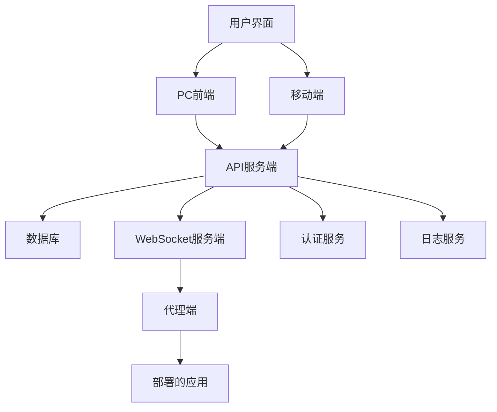
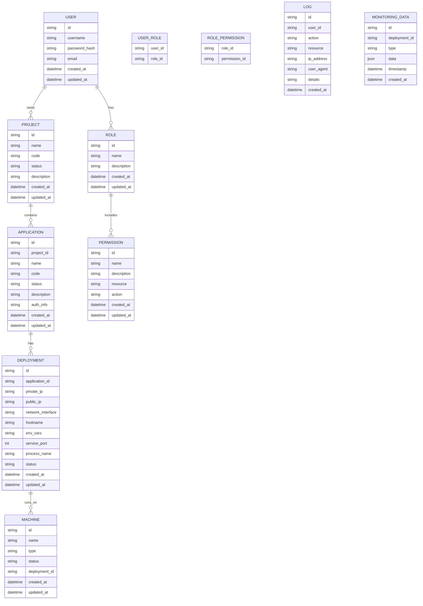
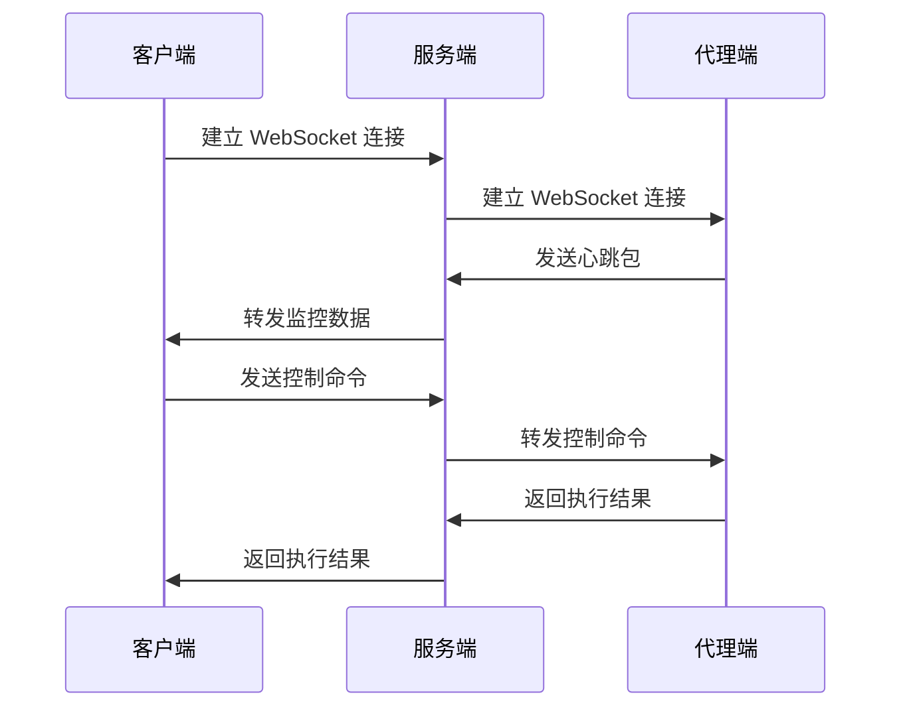
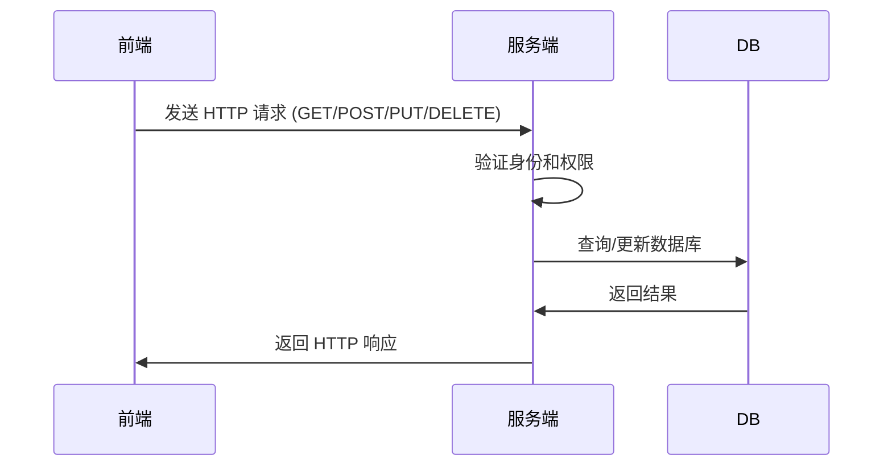
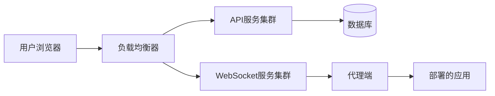

# AiOne MoniHub 项目结构设计

## 1. 概述

AiOne MoniHub 是一款集成化监控与管理平台，旨在为用户提供高效、便捷的远程应用管理解决方案。该平台支持用户通过 PC 或移动设备远程访问并管理其部署的应用程序，实现对应用状态的实时监控、启停控制等核心操作。

本项目采用 monorepo 结构，包含服务端（Rust Actix Web）、PC 前端（Shadcn + Tailwind CSS + Vite）和代理端（Java Spring Boot 和 JavaScript）三个主要部分。

## 2. 整体架构



## 3. 项目结构

```
aione-monihub/
├── README.md
├── LICENSE
├── Cargo.toml                    # Rust 工作区配置
├── package.json                  # 前端项目配置
├── apps/
│   ├── server/                   # Rust 服务端
│   │   ├── api/                  # REST API 服务
│   │   ├── websocket/            # WebSocket 服务
│   │   └── Cargo.toml
│   ├── frontend/                 # PC 前端
│   │   ├── index.html
│   │   ├── package.json
│   │   ├── vite.config.ts
│   │   ├── src/
│   │   │   ├── components/       # UI 组件
│   │   │   ├── pages/            # 页面组件
│   │   │   ├── hooks/            # 自定义 hooks
│   │   │   ├── lib/              # 工具库
│   │   │   └── App.tsx
│   │   └── public/
│   └── agent/                    # 代理端
│       ├── java/                 # Java 代理 (Spring Boot)
│       │   ├── pom.xml
│       │   └── src/
│       └── js/                   # JavaScript 代理
│           ├── package.json
│           └── src/
├── packages/                     # 共享包
│   ├── config/                   # 配置文件
│   ├── ui/                       # 共享 UI 组件
│   └── types/                    # 共享类型定义
├── docs/                         # 文档
└── docker/                       # Docker 配置
```

## 4. 各模块详细设计

### 4.1 服务端 (Rust Actix Web)

服务端采用 Rust 语言和 Actix Web 框架构建，分为 API 服务和 WebSocket 服务两个部分。

#### 4.1.1 API 服务
- 提供 RESTful API 接口
- 处理用户认证和授权
- 管理项目、应用、部署等业务逻辑
- 提供日志查询和导出功能

#### 4.1.2 WebSocket 服务
- 处理与代理端的实时通信
- 发送控制命令到代理端
- 接收监控数据并存储到数据库
- 实现心跳检测机制

### 4.2 PC 前端 (Shadcn + Tailwind CSS + Vite)

PC 前端使用现代化的前端技术栈构建，提供用户友好的界面。

#### 4.2.1 技术栈
- React 18 作为核心框架
- TypeScript 提供类型安全
- Vite 作为构建工具
- Shadcn UI 组件库
- Tailwind CSS 用于样式设计
- React Router 用于路由管理
- Zustand 用于状态管理

#### 4.2.2 功能模块
- 登录页面
- 项目管理页面
- 应用管理页面
- 部署管理页面
- 用户管理页面
- 角色权限管理页面
- 日志管理页面
- 机器管理页面

### 4.3 代理端

代理端包含多种语言实现，用于与部署的应用进行交互。

#### 4.3.1 Java 代理 (Spring Boot)
- 与服务端建立 WebSocket 连接
- 执行服务端发送的命令
- 收集监控数据并上报
- 实现文件管理功能
- 提供远程终端访问

##### 监控数据收集
- CPU 使用率
- 内存使用情况
- 磁盘使用情况
- 网络流量
- 进程信息
- 系统负载

##### 命令执行
- 启动/停止/重启应用
- 执行自定义命令
- 文件上传/下载/删除
- 远程终端命令执行

#### 4.3.2 JavaScript 代理
- 轻量级代理实现
- 适用于 Node.js 环境
- 基本的命令执行和数据上报功能

##### 监控数据收集
- CPU 使用率
- 内存使用情况
- 磁盘使用情况
- 网络流量

##### 命令执行
- 启动/停止应用
- 执行简单命令

## 5. 功能模块详细设计

### 5.1 登录页面
- 用户名/密码登录
- 多因素认证（可选）
- 忘记密码功能
- 邮箱重置密码

### 5.2 项目管理
- 创建、编辑、删除项目
- 项目字段：名称、编码、状态、简介
- 项目搜索和过滤功能

### 5.3 应用管理
- 创建、编辑、删除应用
- 应用字段：归属项目、名称、编码、状态、介绍、授权信息

### 5.4 部署管理
- 创建、编辑、删除部署
- 部署字段：关联应用、内网IP、公网IP、网卡标识、主机名称、环境变量、服务端口、进程名称、部署状态
- 远程终端访问
- 文件管理（上传、下载、删除）
- 系统监控（CPU、内存、磁盘使用情况）

#### 5.4.1 远程终端访问
- 通过 WebSocket 实现实时终端交互
- 支持多种 shell 类型 (bash, sh, cmd, powershell)
- 终端会话管理
- 终端输入输出流控制

#### 5.4.2 文件管理
- 文件浏览和目录结构查看
- 文件上传和下载
- 文件删除和重命名
- 文件内容查看和编辑
- 文件权限管理

### 5.5 用户管理
- 用户账号信息管理
- 用户添加、编辑、删除和禁用
- 用户角色分配

### 5.6 角色管理
- 角色定义和管理
- 角色权限配置

### 5.7 权限管理
- 菜单和操作按钮权限设置
- 权限批量分配和撤销

### 5.8 日志管理
- 登录日志和操作日志记录
- 日志搜索、过滤和导出

### 5.9 机器管理
- 机器添加、编辑、删除和查看
- 机器信息：名称、类型、状态、关联部署和应用
- 机器搜索和过滤

## 6. 数据库设计



### 6.1 监控数据表 (MONITORING_DATA)
- `id`: 监控数据唯一标识
- `deployment_id`: 关联的部署ID
- `type`: 数据类型 (cpu, memory, disk, network)
- `data`: 监控数据内容 (JSON格式)
- `timestamp`: 数据时间戳
- `created_at`: 记录创建时间

## 7. 核心技术原理

### 7.1 通讯原理
- 客户端与服务端之间使用 WebSocket 进行实时通信
- WebSocket 连接用于传输控制命令和接收实时监控数据
- 文件的上传和下载通过 HTTP 协议进行传输

### 7.2 数据上报机制
- 在应用中植入 SDK，实现对部署数据的自动上报
- SDK 定时收集监控数据（如：CPU使用率、内存使用率、网络流量等），并通过 WebSocket 连接上报至服务端
- 服务端接收到监控数据后，将其存储在数据库中

### 7.3 命令执行
- 服务端根据接收到的监控数据，分析并决定是否需要执行特定命令或操作
- 如果需要执行命令，服务端通过 WebSocket 连接将命令发送至客户端
- 客户端接收到命令后，执行相应的操作，并将执行结果反馈给服务端

## 8. API 端点设计

### 8.1 认证相关
- `POST /api/auth/login` - 用户登录
- `POST /api/auth/logout` - 用户登出
- `POST /api/auth/refresh` - 刷新 Token
- `POST /api/auth/forgot-password` - 忘记密码
- `POST /api/auth/reset-password` - 重置密码

### 8.2 项目管理
- `GET /api/projects` - 获取项目列表
- `POST /api/projects` - 创建项目
- `GET /api/projects/{id}` - 获取项目详情
- `PUT /api/projects/{id}` - 更新项目
- `DELETE /api/projects/{id}` - 删除项目

### 8.3 应用管理
- `GET /api/applications` - 获取应用列表
- `POST /api/applications` - 创建应用
- `GET /api/applications/{id}` - 获取应用详情
- `PUT /api/applications/{id}` - 更新应用
- `DELETE /api/applications/{id}` - 删除应用

### 8.4 部署管理
- `GET /api/deployments` - 获取部署列表
- `POST /api/deployments` - 创建部署
- `GET /api/deployments/{id}` - 获取部署详情
- `PUT /api/deployments/{id}` - 更新部署
- `DELETE /api/deployments/{id}` - 删除部署

#### 8.4.1 远程终端相关
- `POST /api/deployments/{id}/terminal` - 初始化终端会话
- `DELETE /api/deployments/{id}/terminal` - 关闭终端会话
- `POST /api/deployments/{id}/terminal/input` - 发送终端输入

#### 8.4.2 文件管理相关
- `GET /api/deployments/{id}/files` - 获取文件列表
- `GET /api/deployments/{id}/files/{path}` - 获取文件内容
- `POST /api/deployments/{id}/files` - 上传文件
- `PUT /api/deployments/{id}/files/{path}` - 更新文件
- `DELETE /api/deployments/{id}/files/{path}` - 删除文件

### 8.5 用户管理
- `GET /api/users` - 获取用户列表
- `POST /api/users` - 创建用户
- `GET /api/users/{id}` - 获取用户详情
- `PUT /api/users/{id}` - 更新用户
- `DELETE /api/users/{id}` - 删除用户

### 8.6 角色管理
- `GET /api/roles` - 获取角色列表
- `POST /api/roles` - 创建角色
- `GET /api/roles/{id}` - 获取角色详情
- `PUT /api/roles/{id}` - 更新角色
- `DELETE /api/roles/{id}` - 删除角色

### 8.7 权限管理
- `GET /api/permissions` - 获取权限列表
- `POST /api/permissions` - 创建权限
- `GET /api/permissions/{id}` - 获取权限详情
- `PUT /api/permissions/{id}` - 更新权限
- `DELETE /api/permissions/{id}` - 删除权限

### 8.8 日志管理
- `GET /api/logs` - 获取日志列表
- `POST /api/logs/export` - 导出日志

### 8.9 机器管理
- `GET /api/machines` - 获取机器列表
- `POST /api/machines` - 创建机器
- `GET /api/machines/{id}` - 获取机器详情
- `PUT /api/machines/{id}` - 更新机器
- `DELETE /api/machines/{id}` - 删除机器

## 9. WebSocket 消息格式

### 9.1 服务端到代理端消息
```json
{
  "type": "command",
  "id": "unique_command_id",
  "action": "start|stop|restart|execute|terminal|file",
  "target": "deployment_id",
  "payload": {
    // 命令特定参数
  }
}
```

#### 9.1.1 终端命令消息
```json
{
  "type": "command",
  "id": "terminal_001",
  "action": "terminal",
  "target": "deployment_123",
  "payload": {
    "operation": "init|input|close",
    "shell": "bash",
    "data": "ls -la"
  }
}
```

#### 9.1.2 文件操作命令消息
```json
{
  "type": "command",
  "id": "file_001",
  "action": "file",
  "target": "deployment_123",
  "payload": {
    "operation": "list|read|write|delete",
    "path": "/path/to/file",
    "content": "file content"
  }
}
```

### 9.2 代理端到服务端消息
```json
{
  "type": "heartbeat|data|result|terminal|file",
  "deploymentId": "deployment_id",
  "payload": {
    // 监控数据或执行结果
  }
}
```

#### 9.2.1 终端响应消息
```json
{
  "type": "terminal",
  "deploymentId": "deployment_123",
  "payload": {
    "sessionId": "terminal_001",
    "output": "command output",
    "error": "error message if any"
  }
}
```

#### 9.2.2 文件操作响应消息
```json
{
  "type": "file",
  "deploymentId": "deployment_123",
  "payload": {
    "operation": "list|read|write|delete",
    "path": "/path/to/file",
    "content": "file content",
    "files": [
      {"name": "file1.txt", "type": "file", "size": 1024},
      {"name": "dir1", "type": "directory"}
    ],
    "result": "success|failure",
    "message": "operation result message"
  }
}
```

### 9.3 监控数据结构

#### 9.3.1 CPU 监控数据
```json
{
  "type": "cpu",
  "timestamp": "2023-01-01T00:00:00Z",
  "data": {
    "usage": 45.2,
    "cores": [
      {"core": 0, "usage": 32.1},
      {"core": 1, "usage": 58.3}
    ]
  }
}
```

#### 9.3.2 内存监控数据
```json
{
  "type": "memory",
  "timestamp": "2023-01-01T00:00:00Z",
  "data": {
    "total": 8589934592,
    "used": 4294967296,
    "free": 4294967296,
    "usage": 50.0
  }
}
```

#### 9.3.3 磁盘监控数据
```json
{
  "type": "disk",
  "timestamp": "2023-01-01T00:00:00Z",
  "data": {
    "total": 107374182400,
    "used": 53687091200,
    "free": 53687091200,
    "usage": 50.0
  }
}
```

#### 9.3.4 网络监控数据
```json
{
  "type": "network",
  "timestamp": "2023-01-01T00:00:00Z",
  "data": {
    "bytes_sent": 1024000,
    "bytes_recv": 2048000,
    "packets_sent": 1000,
    "packets_recv": 2000
  }
}
```

### 9.3 服务端到前端消息
```json
{
  "type": "notification|update",
  "resource": "deployment|application|project",
  "action": "created|updated|deleted",
  "data": {
    // 更新的数据
  }
}
```

## 10. 通信机制

### 10.1 WebSocket 通信


### 10.2 HTTP API 通信


## 11. 安全设计

### 11.1 认证机制
- 用户名/密码认证
- JWT Token 认证
- 多因素认证（可选）

### 11.2 授权机制
- 基于角色的访问控制 (RBAC)
- 细粒度权限控制
- API 访问控制

### 11.3 数据安全
- 敏感数据加密存储
- HTTPS 通信加密
- WebSocket 通信加密

## 12. 部署架构



## 13. 总结

本设计文档详细描述了 AiOne MoniHub 监控管理平台的整体架构和各模块设计。系统采用现代化的技术栈，包括 Rust、React、Spring Boot 等，通过 monorepo 结构组织代码，便于维护和扩展。

系统核心功能包括项目管理、应用管理、部署管理、用户权限管理、日志管理和机器管理等，能够满足用户对远程应用的监控和管理需求。通过 WebSocket 实现实时通信，支持远程终端访问和文件管理等高级功能。

安全性方面，系统采用了 JWT 认证、RBAC 权限控制等机制，确保系统安全可靠。可扩展性方面，系统采用微服务架构设计，便于后续功能扩展和性能优化。