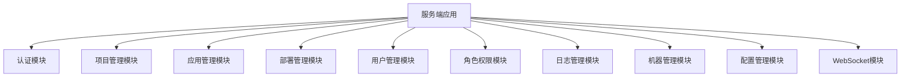
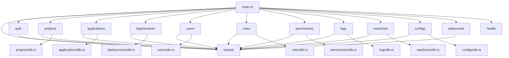

# 服务端模块拆分设计文档

## 1. 概述

本文档描述了将当前单体式的服务端项目按照功能模块进行拆分的设计方案。通过模块化拆分，可以提高代码的可维护性、可扩展性和团队协作效率。

### 1.1 当前问题

目前服务端项目将所有功能都放在`api/src`目录下，包含以下文件：
- `main.rs` - 应用入口和路由配置
- `handlers.rs` - 所有API处理函数（1400+行）
- `models.rs` - 所有数据模型定义
- `db.rs` - 数据库操作相关代码
- `auth.rs` - 认证授权相关功能
- `errors.rs` - 错误处理定义
- `websocket.rs` - WebSocket相关功能

### 1.2 拆分目标

1. 按业务功能将代码拆分为独立模块
2. 每个模块包含自己的路由、处理函数、数据模型和数据库操作
3. 保持现有功能不变，仅重构代码结构
4. 提高代码可读性和维护性

## 2. 模块拆分方案

### 2.1 模块划分

根据当前API端点的功能，将系统划分为以下模块：



### 2.2 模块目录结构

拆分后的目录结构如下：

```
apps/server/
├── Cargo.toml
├── api/
│   ├── src/
│   │   ├── main.rs
│   │   ├── lib.rs
│   │   ├── auth/
│   │   │   ├── mod.rs
│   │   │   ├── handlers.rs
│   │   │   ├── models.rs
│   │   │   └── routes.rs
│   │   ├── projects/
│   │   │   ├── mod.rs
│   │   │   ├── handlers.rs
│   │   │   ├── models.rs
│   │   │   ├── db.rs
│   │   │   └── routes.rs
│   │   ├── applications/
│   │   │   ├── mod.rs
│   │   │   ├── handlers.rs
│   │   │   ├── models.rs
│   │   │   ├── db.rs
│   │   │   └── routes.rs
│   │   ├── deployments/
│   │   │   ├── mod.rs
│   │   │   ├── handlers.rs
│   │   │   ├── models.rs
│   │   │   ├── db.rs
│   │   │   └── routes.rs
│   │   ├── users/
│   │   │   ├── mod.rs
│   │   │   ├── handlers.rs
│   │   │   ├── models.rs
│   │   │   ├── db.rs
│   │   │   └── routes.rs
│   │   ├── roles/
│   │   │   ├── mod.rs
│   │   │   ├── handlers.rs
│   │   │   ├── models.rs
│   │   │   ├── db.rs
│   │   │   └── routes.rs
│   │   ├── permissions/
│   │   │   ├── mod.rs
│   │   │   ├── handlers.rs
│   │   │   ├── models.rs
│   │   │   ├── db.rs
│   │   │   └── routes.rs
│   │   ├── logs/
│   │   │   ├── mod.rs
│   │   │   ├── handlers.rs
│   │   │   ├── models.rs
│   │   │   ├── db.rs
│   │   │   └── routes.rs
│   │   ├── machines/
│   │   │   ├── mod.rs
│   │   │   ├── handlers.rs
│   │   │   ├── models.rs
│   │   │   ├── db.rs
│   │   │   └── routes.rs
│   │   ├── configs/
│   │   │   ├── mod.rs
│   │   │   ├── handlers.rs
│   │   │   ├── models.rs
│   │   │   ├── db.rs
│   │   │   └── routes.rs
│   │   ├── websocket/
│   │   │   ├── mod.rs
│   │   │   ├── handlers.rs
│   │   │   ├── models.rs
│   │   │   └── server.rs
│   │   ├── shared/
│   │   │   ├── mod.rs
│   │   │   ├── error.rs
│   │   │   └── database.rs
│   │   └── health/
│   │       ├── mod.rs
│   │       ├── handlers.rs
│   │       └── routes.rs
```

## 3. 各模块详细设计

### 3.1 公共模块 (shared)

公共模块包含所有模块都会使用的组件：

**shared/error.rs**
- 包含ApiError枚举定义
- 实现ResponseError trait
- 实现各种From trait转换

**shared/database.rs**
- Database结构体定义
- 数据库连接管理
- 通用数据库操作方法

### 3.2 认证模块 (auth)

**auth/models.rs**
- LoginRequest/Response结构体
- ForgotPasswordRequest/Response结构体
- ResetPasswordRequest/Response结构体
- Claims结构体（JWT）

**auth/handlers.rs**
- login处理函数
- forgot_password处理函数
- reset_password处理函数
- validate_token中间件函数

**auth/routes.rs**
- 定义认证相关路由：
  - `/api/v1/auth/login`
  - `/api/v1/auth/forgot-password`
  - `/api/v1/auth/reset-password`

### 3.3 项目管理模块 (projects)

**projects/models.rs**
- Project结构体（数据库模型）
- ProjectResponse结构体（API响应）
- ProjectCreateRequest/ProjectUpdateRequest结构体（API请求）

**projects/db.rs**
- create_project函数
- get_project_by_id函数
- get_projects函数
- update_project函数
- delete_project函数

**projects/handlers.rs**
- get_projects处理函数
- create_project处理函数
- get_project处理函数
- update_project处理函数
- delete_project处理函数

**projects/routes.rs**
- 定义项目管理相关路由：
  - `/api/v1/projects` (GET, POST)
  - `/api/v1/projects/{id}` (GET, PUT, DELETE)

### 3.4 应用管理模块 (applications)

**applications/models.rs**
- Application结构体（数据库模型）
- ApplicationResponse结构体（API响应）
- ApplicationCreateRequest/ApplicationUpdateRequest结构体（API请求）
- Authorization结构体

**applications/db.rs**
- create_application函数
- get_application_by_id函数
- get_applications函数
- update_application函数
- delete_application函数

**applications/handlers.rs**
- get_applications处理函数
- create_application处理函数
- get_application处理函数
- update_application处理函数
- delete_application处理函数

**applications/routes.rs**
- 定义应用管理相关路由：
  - `/api/v1/applications` (GET, POST)
  - `/api/v1/applications/{id}` (GET, PUT, DELETE)

### 3.5 部署管理模块 (deployments)

**deployments/models.rs**
- Deployment结构体（数据库模型）
- DeploymentResponse结构体（API响应）
- DeploymentCreateRequest/DeploymentUpdateRequest结构体（API请求）

**deployments/db.rs**
- create_deployment函数
- get_deployment_by_id函数
- get_deployments函数
- update_deployment函数
- delete_deployment函数
- get_deployment_monitoring函数

**deployments/handlers.rs**
- get_deployments处理函数
- create_deployment处理函数
- get_deployment处理函数
- update_deployment处理函数
- delete_deployment处理函数
- get_deployment_monitoring处理函数
- 文件管理相关处理函数

**deployments/routes.rs**
- 定义部署管理相关路由：
  - `/api/v1/deployments` (GET, POST)
  - `/api/v1/deployments/{id}` (GET, PUT, DELETE)
  - `/api/v1/deployments/{id}/monitoring` (GET)
  - 文件管理相关路由

### 3.6 用户管理模块 (users)

**users/models.rs**
- User结构体（数据库模型）
- UserResponse结构体（API响应）
- UserCreateRequest/UserUpdateRequest结构体（API请求）

**users/db.rs**
- create_user函数
- get_user_by_id函数
- get_users函数
- update_user函数
- delete_user函数
- disable_user函数
- enable_user函数

**users/handlers.rs**
- get_users处理函数
- create_user处理函数
- get_user处理函数
- update_user处理函数
- delete_user处理函数
- disable_user处理函数
- enable_user处理函数

**users/routes.rs**
- 定义用户管理相关路由：
  - `/api/v1/users` (GET, POST)
  - `/api/v1/users/{id}` (GET, PUT, DELETE)
  - `/api/v1/users/{id}/disable` (POST)
  - `/api/v1/users/{id}/enable` (POST)

### 3.7 角色权限模块 (roles & permissions)

**roles/models.rs**
- Role结构体（数据库模型）
- RoleResponse结构体（API响应）
- RoleCreateRequest/RoleUpdateRequest结构体（API请求）

**roles/db.rs**
- create_role函数
- get_role_by_id函数
- get_roles函数
- update_role函数
- delete_role函数

**roles/handlers.rs**
- get_roles处理函数
- create_role处理函数
- get_role处理函数
- update_role处理函数
- delete_role处理函数

**roles/routes.rs**
- 定义角色管理相关路由：
  - `/api/v1/roles` (GET, POST)
  - `/api/v1/roles/{id}` (GET, PUT, DELETE)

**permissions/models.rs**
- Permission结构体（数据库模型）
- PermissionResponse结构体（API响应）
- PermissionCreateRequest结构体（API请求）

**permissions/db.rs**
- create_permission函数
- get_permission_by_id函数
- get_permissions函数
- assign_permissions函数
- revoke_permissions函数

**permissions/handlers.rs**
- get_permissions处理函数
- create_permission处理函数
- assign_permissions处理函数
- revoke_permissions处理函数

**permissions/routes.rs**
- 定义权限管理相关路由：
  - `/api/v1/permissions` (GET, POST)
  - `/api/v1/permissions/assign` (POST)
  - `/api/v1/permissions/revoke` (POST)

### 3.8 日志管理模块 (logs)

**logs/models.rs**
- Log结构体（数据库模型）
- LogResponse结构体（API响应）
- LogExportRequest结构体（API请求）

**logs/db.rs**
- create_log函数
- get_log_by_id函数
- get_logs函数
- export_logs函数

**logs/handlers.rs**
- get_logs处理函数
- export_logs处理函数

**logs/routes.rs**
- 定义日志管理相关路由：
  - `/api/v1/logs` (GET)
  - `/api/v1/logs/export` (GET)

### 3.9 机器管理模块 (machines)

**machines/models.rs**
- Machine结构体（数据库模型）
- MachineResponse结构体（API响应）
- MachineCreateRequest/MachineUpdateRequest结构体（API请求）

**machines/db.rs**
- create_machine函数
- get_machine_by_id函数
- get_machines函数
- update_machine函数
- delete_machine函数
- get_machine_monitoring_data函数

**machines/handlers.rs**
- get_machines处理函数
- create_machine处理函数
- get_machine处理函数
- update_machine处理函数
- delete_machine处理函数
- get_machine_monitoring_data处理函数

**machines/routes.rs**
- 定义机器管理相关路由：
  - `/api/v1/machines` (GET, POST)
  - `/api/v1/machines/{id}` (GET, PUT, DELETE)
  - `/api/v1/machines/{id}/monitoring-data` (GET)

### 3.10 配置管理模块 (configs)

**configs/models.rs**
- Config结构体（数据库模型）
- ConfigResponse结构体（API响应）
- ConfigCreateRequest结构体（API请求）

**configs/db.rs**
- create_config函数
- get_config_by_id函数
- get_configs函数
- delete_config函数
- get_config_by_code函数
- get_config_by_code_and_environment函数
- get_config_by_code_env_and_version函数

**configs/handlers.rs**
- get_configs处理函数
- create_config处理函数
- delete_config处理函数
- get_config_by_code处理函数
- get_config_by_code_and_environment处理函数
- get_config_by_code_env_and_version处理函数

**configs/routes.rs**
- 定义配置管理相关路由：
  - `/api/v1/configs` (GET, POST)
  - `/api/v1/configs/code/{code}` (GET)
  - `/api/v1/configs/code/{code}/environment/{environment}` (GET)
  - `/api/v1/configs/code/{code}/environment/{environment}/version/{version}` (GET)
  - `/api/v1/configs/{id}` (DELETE)

### 3.11 WebSocket模块 (websocket)

**websocket/models.rs**
- WsMessage结构体
- Connect/Disconnect/ClientMessage结构体

**websocket/server.rs**
- WsServer结构体及其实现
- WsSession结构体及其实现

**websocket/handlers.rs**
- terminal_websocket处理函数

### 3.12 健康检查模块 (health)

**health/handlers.rs**
- health处理函数

**health/routes.rs**
- 定义健康检查路由：
  - `/health` (GET)

## 4. 模块间依赖关系



## 5. 实施步骤

### 5.1 准备工作
1. 创建各模块目录结构
2. 创建模块的mod.rs文件
3. 设置模块导出

### 5.2 代码迁移
1. 将相关数据模型迁移到对应模块的models.rs
2. 将数据库操作迁移到对应模块的db.rs
3. 将处理函数迁移到对应模块的handlers.rs
4. 将路由定义迁移到对应模块的routes.rs

### 5.3 依赖调整
1. 更新main.rs中的模块导入
2. 更新各模块间的引用关系
3. 调整Cargo.toml（如需要）

### 5.4 测试验证
1. 确保所有路由正常工作
2. 验证数据库操作正确性
3. 确认错误处理机制正常

## 6. 预期收益

1. **提高可维护性**：每个模块职责单一，代码更清晰
2. **增强可扩展性**：添加新功能时只需关注特定模块
3. **改善团队协作**：不同团队可以并行开发不同模块
4. **便于测试**：每个模块可以独立进行单元测试
5. **提高代码复用性**：共享模块可以被多个业务模块使用