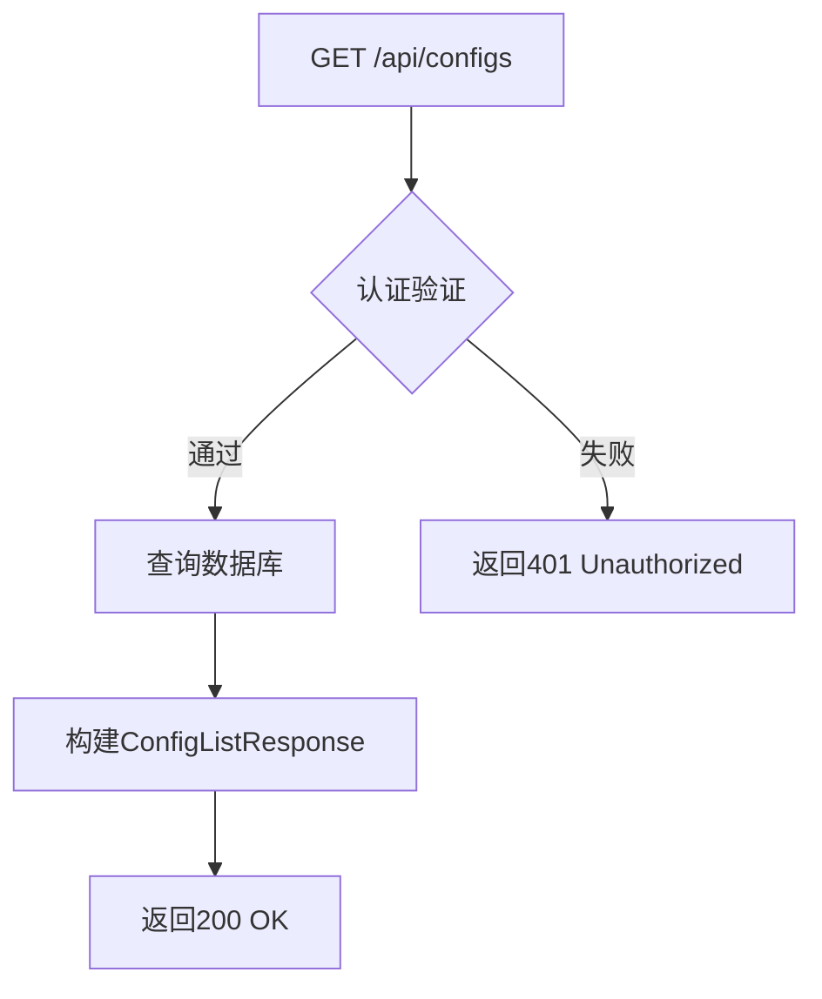
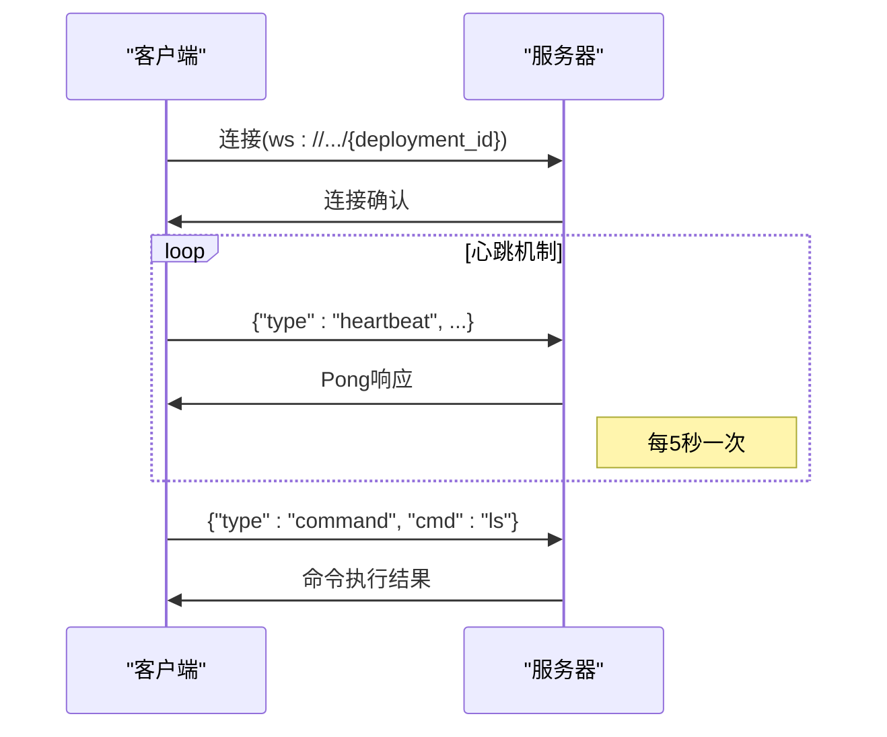

# API参考

<cite>
**本文档中引用的文件**  
- [main.rs](file://apps/server/src/main.rs)
- [models.rs](file://apps/server/src/configs/models.rs)
- [routes.rs](file://apps/server/src/configs/routes.rs)
- [handlers.rs](file://apps/server/src/configs/handlers.rs)
- [users/models.rs](file://apps/server/src/users/models.rs)
- [users/routes.rs](file://apps/server/src/users/routes.rs)
- [users/handlers.rs](file://apps/server/src/users/handlers.rs)
- [websocket/models.rs](file://apps/server/src/websocket/models.rs)
- [websocket/routes.rs](file://apps/server/src/websocket/routes.rs)
- [websocket/server.rs](file://apps/server/src/websocket/server.rs)
- [websocket/handlers.rs](file://apps/server/src/websocket/handlers.rs)
- [auth/models.rs](file://apps/server/src/auth/models.rs)
</cite>

## 目录
1. [简介](#简介)
2. [RESTful API 端点](#restful-api-端点)
3. [WebSocket API](#websocket-api)
4. [认证与安全](#认证与安全)
5. [错误码说明](#错误码说明)
6. [速率限制](#速率限制)
7. [Swagger UI 集成](#swagger-ui-集成)

## 简介
AiOne MoniHub 提供了一套完整的 RESTful 和 WebSocket API，用于管理用户、项目、配置和实时日志。本 API 文档基于 Utoipa 生成的 OpenAPI 规范，详细描述了所有可用端点、请求/响应结构、认证机制和使用示例。

**Section sources**
- [main.rs](file://apps/server/src/main.rs#L0-L160)

## RESTful API 端点

### 配置管理 API

#### 获取所有配置
- **HTTP 方法**: GET
- **URL 路径**: `/api/configs`
- **请求头**: `Authorization: Bearer <token>`
- **查询参数**:
  - `page`: 页码（可选）
  - `limit`: 每页数量（可选）
  - `search`: 搜索关键字（可选）
  - `type_`: 配置类型（可选）
  - `environment`: 环境名称（可选）
- **响应格式**: `ConfigListResponse`



**Diagram sources**
- [routes.rs](file://apps/server/src/configs/routes.rs#L0-L11)
- [handlers.rs](file://apps/server/src/configs/handlers.rs#L34-L76)

**Section sources**
- [models.rs](file://apps/server/src/configs/models.rs#L0-L80)
- [handlers.rs](file://apps/server/src/configs/handlers.rs#L34-L76)

#### 创建配置
- **HTTP 方法**: POST
- **URL 路径**: `/api/configs`
- **请求头**: `Authorization: Bearer <token>`
- **请求体 JSON 结构**:
```json
{
  "code": "string",
  "environment": "string",
  "name": "string",
  "type_": "string",
  "content": "string",
  "description": "string"
}
```
- **响应格式**: `ConfigResponse`

**Section sources**
- [models.rs](file://apps/server/src/configs/models.rs#L0-L50)
- [handlers.rs](file://apps/server/src/configs/handlers.rs#L34-L76)

#### 根据代码获取配置
- **HTTP 方法**: GET
- **URL 路径**: `/api/configs/code/{code}`
- **请求头**: `Authorization: Bearer <token>`
- **路径参数**: `code` (配置代码)
- **响应格式**: `ConfigListResponse`

**Section sources**
- [routes.rs](file://apps/server/src/configs/routes.rs#L0-L11)
- [handlers.rs](file://apps/server/src/configs/handlers.rs#L74-L113)

#### 根据代码和环境获取配置
- **HTTP 方法**: GET
- **URL 路径**: `/api/configs/code/{code}/environment/{environment}`
- **请求头**: `Authorization: Bearer <token>`
- **路径参数**: 
  - `code`: 配置代码
  - `environment`: 环境名称
- **响应格式**: `ConfigResponse`

**Section sources**
- [routes.rs](file://apps/server/src/configs/routes.rs#L0-L11)
- [handlers.rs](file://apps/server/src/configs/handlers.rs#L148-L184)

#### 根据代码、环境和版本获取配置
- **HTTP 方法**: GET
- **URL 路径**: `/api/configs/code/{code}/environment/{environment}/version/{version}`
- **请求头**: `Authorization: Bearer <token>`
- **路径参数**: 
  - `code`: 配置代码
  - `environment`: 环境名称
  - `version`: 配置版本
- **响应格式**: `ConfigResponse`

**Section sources**
- [handlers.rs](file://apps/server/src/configs/handlers.rs#L183-L219)

#### 删除配置
- **HTTP 方法**: DELETE
- **URL 路径**: `/api/configs/{id}`
- **请求头**: `Authorization: Bearer <token>`
- **路径参数**: `id` (配置ID)
- **响应**: 200 OK

**Section sources**
- [routes.rs](file://apps/server/src/configs/routes.rs#L0-L11)
- [handlers.rs](file://apps/server/src/configs/handlers.rs#L183-L219)

### 用户管理 API

#### 获取所有用户
- **HTTP 方法**: GET
- **URL 路径**: `/api/users`
- **请求头**: `Authorization: Bearer <token>`
- **查询参数**:
  - `page`: 页码（可选）
  - `limit`: 每页数量（可选）
  - `search`: 搜索关键字（可选）
  - `status`: 用户状态（可选）
- **响应格式**: `UserListResponse`

**Section sources**
- [users/routes.rs](file://apps/server/src/users/routes.rs#L0-L12)
- [users/models.rs](file://apps/server/src/users/models.rs#L0-L66)

#### 创建用户
- **HTTP 方法**: POST
- **URL 路径**: `/api/users`
- **请求头**: `Authorization: Bearer <token>`
- **请求体 JSON 结构**:
```json
{
  "username": "string",
  "email": "string",
  "password": "string",
  "status": "string"
}
```
- **响应格式**: `UserResponse`

**Section sources**
- [users/routes.rs](file://apps/server/src/users/routes.rs#L0-L12)
- [users/models.rs](file://apps/server/src/users/models.rs#L0-L66)

#### 获取单个用户
- **HTTP 方法**: GET
- **URL 路径**: `/api/users/{id}`
- **请求头**: `Authorization: Bearer <token>`
- **路径参数**: `id` (用户ID)
- **响应格式**: `UserResponse`

**Section sources**
- [users/routes.rs](file://apps/server/src/users/routes.rs#L0-L12)

#### 更新用户
- **HTTP 方法**: PUT
- **URL 路径**: `/api/users/{id}`
- **请求头**: `Authorization: Bearer <token>`
- **路径参数**: `id` (用户ID)
- **请求体 JSON 结构**:
```json
{
  "username": "string",
  "email": "string",
  "status": "string"
}
```
- **响应格式**: `UserResponse`

**Section sources**
- [users/routes.rs](file://apps/server/src/users/routes.rs#L0-L12)

#### 删除用户
- **HTTP 方法**: DELETE
- **URL 路径**: `/api/users/{id}`
- **请求头**: `Authorization: Bearer <token>`
- **路径参数**: `id` (用户ID)
- **响应**: 200 OK

**Section sources**
- [users/routes.rs](file://apps/server/src/users/routes.rs#L0-L12)

#### 禁用用户
- **HTTP 方法**: POST
- **URL 路径**: `/api/users/{id}/disable`
- **请求头**: `Authorization: Bearer <token>`
- **路径参数**: `id` (用户ID)
- **响应**: 200 OK

**Section sources**
- [users/routes.rs](file://apps/server/src/users/routes.rs#L0-L12)

#### 启用用户
- **HTTP 方法**: POST
- **URL 路径**: `/api/users/{id}/enable`
- **请求头**: `Authorization: Bearer <token>`
- **路径参数**: `id` (用户ID)
- **响应**: 200 OK

**Section sources**
- [users/routes.rs](file://apps/server/src/users/routes.rs#L0-L12)

## WebSocket API

### 终端 WebSocket 连接
- **连接 URL**: `ws://localhost:9080/api/websocket/terminal/{deployment_id}`
- **消息格式**: 文本消息 (JSON)
- **事件类型**:
  - `heartbeat`: 心跳消息
  - `command`: 执行命令
- **心跳机制**: 客户端每5秒发送一次心跳，服务器每10秒检查一次连接状态



**Diagram sources**
- [websocket/routes.rs](file://apps/server/src/websocket/routes.rs#L0-L5)
- [websocket/server.rs](file://apps/server/src/websocket/server.rs#L0-L156)
- [websocket/handlers.rs](file://apps/server/src/websocket/handlers.rs#L0-L21)

**Section sources**
- [websocket/models.rs](file://apps/server/src/websocket/models.rs#L0-L28)
- [websocket/server.rs](file://apps/server/src/websocket/server.rs#L0-L156)

## 认证与安全

### Bearer Token 认证
所有 RESTful API 端点都需要在请求头中包含 Bearer Token：
```
Authorization: Bearer <your-jwt-token>
```

### 登录认证
- **HTTP 方法**: POST
- **URL 路径**: `/api/auth/login`
- **请求体**:
```json
{
  "username": "string",
  "password": "string"
}
```
- **响应**:
```json
{
  "token": "jwt-token-string",
  "user": {
    "id": "string",
    "username": "string",
    "email": "string",
    "roles": ["string"]
  },
  "timestamp": 1234567890,
  "trace_id": "uuid-string"
}
```

**Section sources**
- [auth/models.rs](file://apps/server/src/auth/models.rs#L0-L46)

## 错误码说明
- **401 Unauthorized**: 认证失败，缺少或无效的 Bearer Token
- **403 Forbidden**: 权限不足，无法访问该资源
- **404 Not Found**: 请求的资源不存在
- **429 Too Many Requests**: 请求过于频繁，已达到速率限制
- **500 Internal Server Error**: 服务器内部错误

**Section sources**
- [handlers.rs](file://apps/server/src/configs/handlers.rs#L34-L219)

## 速率限制
系统对 API 请求实施速率限制策略：
- 每分钟最多 100 个请求
- 超过限制将返回 429 状态码
- 建议客户端实现指数退避重试机制

## Swagger UI 集成
系统集成了 Swagger UI 自动生成文档页面：
- **访问路径**: `http://localhost:9080/swagger-ui/`
- **OpenAPI 规范路径**: `http://localhost:9080/api-docs/openapi.json`
- **功能**: 提供交互式 API 文档，支持直接在浏览器中测试 API 端点

**Section sources**
- [main.rs](file://apps/server/src/main.rs#L127-L160)