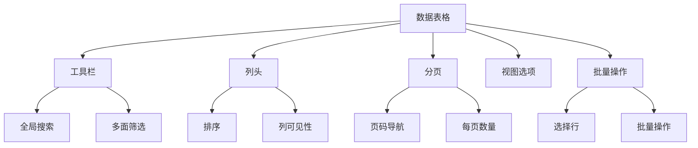
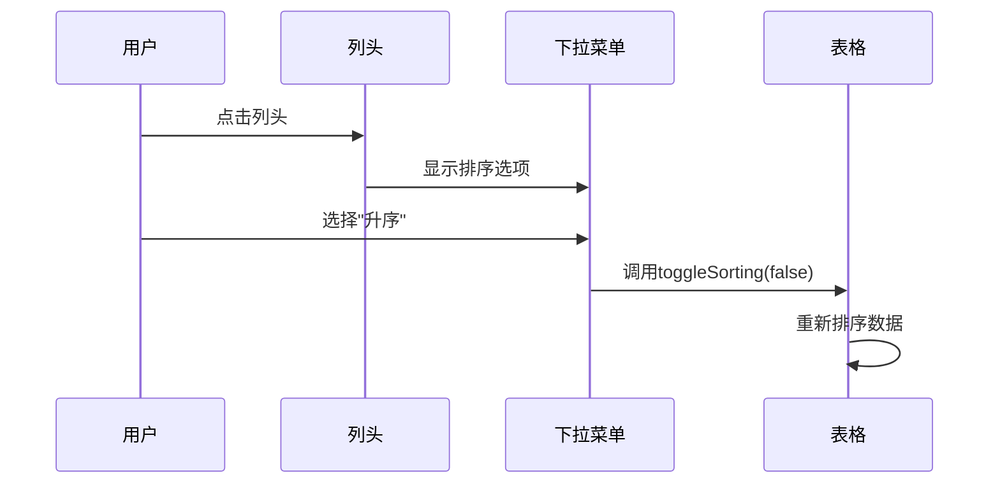
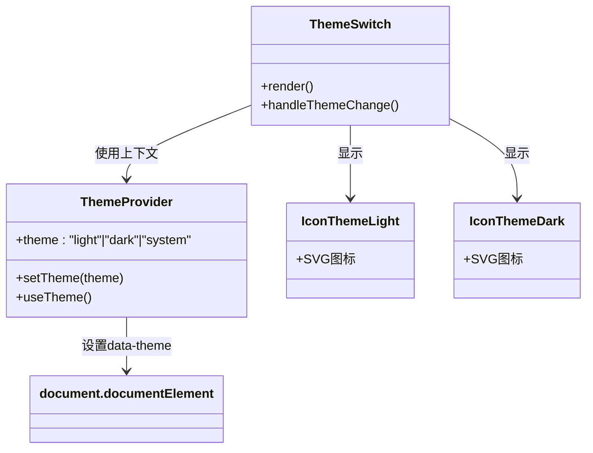

# UI组件库

<cite>
**本文档中引用的文件**  
- [button.tsx](file://apps/frontend/src/components/ui/button.tsx)
- [card.tsx](file://apps/frontend/src/components/ui/card.tsx)
- [table.tsx](file://apps/frontend/src/components/ui/table.tsx)
- [command.tsx](file://apps/frontend/src/components/ui/command.tsx)
- [theme-switch.tsx](file://apps/frontend/src/components/theme-switch.tsx)
- [app-sidebar.tsx](file://apps/frontend/src/components/layout/app-sidebar.tsx)
- [authenticated-layout.tsx](file://apps/frontend/src/components/layout/authenticated-layout.tsx)
- [command-menu.tsx](file://apps/frontend/src/components/command-menu.tsx)
- [pagination.tsx](file://apps/frontend/src/components/data-table/pagination.tsx)
- [column-header.tsx](file://apps/frontend/src/components/data-table/column-header.tsx)
- [faceted-filter.tsx](file://apps/frontend/src/components/data-table/faceted-filter.tsx)
- [toolbar.tsx](file://apps/frontend/src/components/data-table/toolbar.tsx)
- [bulk-actions.tsx](file://apps/frontend/src/components/data-table/bulk-actions.tsx)
- [view-options.tsx](file://apps/frontend/src/components/data-table/view-options.tsx)
- [theme-provider.tsx](file://apps/frontend/src/context/theme-provider.tsx)
- [icon-theme-light.tsx](file://apps/frontend/src/assets/custom/icon-theme-light.tsx)
- [icon-theme-dark.tsx](file://apps/frontend/src/assets/custom/icon-theme-dark.tsx)
</cite>

## 目录
1. [简介](#简介)
2. [基础UI组件](#基础ui组件)
3. [数据表格组件](#数据表格组件)
4. [布局组件](#布局组件)
5. [功能型组件](#功能型组件)
6. [主题与可访问性](#主题与可访问性)
7. [使用建议](#使用建议)

## 简介
本组件库基于shadcn/ui构建，提供了一套现代化、可访问性强、响应式且支持主题切换的React UI组件。所有组件均采用Tailwind CSS进行样式控制，通过`class-variance-authority`实现灵活的变体管理，并集成`@radix-ui`的无障碍原语，确保符合WCAG标准。组件库位于`components/ui`目录下，通过`components.json`进行自动化管理，支持按需导入和Tree Shaking。

## 基础UI组件

### 按钮组件 (Button)
提供多种样式变体和尺寸选项，支持图标嵌入和无障碍访问。

**Props接口定义**
- `variant`: "default" | "destructive" | "outline" | "secondary" | "ghost" | "link"
- `size`: "default" | "sm" | "lg" | "icon"
- `asChild`: boolean (使用Slot模式包装子元素)
- 继承原生button元素的所有属性

**视觉状态**
- 默认：根据variant显示对应背景和文本颜色
- 悬停：背景色变暗10%，添加轻微阴影
- 焦点：显示环形轮廓线，符合无障碍标准
- 禁用：透明度降低至50%，指针事件禁用

**使用示例**
```tsx
<Button variant="default" size="lg">主按钮</Button>
<Button variant="outline" asChild><a href="#">链接按钮</a></Button>
```

**Section sources**
- [button.tsx](file://apps/frontend/src/components/ui/button.tsx#L1-L58)

### 卡片组件 (Card)
提供结构化的信息展示容器，包含标题、描述、内容和操作区域。

**组件结构**
- `Card`: 主容器
- `CardHeader`: 头部区域
- `CardTitle`: 标题
- `CardDescription`: 描述文本
- `CardAction`: 右上角操作按钮
- `CardContent`: 内容主体
- `CardFooter`: 底部区域

**响应式设计**
- 在小屏幕上自动调整为单列布局
- 支持容器查询（@container）进行精细控制

**Section sources**
- [card.tsx](file://apps/frontend/src/components/ui/card.tsx#L1-L91)

### 表格组件 (Table)
基于语义化HTML表格构建，提供完整的无障碍支持和样式控制。

**组件结构**
- `Table`: 表格容器
- `TableHeader`: 表头
- `TableBody`: 表体
- `TableFooter`: 表尾
- `TableHead`: 表头单元格
- `TableRow`: 表行
- `TableCell`: 表数据单元格
- `TableCaption`: 表格说明

**可访问性特性**
- 使用`role=checkbox`时自动调整对齐
- 行悬停时背景色变化，选中行有特殊标记
- 支持键盘导航

**Section sources**
- [table.tsx](file://apps/frontend/src/components/ui/table.tsx#L1-L113)

## 数据表格组件

### 核心功能概述
`data-table`组件集成为企业级数据展示提供完整解决方案，包含分页、排序、筛选、批量操作等功能，基于`@tanstack/react-table`构建。



**Diagram sources**
- [index.ts](file://apps/frontend/src/components/data-table/index.ts#L1-L6)

### 分页功能 (Pagination)
支持页码跳转、每页数量选择和快速导航。

**功能特性**
- 显示当前页/总页数
- 下拉菜单选择每页显示数量（10, 20, 30, 40, 50）
- 首页/上一页/下一页/末页按钮
- 智能页码显示（当前页前后各2页，超出范围显示省略号）

**响应式设计**
- 在小屏幕上重新排列布局
- 隐藏部分文本以节省空间

**Section sources**
- [pagination.tsx](file://apps/frontend/src/components/data-table/pagination.tsx#L1-L127)

### 排序与筛选功能
#### 列头排序 (ColumnHeader)


**Diagram sources**
- [column-header.tsx](file://apps/frontend/src/components/data-table/column-header.tsx#L1-L74)

#### 多面筛选 (FacetedFilter)
提供下拉式筛选界面，显示选项计数和已选状态。

**功能特性**
- 支持图标和标签
- 显示每个选项的统计数量
- 已选选项在按钮上显示徽章
- 支持清除所有筛选

**视觉状态**
- 默认：虚线边框按钮
- 有筛选：显示已选数量徽章
- 悬停：背景色变化

**Section sources**
- [faceted-filter.tsx](file://apps/frontend/src/components/data-table/faceted-filter.tsx#L1-L146)

### 工具栏 (Toolbar)
集成搜索、筛选和重置功能的统一控制面板。

**组件结构**
- 全局搜索输入框
- 多个`DataTableFacetedFilter`实例
- 重置按钮（当有筛选时显示）
- `DataTableViewOptions`（右对齐）

**功能特性**
- 支持列特定搜索或全局搜索
- 筛选条件可视化
- 一键重置所有筛选状态

**Section sources**
- [toolbar.tsx](file://apps/frontend/src/components/data-table/toolbar.tsx#L1-L85)

### 批量操作 (BulkActions)
支持对选中行进行批量处理。

**功能特性**
- 显示已选行数量
- 提供批量操作按钮
- 支持自定义操作菜单
- 与表格选择状态同步

**使用场景**
- 批量删除
- 批量导出
- 批量状态变更

**Section sources**
- [bulk-actions.tsx](file://apps/frontend/src/components/data-table/bulk-actions.tsx)

### 视图选项 (ViewOptions)
允许用户自定义表格列的可见性。

**功能特性**
- 下拉菜单显示所有可隐藏列
- 复选框控制列的显示/隐藏
- 实时更新表格布局
- 支持模态或非模态显示

**Section sources**
- [view-options.tsx](file://apps/frontend/src/components/data-table/view-options.tsx#L1-L56)

## 布局组件

### 应用侧边栏 (AppSidebar)
提供应用的主要导航结构。

**功能特性**
- 支持多级导航
- 当前路由高亮
- 响应式折叠/展开
- 团队切换器集成
- 用户信息展示

**组件依赖**
- `nav-group`: 导航分组
- `nav-user`: 用户信息
- `team-switcher`: 团队切换
- `sidebar` (来自ui组件)

**Section sources**
- [app-sidebar.tsx](file://apps/frontend/src/components/layout/app-sidebar.tsx)

### 认证布局 (AuthenticatedLayout)
为已登录用户提供统一的应用布局框架。

**布局结构**
- 顶部导航栏
- 侧边栏
- 主内容区域
- 响应式断点适配

**功能特性**
- 自动注入认证上下文
- 支持配置抽屉
- 集成进度指示器
- 响应式设计优化

**Section sources**
- [authenticated-layout.tsx](file://apps/frontend/src/components/layout/authenticated-layout.tsx)

## 功能型组件

### 全局命令菜单 (CommandMenu)
提供快捷命令访问界面，基于`@radix-ui/react-command`构建。

**触发方式**
- 键盘快捷键（通常为Ctrl+K）
- 专用按钮触发
- 移动端底部弹出

**功能特性**
- 支持分类命令
- 模糊搜索
- 最近使用记录
- 键盘导航支持

**Section sources**
- [command-menu.tsx](file://apps/frontend/src/components/command-menu.tsx)

### 主题切换器 (ThemeSwitch)
实现亮暗模式切换功能。

**实现原理**


**Diagram sources**
- [theme-switch.tsx](file://apps/frontend/src/components/theme-switch.tsx)
- [theme-provider.tsx](file://apps/frontend/src/context/theme-provider.tsx#L86-L109)
- [icon-theme-light.tsx](file://apps/frontend/src/assets/custom/icon-theme-light.tsx#L1-L27)
- [icon-theme-dark.tsx](file://apps/frontend/src/assets/custom/icon-theme-dark.tsx#L1-L27)

**功能特性**
- 三种模式：亮色、暗色、跟随系统
- 持久化存储用户偏好
- 平滑过渡动画
- 系统偏好检测

**视觉反馈**
- 对应模式的SVG图标
- 悬停效果
- 当前模式高亮

**Section sources**
- [theme-switch.tsx](file://apps/frontend/src/components/theme-switch.tsx)

## 主题与可访问性

### 主题系统
基于CSS变量和`data-theme`属性实现主题切换。

**实现机制**
- `ThemeProvider`使用React Context管理主题状态
- 主题变更时更新`document.documentElement`的`data-theme`属性
- CSS变量定义在`styles/theme.css`中
- 用户偏好通过Cookie持久化存储

**支持的主题**
- light: 亮色主题
- dark: 暗色主题
- system: 跟随系统设置

**Section sources**
- [theme-provider.tsx](file://apps/frontend/src/context/theme-provider.tsx)

### 可访问性特性
#### RTL支持
通过`DirectionProvider`实现从右到左的语言布局支持。

**实现方式**
- 使用`@radix-ui/react-direction`
- Cookie持久化存储方向偏好
- 动态更新`html`元素的`dir`属性

**Section sources**
- [direction-provider.tsx](file://apps/frontend/src/context/direction-provider.tsx#L1-L47)

#### 无障碍最佳实践
- 所有交互元素都有适当的ARIA属性
- 支持键盘导航（Tab, Enter, Space等）
- 足够的对比度满足WCAG标准
- 视觉焦点指示器清晰可见
- 屏幕阅读器友好的标签和说明

## 使用建议

### 组件预览页面
建议建立Storybook风格的组件文档站点，包含：

**推荐功能**
- 实时Props编辑器
- 多种状态预览（默认、悬停、焦点、禁用）
- 代码示例复制
- 响应式预览（不同屏幕尺寸）
- 可访问性检查工具

**实现方式**
- 使用Storybook或类似工具
- 自动生成组件文档
- 集成设计系统规范

### 最佳实践
- 优先使用`asChild`模式包装复杂子元素
- 利用`cn`工具函数合并类名
- 遵循组件的语义化使用方式
- 在生产环境中移除不必要的开发依赖
- 定期更新shadcn/ui基础组件

### 性能优化
- 按需导入组件，避免整体引入
- 合理使用`React.memo`进行性能优化
- 避免在渲染函数中创建新对象
- 利用`useCallback`和`useMemo`缓存计算结果