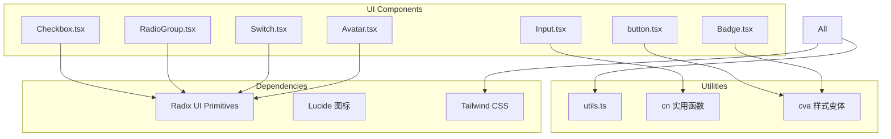
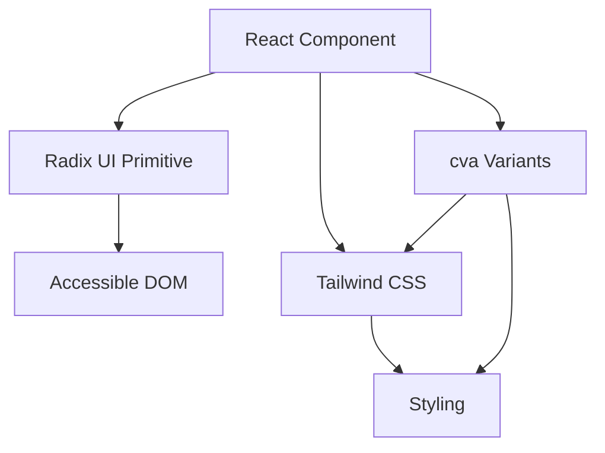
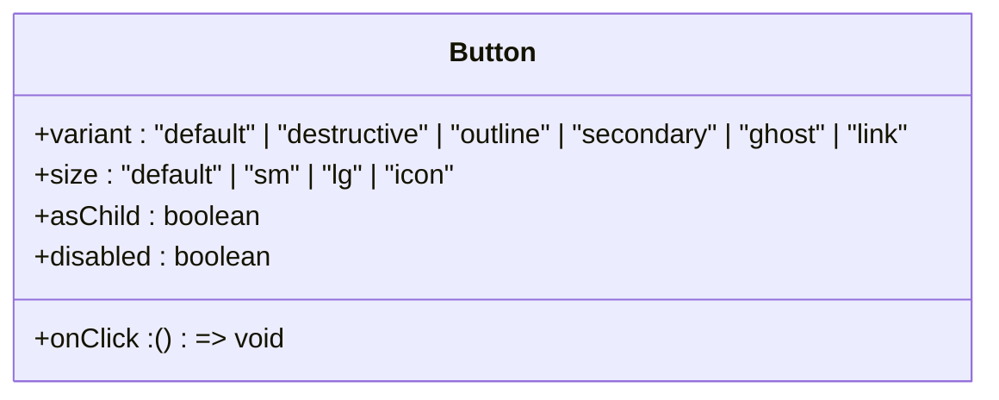
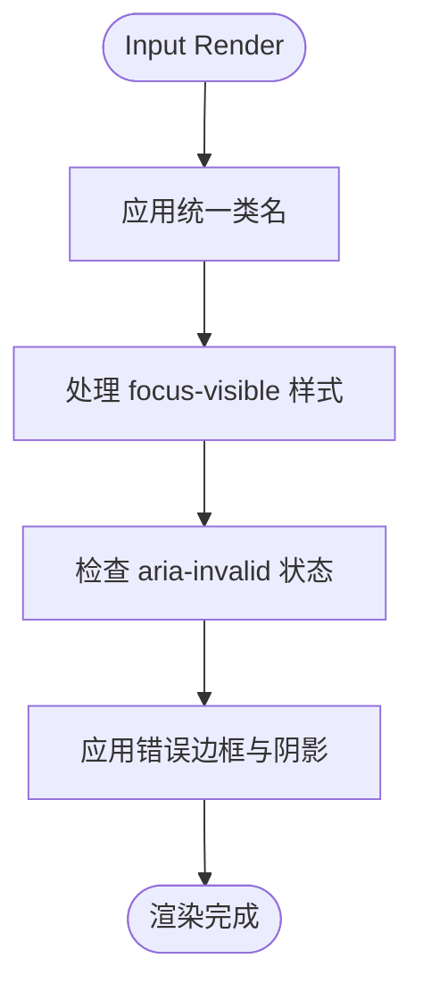
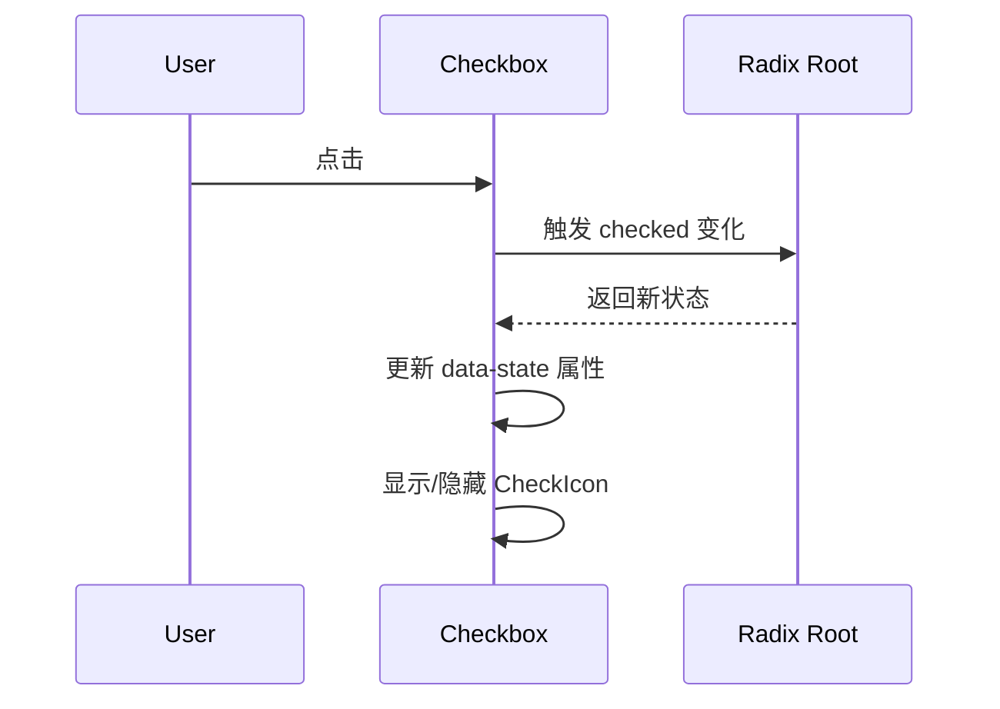
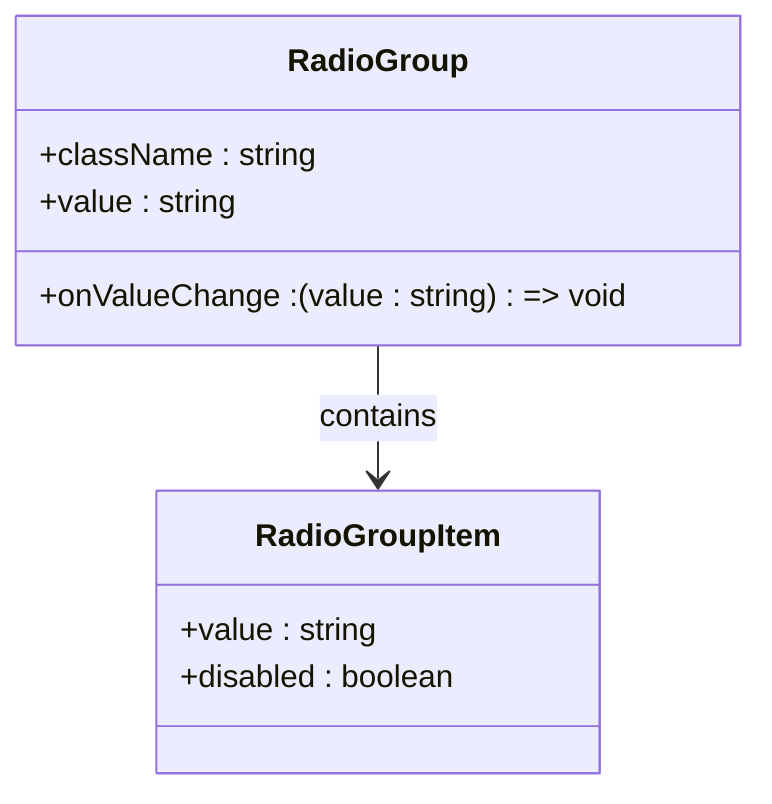
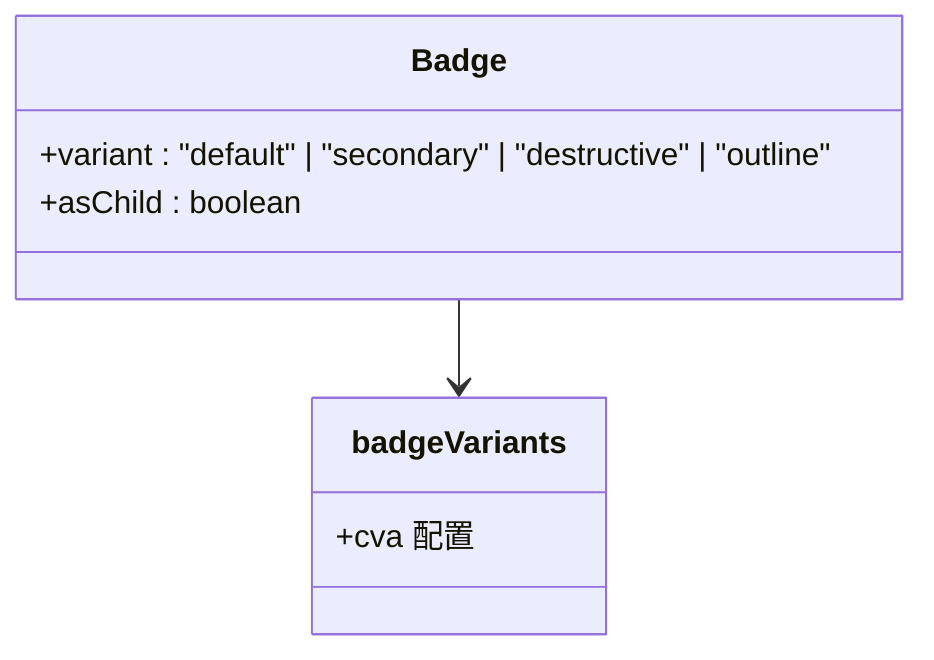
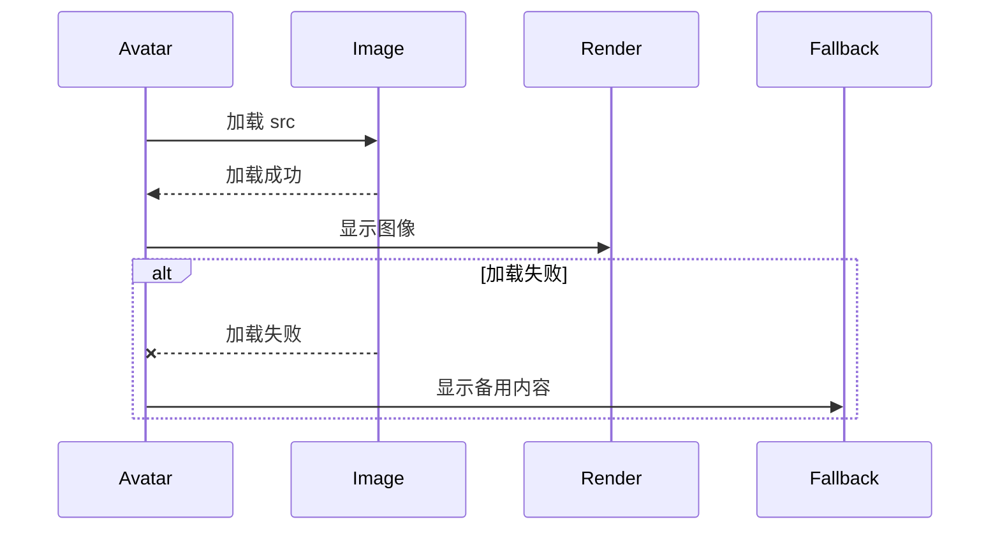
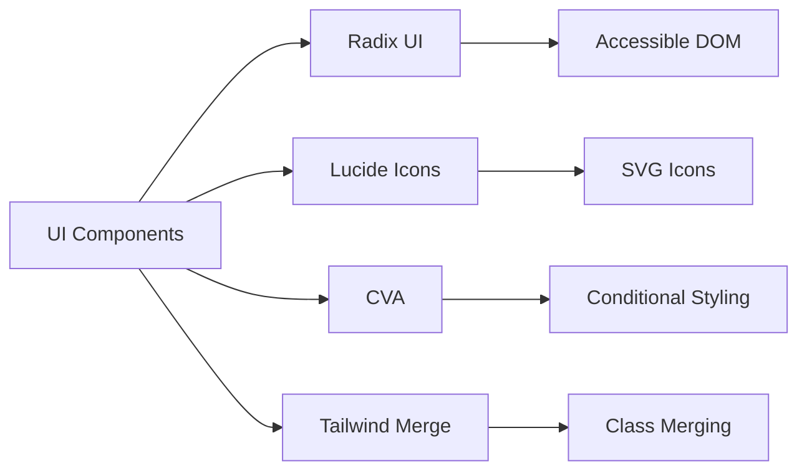

# 基础UI组件

<cite>
**本文档中引用的文件**  
- [button.tsx](file://apps/frontend/src/components/ui/button.tsx)
- [input.tsx](file://apps/frontend/src/components/ui/input.tsx)
- [checkbox.tsx](file://apps/frontend/src/components/ui/checkbox.tsx)
- [radio-group.tsx](file://apps/frontend/src/components/ui/radio-group.tsx)
- [switch.tsx](file://apps/frontend/src/components/ui/switch.tsx)
- [badge.tsx](file://apps/frontend/src/components/ui/badge.tsx)
- [avatar.tsx](file://apps/frontend/src/components/ui/avatar.tsx)
</cite>

## 目录
1. [简介](#简介)
2. [项目结构](#项目结构)
3. [核心组件](#核心组件)
4. [架构概览](#架构概览)
5. [详细组件分析](#详细组件分析)
6. [依赖分析](#依赖分析)
7. [性能考虑](#性能考虑)
8. [故障排除指南](#故障排除指南)
9. [结论](#结论)

## 简介
本文档详细说明了前端项目中使用的一组基础UI原子组件，包括按钮、输入框、复选框、单选组、开关、徽章和头像等。这些组件基于 `shadcn/ui` 设计系统构建，使用 Tailwind CSS 进行样式定制，并通过 Radix UI 提供无障碍支持和原生交互行为。文档涵盖每个组件的 TypeScript 类型定义、Props 接口、支持的 HTML 属性、事件回调机制、可访问性实现、视觉状态表现及响应式行为。

## 项目结构
该前端项目采用模块化结构，核心UI组件集中存放于 `apps/frontend/src/components/ui/` 目录下。每个组件以独立的 `.tsx` 文件实现，遵循 Headless UI + Tailwind 的设计模式，通过 `class-variance-authority`（cva）管理样式变体，确保一致性和可扩展性。



**Diagram sources**
- [button.tsx](file://apps/frontend/src/components/ui/button.tsx#L1-L58)
- [badge.tsx](file://apps/frontend/src/components/ui/badge.tsx#L1-L44)
- [avatar.tsx](file://apps/frontend/src/components/ui/avatar.tsx#L1-L50)

**本节来源**
- [apps/frontend/src/components/ui/](file://apps/frontend/src/components/ui/)

## 核心组件
本节概述了基础UI组件集合的核心功能与设计原则。所有组件均采用无样式（unstyled）策略，通过组合 Radix UI 的可访问性原语与 Tailwind 的实用类实现高度可定制的视觉表现。组件支持默认、悬停、聚焦、禁用等交互状态，并通过 `focus-visible` 和 `aria-invalid` 等属性保障可访问性。

**本节来源**
- [button.tsx](file://apps/frontend/src/components/ui/button.tsx#L1-L58)
- [input.tsx](file://apps/frontend/src/components/ui/input.tsx#L1-L20)

## 架构概览
系统采用分层架构，上层为声明式React组件，中间层为Radix UI提供的无障碍原语，底层为Tailwind CSS样式系统和cva变体管理器。这种架构实现了关注点分离，提升了组件的可维护性与一致性。



**Diagram sources**
- [button.tsx](file://apps/frontend/src/components/ui/button.tsx#L1-L58)
- [switch.tsx](file://apps/frontend/src/components/ui/switch.tsx#L1-L27)

## 详细组件分析

### 按钮组件分析
`Button` 组件是用户交互的主要入口，支持多种样式变体（default、destructive、outline、secondary、ghost、link）和尺寸（default、sm、lg、icon）。通过 `asChild` 属性可将样式应用于任意子元素，实现语义化标签的样式继承。



**Diagram sources**
- [button.tsx](file://apps/frontend/src/components/ui/button.tsx#L1-L58)

**本节来源**
- [button.tsx](file://apps/frontend/src/components/ui/button.tsx#L1-L58)

### 输入框组件分析
`Input` 组件封装了原生 `<input>` 元素，提供统一的样式和可访问性支持。支持文本、密码、数字等多种类型，自动处理聚焦、无效状态的视觉反馈，并兼容 `react-hook-form` 等表单库。



**Diagram sources**
- [input.tsx](file://apps/frontend/src/components/ui/input.tsx#L1-L20)

**本节来源**
- [input.tsx](file://apps/frontend/src/components/ui/input.tsx#L1-L20)

### 复选框组件分析
`Checkbox` 基于 `@radix-ui/react-checkbox` 构建，确保键盘导航和屏幕阅读器兼容性。选中状态通过 `data-state="checked"` 属性控制，内部使用 `CheckIcon` 作为指示器。



**Diagram sources**
- [checkbox.tsx](file://apps/frontend/src/components/ui/checkbox.tsx#L1-L28)

**本节来源**
- [checkbox.tsx](file://apps/frontend/src/components/ui/checkbox.tsx#L1-L28)

### 单选组组件分析
`RadioGroup` 与 `RadioGroupItem` 协同工作，形成互斥选择组。使用 `grid` 布局排列选项，每个选项通过 `CircleIcon` 显示选中状态，支持 RTL 布局。



**Diagram sources**
- [radio-group.tsx](file://apps/frontend/src/components/ui/radio-group.tsx#L1-L41)

**本节来源**
- [radio-group.tsx](file://apps/frontend/src/components/ui/radio-group.tsx#L1-L41)

### 开关组件分析
`Switch` 组件提供布尔值切换功能，具有平滑的动画过渡。拇指（Thumb）在轨道内左右滑动，通过 `data-state` 属性同步视觉状态，支持禁用和聚焦样式。

```mermaid
flowchart LR
A[Switch Root] --> B[State: checked/unchecked]
A --> C[Thumb Position: translate-x-0 / translate-x-[calc(100%-2px)]]
B --> C
A --> D[Focus Ring: focus-visible:ring-[3px]]
A --> E[Disabled: opacity-50]
```

**Diagram sources**
- [switch.tsx](file://apps/frontend/src/components/ui/switch.tsx#L1-L27)

**本节来源**
- [switch.tsx](file://apps/frontend/src/components/ui/switch.tsx#L1-L27)

### 徽章组件分析
`Badge` 用于标记状态或分类信息，支持 default、secondary、destructive、outline 四种变体。自动收缩宽度，常用于标签、通知计数等场景。



**Diagram sources**
- [badge.tsx](file://apps/frontend/src/components/ui/badge.tsx#L1-L44)

**本节来源**
- [badge.tsx](file://apps/frontend/src/components/ui/badge.tsx#L1-L44)

### 头像组件分析
`Avatar` 组件由 `Root`、`Image` 和 `Fallback` 三部分组成，用于显示用户图像。当图片加载失败时自动显示 `Fallback` 内容（如首字母），确保界面完整性。



**Diagram sources**
- [avatar.tsx](file://apps/frontend/src/components/ui/avatar.tsx#L1-L50)

**本节来源**
- [avatar.tsx](file://apps/frontend/src/components/ui/avatar.tsx#L1-L50)

## 依赖分析
组件库依赖于多个关键第三方库：
- `@radix-ui/react-*`：提供无障碍的无样式原语
- `lucide-react`：提供一致的图标集
- `class-variance-authority`：管理条件样式变体
- `tailwind-merge`：安全合并 Tailwind 类名



**Diagram sources**
- [package.json](file://apps/frontend/package.json)
- [button.tsx](file://apps/frontend/src/components/ui/button.tsx#L1-L58)

**本节来源**
- [apps/frontend/package.json](file://apps/frontend/package.json)

## 性能考虑
所有组件均采用函数式组件与 `React.memo` 优化策略（隐式通过 Radix 实现），避免不必要的重渲染。样式通过构建时生成的 `cva` 变体预定义，减少运行时计算开销。图标按需导入，支持 Tree Shaking。

## 故障排除指南
常见问题包括样式丢失、交互无响应、图标不显示等。解决方案包括：
- 确保 `tailwind.css` 正确引入
- 检查 `cn` 工具函数是否正确合并类名
- 验证 Radix UI Provider 是否包裹应用
- 确认图标包已安装且路径正确

**本节来源**
- [utils.ts](file://apps/frontend/src/lib/utils.ts)
- [theme-provider.tsx](file://apps/frontend/src/context/theme-provider.tsx)

## 结论
该基础UI组件库通过结合 Radix UI 的可访问性优势与 Tailwind CSS 的灵活性，实现了高度可定制、一致且无障碍的用户界面。各组件设计简洁，易于集成到表单、配置面板、数据展示等多种场景中，为项目提供了坚实的设计系统基础。