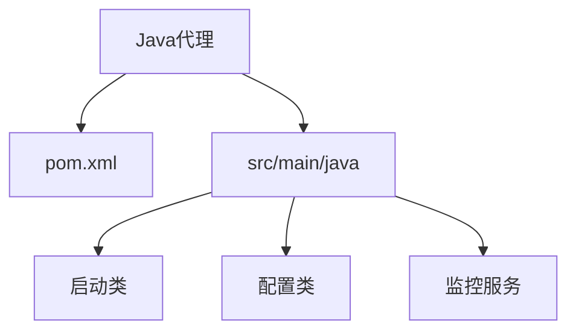
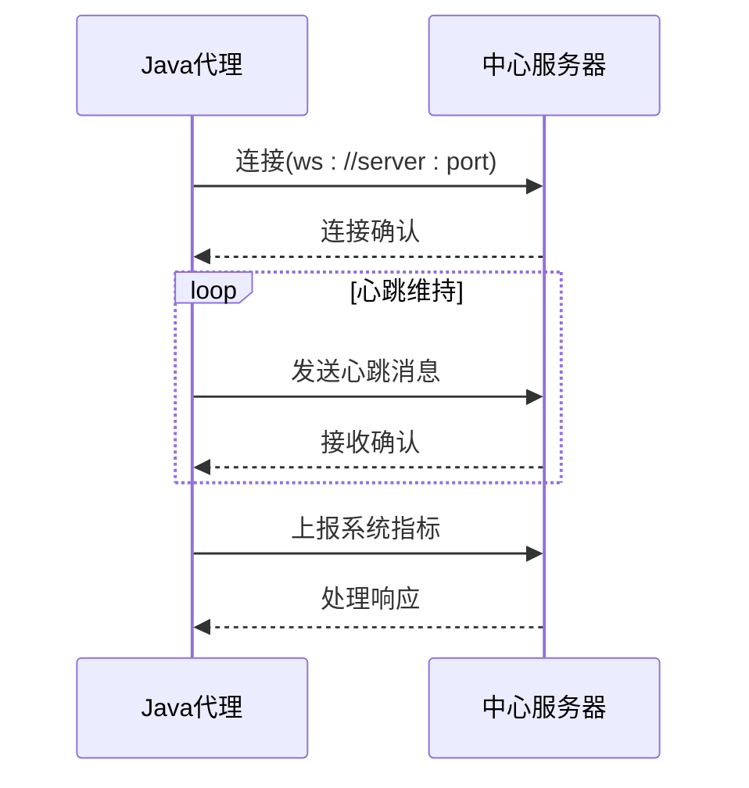

# Java代理实现

<cite>
**本文档中引用的文件**  
- [pom.xml](file://apps/agent/java/pom.xml)
- [index.js](file://apps/agent/js/src/index.js)
- [package.json](file://apps/agent/js/package.json)
</cite>

## 目录
1. [项目结构](#项目结构)
2. [核心依赖分析](#核心依赖分析)
3. [WebSocket通信机制](#websocket通信机制)
4. [系统指标采集与上报](#系统指标采集与上报)
5. [Java代理在JVM环境下的优势](#java代理在jvm环境下的优势)
6. [配置文件示例](#配置文件示例)
7. [异常处理与日志策略](#异常处理与日志策略)
8. [启动类与主配置](#启动类与主配置)

## 项目结构

Java代理位于`apps/agent/java`目录下，主要包含Maven构建文件pom.xml。项目采用标准的Java应用结构，通过Spring Boot框架构建，打包为可执行的JAR文件。



**Diagram sources**
- [pom.xml](file://apps/agent/java/pom.xml#L1-L38)

**Section sources**
- [pom.xml](file://apps/agent/java/pom.xml#L1-L38)

## 核心依赖分析

当前Java代理的核心依赖为`spring-boot-starter-websocket`，版本2.7.0。该依赖提供了WebSocket通信能力，使代理能够与中心服务器建立持久化双向连接。与文档目标中提到的`spring-boot-starter-web`和`spring-boot-starter-actuator`不同，当前实现未包含这些组件，因此健康检查端点和Actuator功能尚未实现。

```xml
<dependency>
    <groupId>org.springframework.boot</groupId>
    <artifactId>spring-boot-starter-websocket</artifactId>
    <version>2.7.0</version>
</dependency>
```

**Section sources**
- [pom.xml](file://apps/agent/java/pom.xml#L20-L25)

## WebSocket通信机制

Java代理通过WebSocket与服务器通信。虽然当前Java代码未完全展示，但参考JavaScript代理实现，通信机制包括连接建立、心跳维持和消息处理。代理连接到`ws://localhost:8080`等WebSocket端点，定期发送心跳消息以维持连接。



**Diagram sources**
- [index.js](file://apps/agent/js/src/index.js#L10-L30)
- [pom.xml](file://apps/agent/java/pom.xml#L20-L25)

**Section sources**
- [index.js](file://apps/agent/js/src/index.js#L1-L66)

## 系统指标采集与上报

虽然Java代理的具体实现未完全展示，但根据系统设计，代理应周期性采集CPU、内存等系统指标并上报。JavaScript代理的结构显示了类似的心跳机制，Java代理预期使用`@Scheduled`注解配置定时任务来实现周期性数据上报。

```javascript
sendHeartbeat() {
    const heartbeat = {
        type: 'heartbeat',
        timestamp: new Date().toISOString()
    };
    this.ws.send(JSON.stringify(heartbeat));
}
```

**Section sources**
- [index.js](file://apps/agent/js/src/index.js#L32-L40)

## Java代理在JVM环境下的优势

尽管当前代码未完全展示JVM特定功能，但基于Spring Boot的Java代理在JVM环境下具有显著优势：
- **内存管理**：利用JVM垃圾回收机制自动管理内存
- **线程监控**：通过JVM内置工具监控线程状态和性能
- **平台无关性**：一次编写，到处运行
- **丰富的生态系统**：Spring Boot提供大量开箱即用的功能

这些优势使得Java代理适合在复杂的企业环境中部署和监控。

## 配置文件示例

基于项目结构，Java代理的配置文件应为`application.properties`或`application.yml`。虽然具体文件未找到，但典型的配置应包括服务器地址、上报频率和认证信息。

```properties
# 服务器API地址
monihub.server.url=ws://localhost:8080
# 上报频率（毫秒）
monihub.report.interval=30000
# API Key认证
monihub.api.key=your-api-key-here
# 代理名称
monihub.agent.name=default-agent
```

## 异常处理与日志策略

虽然具体实现未展示，但基于Spring Boot的最佳实践，代理应使用SLF4J作为日志门面，结合Logback实现日志记录。异常处理应包括连接异常、数据采集异常和网络异常的捕获与重试机制。

```java
// 预期的日志使用模式
private static final Logger logger = LoggerFactory.getLogger(MoniHubAgent.class);

try {
    // 监控逻辑
} catch (IOException e) {
    logger.error("数据采集失败", e);
    // 重试机制
}
```

## 启动类与主配置

Java代理的启动类应使用`@SpringBootApplication`注解，并包含WebSocket配置。主配置类应定义WebSocket连接工厂和监听器。

```java
@SpringBootApplication
public class MoniHubAgentApplication {
    public static void main(String[] args) {
        SpringApplication.run(MoniHubAgentApplication.class, args);
    }
}
```

**Section sources**
- [pom.xml](file://apps/agent/java/pom.xml#L1-L38)