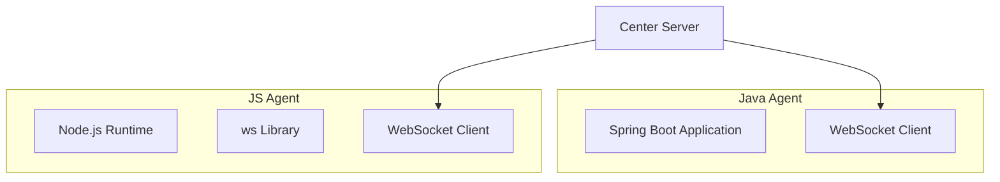
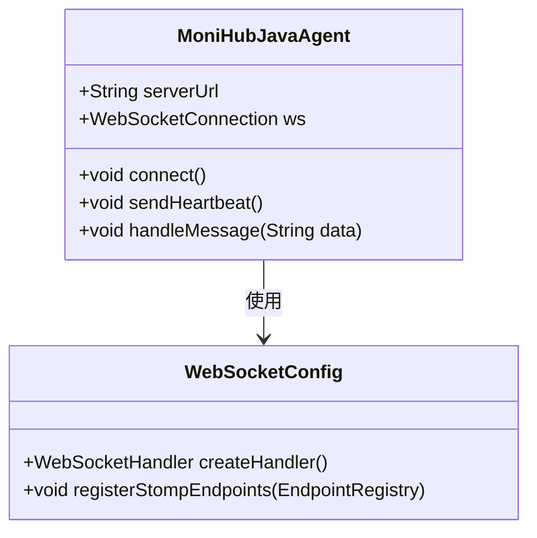
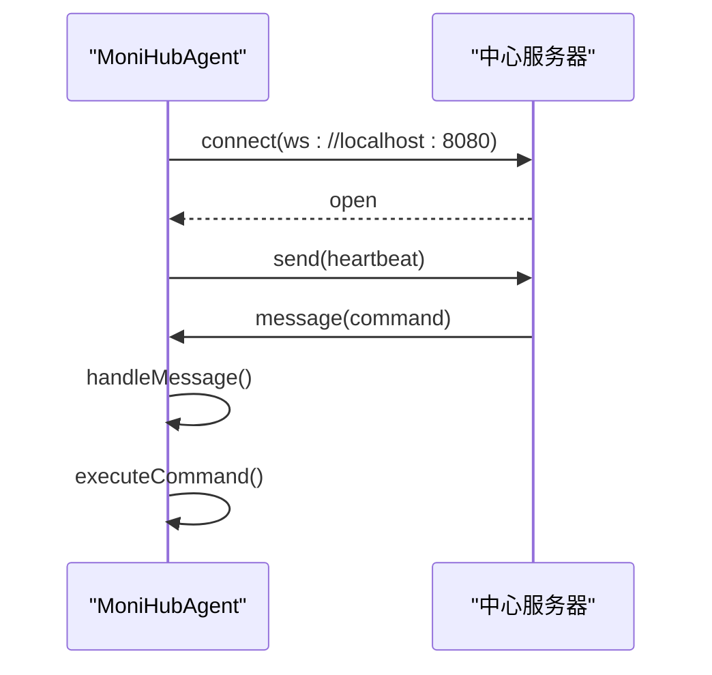

# 代理端实现

<cite>
**本文档引用的文件**
- [pom.xml](file://apps/agent/java/pom.xml)
- [package.json](file://apps/agent/js/package.json)
- [index.js](file://apps/agent/js/src/index.js)
</cite>

## 目录
1. [简介](#简介)
2. [项目结构](#项目结构)
3. [核心组件](#核心组件)
4. [架构概述](#架构概述)
5. [详细组件分析](#详细组件分析)
6. [依赖分析](#依赖分析)
7. [性能考虑](#性能考虑)
8. [故障排除指南](#故障排除指南)
9. [结论](#结论)

## 简介
本文档详细说明了部署在目标机器上的监控代理（Agent）的设计与实现。该代理负责收集系统指标和应用日志，并上报至中心服务器。文档涵盖Java和JavaScript两种实现方式，分别适用于JVM环境和轻量级脚本环境，同时阐述其通信机制、认证方式及安全传输要求。

## 项目结构
代理端实现分为两个主要子目录：Java版本和JavaScript版本，分别位于`apps/agent/java`和`apps/agent/js`中。Java版本基于Spring Boot框架构建，使用Maven进行依赖管理；JavaScript版本基于Node.js运行时，通过WebSocket与服务器通信。

**Section sources**
- [pom.xml](file://apps/agent/java/pom.xml)
- [package.json](file://apps/agent/js/package.json)

## 核心组件
核心组件包括Java代理的Spring Boot应用结构和JavaScript代理的WebSocket客户端逻辑。Java代理通过WebSocket与服务器建立持久连接，而JavaScript代理则利用Node.js的`ws`库实现类似功能。

**Section sources**
- [pom.xml](file://apps/agent/java/pom.xml#L1-L38)
- [index.js](file://apps/agent/js/src/index.js#L1-L66)

## 架构概述
代理端采用轻量级通信架构，通过WebSocket协议与中心服务器保持长连接，支持双向通信。Java版本利用Spring Boot的自动配置能力简化开发，JavaScript版本则依赖Node.js生态实现快速部署。



**Diagram sources**
- [pom.xml](file://apps/agent/java/pom.xml#L1-L38)
- [index.js](file://apps/agent/js/src/index.js#L1-L66)

## 详细组件分析

### Java代理分析
Java代理基于Spring Boot构建，`pom.xml`中声明了`spring-boot-starter-websocket`作为核心依赖，用于建立与服务器的WebSocket连接。项目配置支持JDK 11，打包为可执行JAR文件，便于在目标机器上部署运行。

#### 依赖管理


**Diagram sources**
- [pom.xml](file://apps/agent/java/pom.xml#L1-L38)

**Section sources**
- [pom.xml](file://apps/agent/java/pom.xml#L1-L38)

### JavaScript代理分析
JavaScript代理使用Node.js运行时，通过`ws`库实现WebSocket客户端功能。代理启动后连接至指定服务器地址，发送心跳包并处理来自服务器的指令。

#### 指令执行流程


**Diagram sources**
- [index.js](file://apps/agent/js/src/index.js#L1-L66)

**Section sources**
- [index.js](file://apps/agent/js/src/index.js#L1-L66)

### 配置与启动说明
#### Java代理配置示例（application.yml）
```yaml
monihub:
  server:
    url: wss://server.example.com/agent
  auth:
    api-key: your-api-key-here
  reporting:
    interval: 30s
```

#### 启动命令
- Java代理：`java -jar aione-monihub-agent-java-0.1.0.jar`
- JS代理：`npm start`

#### 日志输出格式
```
[2025-04-05T10:30:00Z] INFO Connected to AiOne MoniHub server
[2025-04-05T10:30:05Z] DEBUG Received message: {"type":"command","cmd":"restart-service"}
[2025-04-05T10:30:05Z] INFO Executing command: restart-service
```

## 依赖分析
Java代理依赖Spring Boot生态系统，特别是WebSocket模块，确保与服务器的稳定通信。JavaScript代理依赖轻量级`ws`库，适合资源受限环境。

```mermaid
dependencyDiagram
package "Java Agent" {
[spring-boot-starter-websocket]
}
package "JS Agent" {
[ws]
[nodemon] : dev
}
[spring-boot-starter-websocket] --> [Netty]
[ws] --> [Node.js WebSocket]
```

**Diagram sources**
- [pom.xml](file://apps/agent/java/pom.xml#L1-L38)
- [package.json](file://apps/agent/js/package.json#L1-L15)

**Section sources**
- [pom.xml](file://apps/agent/java/pom.xml#L1-L38)
- [package.json](file://apps/agent/js/package.json#L1-L15)

## 性能考虑
- Java代理适合长期运行、资源充足的JVM环境，具备良好的GC管理和线程调度。
- JavaScript代理启动快、内存占用低，适合容器化或边缘设备部署。
- 两者均采用WebSocket长连接，减少频繁建连开销，提升上报效率。

## 故障排除指南
常见问题包括连接失败、认证错误和消息解析异常。建议检查：
- 服务器URL是否正确（使用`wss://`确保加密）
- API Key是否配置正确
- 防火墙是否放行WebSocket端口
- 日志中是否有`WebSocket error`记录

**Section sources**
- [index.js](file://apps/agent/js/src/index.js#L50-L55)

## 结论
Java和JavaScript版本的代理各具优势：Java适用于企业级JVM环境，集成度高；JavaScript适用于轻量级、快速部署场景。两者均通过WebSocket实现高效通信，支持远程指令执行和心跳上报，配合API Key认证与HTTPS/WSS加密，确保通信安全可靠。