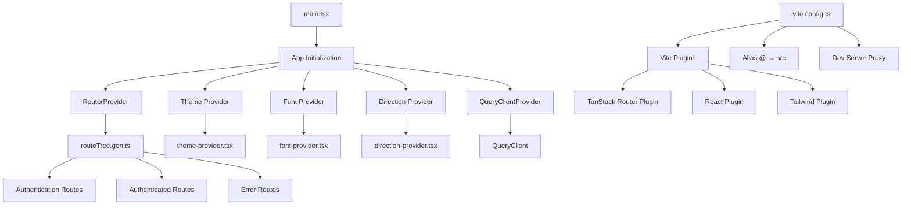
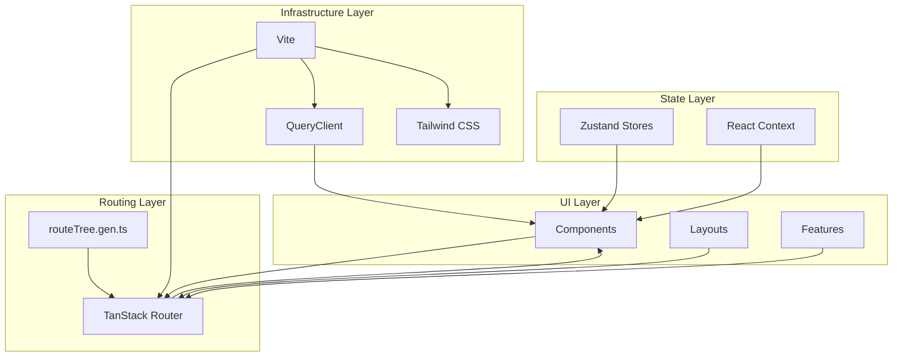
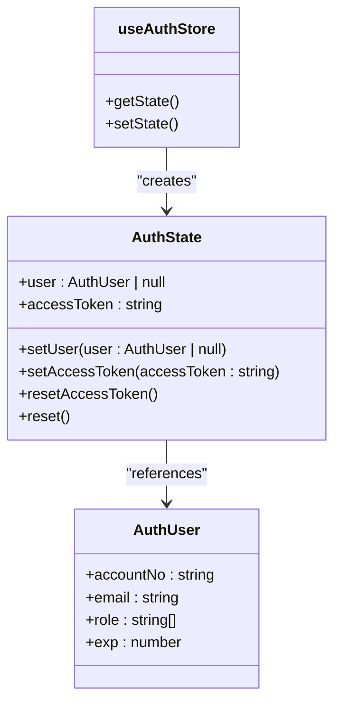
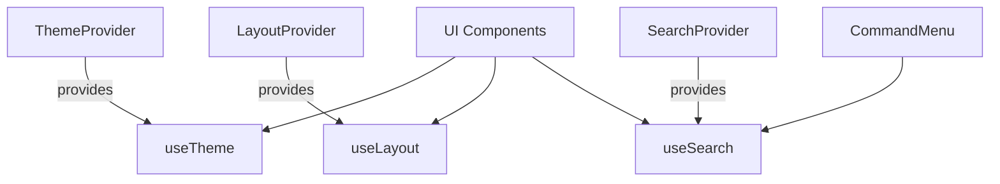
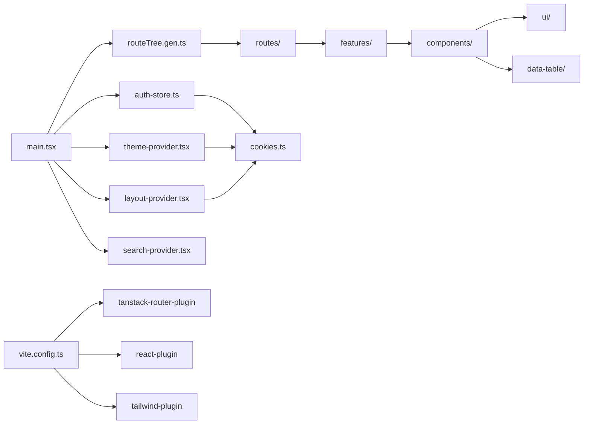

# 前端架构

<cite>
**本文档中引用的文件**  
- [main.tsx](file://apps/frontend/src/main.tsx)
- [routeTree.gen.ts](file://apps/frontend/src/routeTree.gen.ts)
- [vite.config.ts](file://apps/frontend/vite.config.ts)
- [auth-store.ts](file://apps/frontend/src/stores/auth-store.ts)
- [theme-provider.tsx](file://apps/frontend/src/context/theme-provider.tsx)
- [layout-provider.tsx](file://apps/frontend/src/context/layout-provider.tsx)
- [search-provider.tsx](file://apps/frontend/src/context/search-provider.tsx)
</cite>

## 目录
1. [项目结构](#项目结构)
2. [核心组件](#核心组件)
3. [架构概览](#架构概览)
4. [详细组件分析](#详细组件分析)
5. [依赖分析](#依赖分析)
6. [性能考虑](#性能考虑)
7. [故障排除指南](#故障排除指南)
8. [结论](#结论)

## 项目结构

前端项目位于 `apps/frontend` 目录下，采用基于 React 19 的现代前端架构，结合 Vite 构建工具、Zustand 状态管理、TanStack Router 路由系统和 Tailwind CSS 样式方案。项目结构清晰，按功能模块组织，主要目录包括：

- `src/assets`：静态资源，如图标和品牌 Logo
- `src/components`：UI 组件库，包含通用 UI 组件（如按钮、表单）和布局组件
- `src/features`：功能模块，如认证、仪表盘、任务、用户管理等
- `src/routes`：路由定义，支持嵌套路由和布局
- `src/stores`：Zustand 状态存储
- `src/context`：React Context 提供者，用于主题、布局、搜索等全局状态
- `src/lib`：工具函数和辅助逻辑
- `src/config`：配置文件
- `src/styles`：全局样式

入口文件为 `main.tsx`，路由配置由 `routeTree.gen.ts` 自动生成，构建配置由 `vite.config.ts` 定义。



**Diagram sources**
- [main.tsx](file://apps/frontend/src/main.tsx#L1-L104)
- [routeTree.gen.ts](file://apps/frontend/src/routeTree.gen.ts#L1-L722)
- [vite.config.ts](file://apps/frontend/vite.config.ts#L1-L23)

**Section sources**
- [main.tsx](file://apps/frontend/src/main.tsx#L1-L104)
- [vite.config.ts](file://apps/frontend/vite.config.ts#L1-L23)

## 核心组件

前端架构的核心组件包括：
- **main.tsx**：应用入口，初始化全局状态、路由和主题
- **routeTree.gen.ts**：由 TanStack Router 自动生成的路由树，定义应用导航结构
- **auth-store.ts**：使用 Zustand 管理用户认证状态
- **context providers**：实现跨组件通信的上下文提供者
- **vite.config.ts**：Vite 构建配置，包含插件、别名和开发服务器设置

这些组件共同构成了一个可维护、可扩展的现代化前端架构。

**Section sources**
- [main.tsx](file://apps/frontend/src/main.tsx#L1-L104)
- [routeTree.gen.ts](file://apps/frontend/src/routeTree.gen.ts#L1-L722)
- [vite.config.ts](file://apps/frontend/vite.config.ts#L1-L23)
- [auth-store.ts](file://apps/frontend/src/stores/auth-store.ts#L1-L54)
- [theme-provider.tsx](file://apps/frontend/src/context/theme-provider.tsx#L1-L111)

## 架构概览

该前端架构采用分层设计，从入口到功能模块层层解耦，确保高内聚低耦合。整体架构如下：



**Diagram sources**
- [main.tsx](file://apps/frontend/src/main.tsx#L1-L104)
- [routeTree.gen.ts](file://apps/frontend/src/routeTree.gen.ts#L1-L722)
- [vite.config.ts](file://apps/frontend/vite.config.ts#L1-L23)

## 详细组件分析

### 入口初始化分析

`main.tsx` 是应用的入口文件，负责初始化所有全局依赖：

1. 创建 `QueryClient` 实例，配置查询重试、缓存时间和错误处理
2. 创建 `Router` 实例，传入 `routeTree` 和上下文
3. 使用 `StrictMode` 和多个 `Provider` 包裹应用根组件
4. 渲染 `RouterProvider` 启动路由系统

错误处理机制在 `QueryCache` 中定义，当检测到 401 错误时自动重置认证状态并跳转至登录页。

**Section sources**
- [main.tsx](file://apps/frontend/src/main.tsx#L1-L104)

### 路由系统分析

`routeTree.gen.ts` 文件由 TanStack Router 插件自动生成，定义了完整的应用路由结构。该文件通过模块导入和 `update` 方法构建路由树，支持：

- **嵌套路由**：如 `_authenticated` 布局下的多个子路由（设置、用户、任务等）
- **懒加载**：通过代码分割自动实现路由级懒加载
- **参数化路由**：如 `/errors/$error` 支持动态错误码
- **多入口点**：支持 `clerk` 认证子应用和主应用并行

路由结构清晰，易于维护和扩展。

```mermaid
graph TD
A[/] --> B[Settings]
A --> C[Users]
A --> D[Tasks]
A --> E[Chats]
A --> F[Apps]
B --> G[Account]
B --> H[Appearance]
B --> I[Display]
B --> J[Notifications]
K[Sign In] --> L[OTP]
K --> M[Forgot Password]
N[Errors] --> O[401]
N --> P[403]
N --> Q[404]
N --> R[500]
N --> S[503]
T[Clerk] --> U[Sign In]
T --> V[Sign Up]
T --> W[User Management]
```

**Diagram sources**
- [routeTree.gen.ts](file://apps/frontend/src/routeTree.gen.ts#L1-L722)

**Section sources**
- [routeTree.gen.ts](file://apps/frontend/src/routeTree.gen.ts#L1-L722)

### 构建配置分析

`vite.config.ts` 定义了 Vite 构建配置，关键特性包括：

- **插件系统**：集成 `@tanstack/router-plugin/vite` 实现路由自动生成，`@vitejs/plugin-react-swc` 提升构建性能，`@tailwindcss/vite` 支持 Tailwind CSS
- **别名设置**：`@` 指向 `src` 目录，简化模块导入路径
- **自动代码分割**：`autoCodeSplitting: true` 启用路由级代码分割，优化加载性能

该配置确保了开发体验和生产构建的高效性。

**Section sources**
- [vite.config.ts](file://apps/frontend/vite.config.ts#L1-L23)

### 状态管理机制分析

#### 认证状态管理

`auth-store.ts` 使用 Zustand 创建全局认证状态存储，包含：

- `user`：用户信息（账号、邮箱、角色）
- `accessToken`：访问令牌，持久化存储于 Cookie
- `setAccessToken`：设置令牌并同步到 Cookie
- `reset`：重置状态并清除 Cookie

该存储通过 `useAuthStore` Hook 在全应用范围内共享，确保认证状态一致性。



**Diagram sources**
- [auth-store.ts](file://apps/frontend/src/stores/auth-store.ts#L1-L54)

**Section sources**
- [auth-store.ts](file://apps/frontend/src/stores/auth-store.ts#L1-L54)

#### 上下文提供者分析

`context` 目录下的多个 Provider 实现跨组件通信：

- **ThemeProvider**：管理主题状态（亮色/暗色/系统），响应式切换并持久化
- **LayoutProvider**：管理布局变体（inset/sidebar/floating）和可折叠行为
- **SearchProvider**：管理命令菜单状态，支持 `Ctrl+K` 快捷键唤醒

这些上下文通过 `useContext` Hook 消费，实现非父子组件间的高效通信。



**Diagram sources**
- [theme-provider.tsx](file://apps/frontend/src/context/theme-provider.tsx#L1-L111)
- [layout-provider.tsx](file://apps/frontend/src/context/layout-provider.tsx#L1-L86)
- [search-provider.tsx](file://apps/frontend/src/context/search-provider.tsx#L1-L47)

**Section sources**
- [theme-provider.tsx](file://apps/frontend/src/context/theme-provider.tsx#L1-L111)
- [layout-provider.tsx](file://apps/frontend/src/context/layout-provider.tsx#L1-L86)
- [search-provider.tsx](file://apps/frontend/src/context/search-provider.tsx#L1-L47)

## 依赖分析

前端模块间依赖关系清晰，遵循单向数据流原则：



**Diagram sources**
- [main.tsx](file://apps/frontend/src/main.tsx#L1-L104)
- [routeTree.gen.ts](file://apps/frontend/src/routeTree.gen.ts#L1-L722)
- [auth-store.ts](file://apps/frontend/src/stores/auth-store.ts#L1-L54)
- [theme-provider.tsx](file://apps/frontend/src/context/theme-provider.tsx#L1-L111)
- [layout-provider.tsx](file://apps/frontend/src/context/layout-provider.tsx#L1-L86)
- [search-provider.tsx](file://apps/frontend/src/context/search-provider.tsx#L1-L47)
- [vite.config.ts](file://apps/frontend/vite.config.ts#L1-L23)

**Section sources**
- [main.tsx](file://apps/frontend/src/main.tsx#L1-L104)
- [routeTree.gen.ts](file://apps/frontend/src/routeTree.gen.ts#L1-L722)
- [vite.config.ts](file://apps/frontend/vite.config.ts#L1-L23)

## 性能考虑

该架构在性能方面做了多项优化：

- **代码分割**：通过 TanStack Router 插件实现自动代码分割，减少初始加载体积
- **查询缓存**：使用 `@tanstack/react-query` 缓存数据，减少重复请求
- **状态持久化**：关键状态（主题、布局、认证）通过 Cookie 持久化，提升用户体验
- **快捷键优化**：搜索功能支持 `Ctrl+K` 快速唤醒，无需鼠标交互
- **响应式主题**：根据系统偏好自动切换主题，无需额外请求

这些优化确保了应用在不同网络和设备环境下均有良好表现。

## 故障排除指南

常见问题及解决方案：

- **路由未生效**：检查 `routeTree.gen.ts` 是否正确生成，确认 Vite 插件已启用
- **状态未持久化**：确认 Cookie 设置正确，检查域名和路径是否匹配
- **主题切换失效**：检查 `theme-provider.tsx` 中的 `documentElement` 操作是否正确
- **构建失败**：验证 `vite.config.ts` 中的插件顺序和配置项
- **401 错误未跳转**：确认 `QueryCache` 的错误处理逻辑已正确注册

**Section sources**
- [main.tsx](file://apps/frontend/src/main.tsx#L1-L104)
- [auth-store.ts](file://apps/frontend/src/stores/auth-store.ts#L1-L54)
- [theme-provider.tsx](file://apps/frontend/src/context/theme-provider.tsx#L1-L111)
- [vite.config.ts](file://apps/frontend/vite.config.ts#L1-L23)

## 结论

该前端架构基于 React 19 和现代工具链，实现了高度模块化和可维护的设计。通过 `main.tsx` 统一初始化全局依赖，`routeTree.gen.ts` 实现灵活的路由管理，`vite.config.ts` 优化构建流程，`auth-store.ts` 集中管理认证状态，以及多个 `context` 提供者实现跨组件通信，整体架构清晰、扩展性强。建议继续保持模块化设计，定期审查依赖关系，确保长期可维护性。