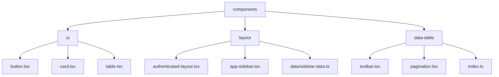
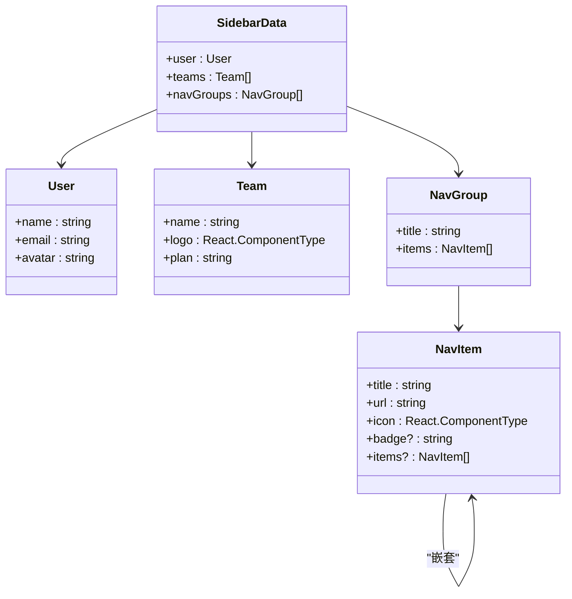
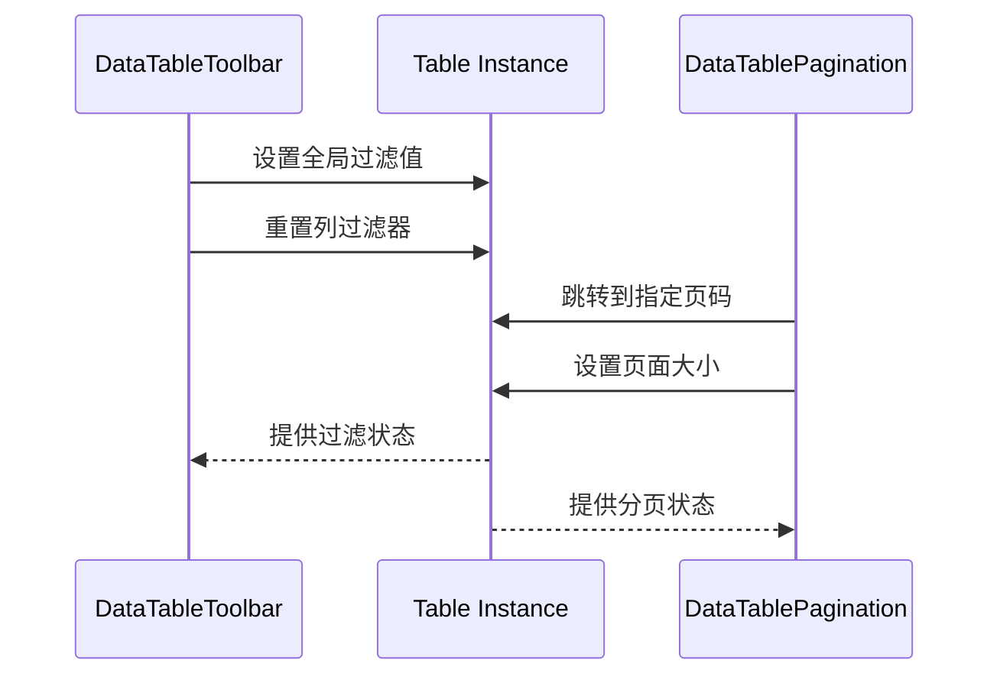
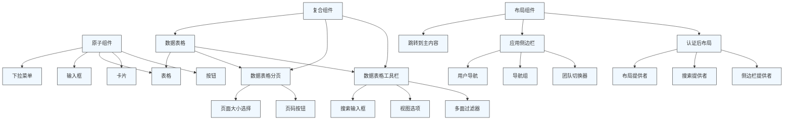

# 前端组件架构

<cite>
**本文档中引用的文件**  
- [button.tsx](file://apps/frontend/src/components/ui/button.tsx)
- [card.tsx](file://apps/frontend/src/components/ui/card.tsx)
- [table.tsx](file://apps/frontend/src/components/ui/table.tsx)
- [authenticated-layout.tsx](file://apps/frontend/src/components/layout/authenticated-layout.tsx)
- [app-sidebar.tsx](file://apps/frontend/src/components/layout/app-sidebar.tsx)
- [sidebar-data.ts](file://apps/frontend/src/components/layout/data/sidebar-data.ts)
- [toolbar.tsx](file://apps/frontend/src/components/data-table/toolbar.tsx)
- [pagination.tsx](file://apps/frontend/src/components/data-table/pagination.tsx)
- [index.ts](file://apps/frontend/src/components/data-table/index.ts)
</cite>

## 目录
1. [项目结构](#项目结构)
2. [核心原子组件实现](#核心原子组件实现)
3. [布局结构分析](#布局结构分析)
4. [复合组件集成模式](#复合组件集成模式)
5. [组件层级图](#组件层级图)
6. [最佳实践](#最佳实践)

## 项目结构

项目采用基于功能和组件类型的分层目录结构，清晰划分UI组件、布局组件和业务功能模块。`components/ui`目录存放基于shadcn/ui的原子化UI组件，`components/layout`包含认证后布局和侧边栏等复合布局组件，`data-table`子系统实现可复用的数据表格功能。

**图示来源**
- [button.tsx](file://apps/frontend/src/components/ui/button.tsx)
- [card.tsx](file://apps/frontend/src/components/ui/card.tsx)
- [table.tsx](file://apps/frontend/src/components/ui/table.tsx)
- [authenticated-layout.tsx](file://apps/frontend/src/components/layout/authenticated-layout.tsx)
- [app-sidebar.tsx](file://apps/frontend/src/components/layout/app-sidebar.tsx)
- [sidebar-data.ts](file://apps/frontend/src/components/layout/data/sidebar-data.ts)

**本节来源**
- [apps/frontend/src/components/ui/button.tsx](file://apps/frontend/src/components/ui/button.tsx)
- [apps/frontend/src/components/layout/app-sidebar.tsx](file://apps/frontend/src/components/layout/app-sidebar.tsx)

## 核心原子组件实现

### 按钮组件 (button.tsx)
基于Radix UI和Class Variance Authority (CVA) 构建，通过`cva`函数定义多态变体（default、destructive、outline等）和尺寸变体（default、sm、lg、icon）。使用`Slot`组件实现组合性，支持`asChild`属性将样式传递给子组件。包含无障碍访问特性，如焦点环、禁用状态处理和ARIA无效状态反馈。

**本节来源**
- [button.tsx](file://apps/frontend/src/components/ui/button.tsx#L1-L58)

### 卡片组件 (card.tsx)
实现语义化卡片容器，包含`CardHeader`、`CardTitle`、`CardDescription`、`CardAction`、`CardContent`和`CardFooter`等子组件。采用Flexbox布局，支持响应式间距和边框。`CardAction`使用CSS Grid定位在右上角，实现灵活的操作按钮布局。

**本节来源**
- [card.tsx](file://apps/frontend/src/components/ui/card.tsx#L1-L91)

### 表格组件 (table.tsx)
基于原生HTML表格语义构建，封装`Table`、`TableHeader`、`TableBody`、`TableFooter`、`TableHead`、`TableRow`、`TableCell`和`TableCaption`组件。外层使用`div`包裹实现水平滚动，支持响应式设计。包含悬停效果、选中状态和无障碍访问特性。

**本节来源**
- [table.tsx](file://apps/frontend/src/components/ui/table.tsx#L1-L113)

## 布局结构分析

### 认证后布局 (authenticated-layout.tsx)
封装认证后页面的整体布局结构，集成多个上下文提供者（SearchProvider、LayoutProvider）和侧边栏提供者（SidebarProvider）。通过`getCookie`读取侧边栏展开状态，实现用户偏好记忆。使用`SkipToMain`组件提升无障碍访问性，`SidebarInset`包裹主要内容区域。

**本节来源**
- [authenticated-layout.tsx](file://apps/frontend/src/components/layout/authenticated-layout.tsx#L1-L42)

### 侧边栏组件 (app-sidebar.tsx)
基于shadcn/ui的Sidebar组件构建，通过`useLayout`钩子获取布局配置。动态渲染`TeamSwitcher`、导航组和用户信息。从`sidebar-data.ts`导入导航数据，实现数据驱动的菜单生成。

**本节来源**
- [app-sidebar.tsx](file://apps/frontend/src/components/layout/app-sidebar.tsx#L1-L37)

### 导航数据 (sidebar-data.ts)
定义侧边栏的静态数据结构，包括用户信息、团队列表和导航组。每个导航组包含标题和项目列表，支持嵌套菜单。使用Lucide图标组件作为菜单项图标，实现视觉一致性。

**图示来源**
- [sidebar-data.ts](file://apps/frontend/src/components/layout/data/sidebar-data.ts#L1-L205)

**本节来源**
- [sidebar-data.ts](file://apps/frontend/src/components/layout/data/sidebar-data.ts#L1-L205)

## 复合组件集成模式

### 数据表格工具栏 (toolbar.tsx)
实现数据表格的过滤和搜索功能，包含全局搜索输入框、多面过滤器和视图选项。支持通过`searchKey`参数指定搜索列，或使用全局过滤。`DataTableFacetedFilter`组件实现多选过滤，`DataTableViewOptions`提供列可见性控制。

**本节来源**
- [toolbar.tsx](file://apps/frontend/src/components/data-table/toolbar.tsx#L1-L85)

### 数据表格分页 (pagination.tsx)
实现完整的分页控件，包含页面大小选择、页码导航和跳转按钮。使用`getPageNumbers`工具函数生成智能页码序列（包含省略号）。支持前往首页、上一页、下一页、末页操作，提供无障碍访问的屏幕阅读器标签。

**本节来源**
- [pagination.tsx](file://apps/frontend/src/components/data-table/pagination.tsx#L1-L127)

### 组件集成方式
`data-table`系统通过`index.ts`统一导出所有子组件，实现模块化引用。在实际使用中，这些组件与`Table`组件组合，形成完整的数据表格解决方案。工具栏和分页组件通过`table`实例与表格状态同步，实现响应式交互。

**图示来源**
- [toolbar.tsx](file://apps/frontend/src/components/data-table/toolbar.tsx#L1-L85)
- [pagination.tsx](file://apps/frontend/src/components/data-table/pagination.tsx#L1-L127)

**本节来源**
- [toolbar.tsx](file://apps/frontend/src/components/data-table/toolbar.tsx#L1-L85)
- [pagination.tsx](file://apps/frontend/src/components/data-table/pagination.tsx#L1-L127)
- [index.ts](file://apps/frontend/src/components/data-table/index.ts#L1-L6)

## 组件层级图

**图示来源**
- [button.tsx](file://apps/frontend/src/components/ui/button.tsx)
- [card.tsx](file://apps/frontend/src/components/ui/card.tsx)
- [table.tsx](file://apps/frontend/src/components/ui/table.tsx)
- [authenticated-layout.tsx](file://apps/frontend/src/components/layout/authenticated-layout.tsx)
- [app-sidebar.tsx](file://apps/frontend/src/components/layout/app-sidebar.tsx)
- [toolbar.tsx](file://apps/frontend/src/components/data-table/toolbar.tsx)
- [pagination.tsx](file://apps/frontend/src/components/data-table/pagination.tsx)

## 最佳实践

### 主题适配
项目通过`theme-provider.tsx`上下文实现主题切换，支持浅色、深色和系统主题。所有UI组件使用Tailwind CSS的暗色模式变体，确保在不同主题下保持视觉一致性。自定义图标组件（如`icon-theme-dark.tsx`）提供主题切换的可视化反馈。

### 响应式设计
采用移动优先的响应式策略，使用Tailwind CSS的断点系统（sm、md、lg、xl）。关键组件如分页控件在小屏幕上自动调整布局，工具栏在窄屏幕上隐藏部分元素。使用`@container`查询实现容器内响应式，提升布局灵活性。

### 无障碍访问
所有交互组件遵循WAI-ARIA标准，提供键盘导航支持。按钮和链接包含焦点指示器，表单元素有适当的标签关联。使用`sr-only`类为屏幕阅读器提供上下文信息，如分页按钮的"前往第X页"提示。`SkipToMain`组件允许用户跳过重复的导航内容。

**本节来源**
- [README.md](file://apps/frontend/README.md#L1-L94)
- [theme-switch.tsx](file://apps/frontend/src/components/theme-switch.tsx)
- [skip-to-main.tsx](file://apps/frontend/src/components/skip-to-main.tsx)