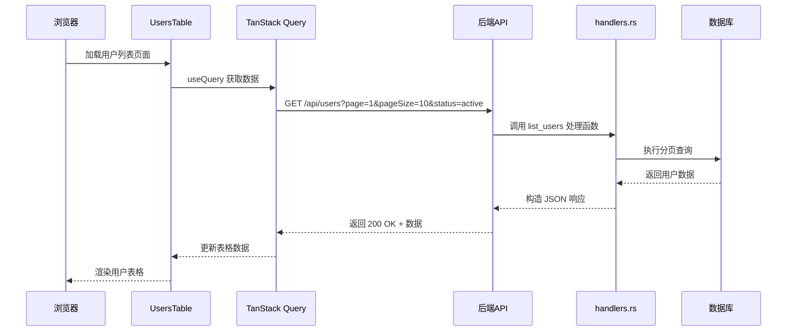
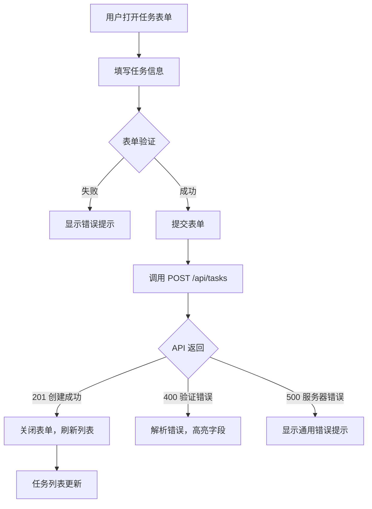
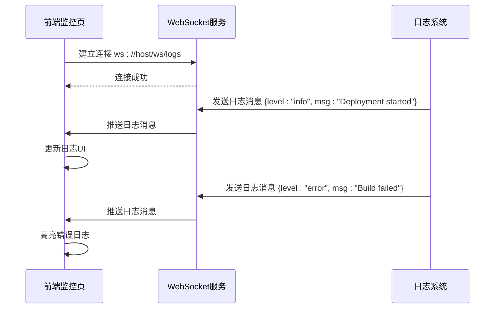

# 功能模块

<cite>
**本文档引用的文件**  
- [users-table.tsx](file://apps/frontend/src/features/users/components/users-table.tsx)
- [users-columns.tsx](file://apps/frontend/src/features/users/components/users-columns.tsx)
- [schema.ts](file://apps/frontend/src/features/users/data/schema.ts)
- [handlers.rs](file://apps/server/src/users/handlers.rs)
- [routes.rs](file://apps/server/src/users/routes.rs)
- [websocket/handlers.rs](file://apps/server/src/websocket/handlers.rs)
- [websocket/routes.rs](file://apps/server/src/websocket/routes.rs)
- [tasks-table.tsx](file://apps/frontend/src/features/tasks/components/tasks-table.tsx)
- [tasks-columns.tsx](file://apps/frontend/src/features/tasks/components/tasks-columns.tsx)
- [data.ts](file://apps/frontend/src/features/tasks/data/data.ts)
</cite>

## 目录
1. [用户管理模块](#用户管理模块)  
2. [任务管理模块](#任务管理模块)  
3. [应用监控与日志流](#应用监控与日志流)  
4. [权限控制机制](#权限控制机制)  
5. [状态变更与交互流程](#状态变更与交互流程)

## 用户管理模块

本模块实现用户信息的增删改查（CRUD）功能，从前端页面到后端接口形成完整链路。

前端通过 `users-table.tsx` 渲染用户列表，使用 TanStack React Table 构建可排序、可筛选、支持分页的表格。表格列定义位于 `users-columns.tsx`，包含用户名、姓名、邮箱、电话、状态、角色及操作列。状态和角色字段通过 Badge 和图标进行可视化展示，并支持多选过滤。

数据获取通过 URL 状态同步机制实现，利用 `useTableUrlState` Hook 将分页、筛选条件持久化在 URL 查询参数中，提升用户体验和可分享性。

前端发起请求时，通过 TanStack Query 自动调用 `/api/users` 接口获取分页数据。后端在 `routes.rs` 中定义该路由，交由 `handlers.rs` 中的 `list_users` 函数处理。该函数通过数据库查询获取用户记录，结合分页参数返回 JSON 响应，数据模型由 `models.rs` 定义。

用户状态包括“活跃”、“非活跃”、“已邀请”、“已暂停”，角色包括“超级管理员”、“管理员”、“收银员”、“经理”。这些类型在前端 `schema.ts` 中通过 Zod 定义，确保类型安全和运行时校验。

**Diagram sources**  
- [users-table.tsx](file://apps/frontend/src/features/users/components/users-table.tsx#L1-L193)
- [routes.rs](file://apps/server/src/users/routes.rs)
- [handlers.rs](file://apps/server/src/users/handlers.rs)

**Section sources**  
- [users-table.tsx](file://apps/frontend/src/features/users/components/users-table.tsx#L1-L193)
- [users-columns.tsx](file://apps/frontend/src/features/users/components/users-columns.tsx#L1-L138)
- [schema.ts](file://apps/frontend/src/features/users/data/schema.ts#L1-L32)

## 任务管理模块

任务管理模块提供任务的创建、编辑、删除和批量操作功能。

前端 `tasks-table.tsx` 使用与用户模块类似的表格结构，列定义在 `tasks-columns.tsx` 中。任务数据结构包含标题、描述、优先级、状态等字段，定义于 `data/schema.ts`。表单验证通过 Zod 模式完成，确保输入合法性。

创建任务时，用户填写表单并提交。前端通过 `fetch` 或 TanStack Query 的 `useMutation` 调用 `POST /api/tasks` 接口。后端 `tasks/routes.rs` 定义该路由，由 `tasks/handlers.rs` 处理。处理函数验证输入、写入数据库并返回结果。

错误处理机制在前端 `lib/handle-server-error.ts` 中实现，统一捕获 API 错误并显示用户友好提示。例如，字段验证失败时，后端返回 400 状态码及错误详情，前端解析后高亮对应表单项。

**Diagram sources**  
- [tasks-table.tsx](file://apps/frontend/src/features/tasks/components/tasks-table.tsx)
- [tasks-columns.tsx](file://apps/frontend/src/features/tasks/components/tasks-columns.tsx)
- [data.ts](file://apps/frontend/src/features/tasks/data/data.ts)

**Section sources**  
- [tasks-table.tsx](file://apps/frontend/src/features/tasks/components/tasks-table.tsx)
- [tasks-columns.tsx](file://apps/frontend/src/features/tasks/components/tasks-columns.tsx)

## 应用监控与日志流

应用监控页面通过 WebSocket 实现实时日志流推送。

前端在监控页面组件中建立 WebSocket 连接至 `/ws/logs`。连接建立后，后端 `websocket/server.rs` 管理连接生命周期，将日志消息广播给所有订阅客户端。

`websocket/routes.rs` 注册 WebSocket 路由，`websocket/handlers.rs` 处理连接升级和消息分发。当日志事件发生时（如部署完成、系统告警），服务端通过 WebSocket 主动推送消息，前端实时更新日志面板。

该机制避免了传统轮询的延迟和资源浪费，确保用户能即时获取系统动态。

**Diagram sources**  
- [websocket/handlers.rs](file://apps/server/src/websocket/handlers.rs)
- [websocket/routes.rs](file://apps/server/src/websocket/routes.rs)

## 权限控制机制

系统通过角色（Role）和权限（Permission）模型实现细粒度访问控制。

用户角色在 `users/models.rs` 中定义，权限在 `permissions/models.rs` 中定义，两者通过 `user_roles` 和 `role_permissions` 关联表建立多对多关系。

前端路由通过 `AuthenticatedLayout` 组件进行保护，未认证用户重定向至登录页。特定页面（如用户管理）需检查当前用户角色，仅允许“管理员”及以上访问。

后端 API 在 `auth/middleware.rs` 中集成权限检查中间件，每个请求验证 JWT 并加载用户角色。关键操作（如删除用户）在 `handlers.rs` 中添加显式权限判断，拒绝非法请求并返回 403 状态码。

## 状态变更与交互流程

系统内各实体支持状态变更，如用户状态从“已邀请”变为“活跃”，任务状态从“待办”变为“完成”。

状态变更通过专用 API 接口触发，如 `PATCH /api/users/{id}/status`。前端提供操作按钮（如“激活”、“暂停”），点击后弹出确认对话框（`users-action-dialog.tsx`），防止误操作。

提交后，后端验证新状态是否合法（如不能从“已暂停”直接变为“已邀请”），更新数据库并广播状态变更事件。前端收到响应后立即更新 UI，确保状态一致性。

所有状态字段均使用枚举类型定义，前端 `schema.ts` 与后端 `models.rs` 保持同步，避免无效状态值。