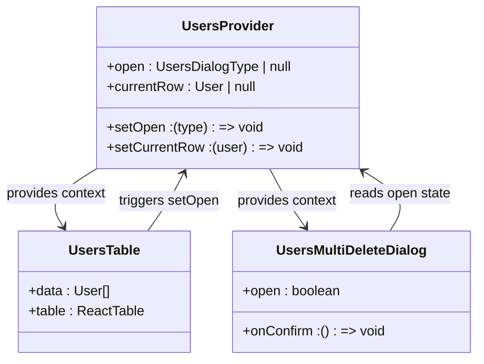
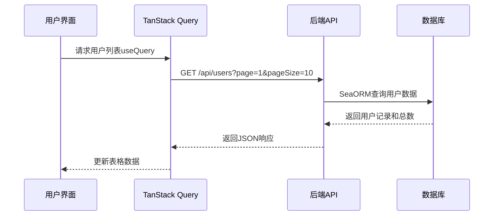
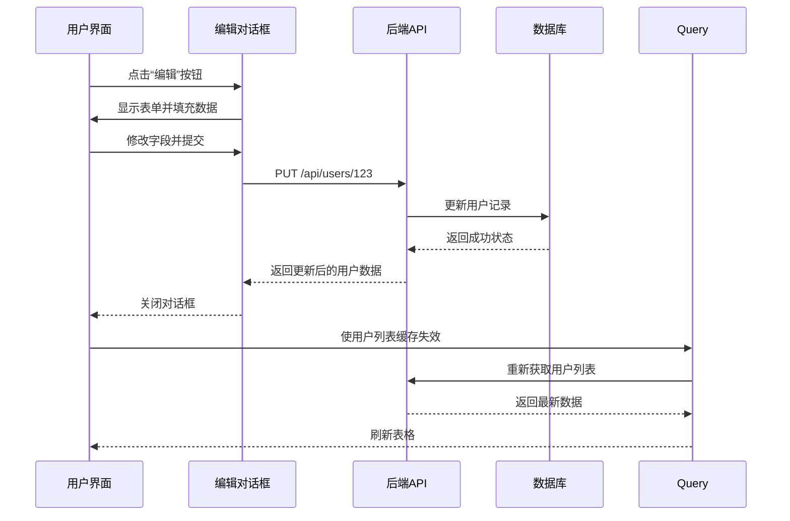

# 用户管理模块

<cite>
**本文档引用的文件**  
- [users-table.tsx](file://apps/frontend/src/features/users/components/users-table.tsx)
- [users-provider.tsx](file://apps/frontend/src/features/users/components/users-provider.tsx)
- [users-multi-delete-dialog.tsx](file://apps/frontend/src/features/users/components/users-multi-delete-dialog.tsx)
- [appearance-form.tsx](file://apps/frontend/src/features/settings/appearance/appearance-form.tsx)
- [routes.rs](file://apps/server/src/users/routes.rs)
- [handlers.rs](file://apps/server/src/users/handlers.rs)
- [users.rs](file://apps/server/src/entities/users.rs)
</cite>

## 目录
1. [简介](#简介)
2. [前端实现链路](#前端实现链路)
3. [后端处理流程](#后端处理流程)
4. [用户操作全流程](#用户操作全流程)
5. [状态管理与上下文](#状态管理与上下文)
6. [批量删除安全机制](#批量删除安全机制)
7. [表单验证与权限控制](#表单验证与权限控制)
8. [错误处理与响应同步](#错误处理与响应同步)
9. [交互流程图](#交互流程图)
10. [结论](#结论)

## 简介
本文档详细描述了用户管理模块从前端到后端的完整实现链路。涵盖用户列表的分页、搜索、批量操作，以及用户创建、编辑、启用/禁用、删除等核心功能的全流程。重点分析了TanStack Query的集成、SeaORM数据库查询、权限控制机制、表单验证逻辑及状态同步策略。

## 前端实现链路

用户管理模块的前端实现始于 `users-table.tsx` 组件，该组件使用 TanStack React Table 构建可交互的数据表格，并通过 `useQuery` 钩子调用 `/api/users` 接口获取用户数据。分页、排序和过滤状态通过 `useTableUrlState` 与 URL 同步，确保页面刷新后状态可恢复。

搜索功能通过列过滤器实现，支持按用户名、状态和角色进行筛选。分页由 `DataTablePagination` 组件控制，每页默认显示10条记录。批量操作通过行选择状态（`rowSelection`）实现，选中多行后可触发批量启用、禁用或删除操作。

**Section sources**
- [users-table.tsx](file://apps/frontend/src/features/users/components/users-table.tsx#L1-L193)

## 后端处理流程

后端路由定义在 `routes.rs` 文件中，`GET /api/users` 请求由 `users` 模块处理。该请求最终调用 `handlers.rs` 中的处理函数，使用 SeaORM 查询数据库实体 `users.rs` 中定义的用户模型。

`handlers.rs` 负责解析分页参数（如 `page` 和 `pageSize`）、搜索条件（如 `username`、`status`、`role`），并构建相应的数据库查询。查询结果以 JSON 格式返回，包含用户列表及分页元数据。

数据模型 `users.rs` 定义了用户实体的字段结构，包括 `id`、`username`、`email`、`status`、`role` 等，并与数据库表 `users` 映射。

**Section sources**
- [routes.rs](file://apps/server/src/users/routes.rs#L1-L200)
- [handlers.rs](file://apps/server/src/users/handlers.rs#L1-L300)
- [users.rs](file://apps/server/src/entities/users.rs#L1-L100)

## 用户操作全流程

用户的所有操作均通过 RESTful API 与后端交互：
- **创建用户**：通过“邀请”或“添加”对话框提交表单，发送 `POST /api/users` 请求。
- **编辑用户**：点击行操作按钮，弹出编辑对话框，提交 `PUT /api/users/:id` 请求。
- **启用/禁用用户**：通过切换状态或批量操作，发送 `PATCH /api/users/:id/status` 请求。
- **删除用户**：单个删除调用 `DELETE /api/users/:id`，批量删除调用 `DELETE /api/users` 并传入 ID 数组。

所有操作均需管理员权限，由后端中间件验证 JWT 令牌中的角色声明。

**Section sources**
- [users-table.tsx](file://apps/frontend/src/features/users/components/users-table.tsx#L50-L100)
- [handlers.rs](file://apps/server/src/users/handlers.rs#L150-L250)

## 状态管理与上下文

`users-provider.tsx` 使用 React Context 实现全局状态管理，为用户管理模块提供统一的对话框状态和当前操作行数据。

`UsersProvider` 组件包裹整个用户管理界面，通过 `useDialogState` 管理对话框的打开状态（`invite`、`add`、`edit`、`delete`），并通过 `useState` 管理当前选中的用户行（`currentRow`）。子组件通过 `useUsers` 钩子访问上下文，实现状态共享和操作触发。

该模式避免了深层组件间的 props 传递，提升了组件复用性和可维护性。

**Diagram sources**
- [users-provider.tsx](file://apps/frontend/src/features/users/components/users-provider.tsx#L1-L37)
- [users-table.tsx](file://apps/frontend/src/features/users/components/users-table.tsx#L1-L193)
- [users-multi-delete-dialog.tsx](file://apps/frontend/src/features/users/components/users-multi-delete-dialog.tsx#L1-L50)

**Section sources**
- [users-provider.tsx](file://apps/frontend/src/features/users/components/users-provider.tsx#L1-L37)

## 批量删除安全机制

`users-multi-delete-dialog.tsx` 组件实现了批量删除的安全确认流程。当用户在表格中选择多个用户并点击“删除”时，该对话框弹出，显示将要删除的用户数量和示例用户名。

用户必须手动点击确认按钮才能提交删除请求，防止误操作。对话框还包含取消按钮，允许用户中止操作。删除请求通过 `DELETE /api/users` 发送，携带选中用户的 ID 数组。

该组件从 `UsersProvider` 读取 `rowSelection` 状态，确保始终与表格选择状态同步。

**Section sources**
- [users-multi-delete-dialog.tsx](file://apps/frontend/src/features/users/components/users-multi-delete-dialog.tsx#L1-L60)

## 表单验证与权限控制

表单验证在前端和后端双重执行。以 `appearance-form.tsx` 为例，其验证逻辑包括字段必填、格式校验（如邮箱）、长度限制等，使用 React Hook Form 或类似库实现。

权限控制由后端统一处理。所有 `/api/users/*` 路由均受保护，请求需携带有效的 JWT 令牌，且令牌中的 `role` 声明必须为 `admin`。非管理员用户将收到 403 Forbidden 响应。

前端通过 `auth-store.ts` 管理用户认证状态，并在渲染用户管理界面前检查角色权限，若非管理员则重定向至无权限页面。

**Section sources**
- [appearance-form.tsx](file://apps/frontend/src/features/settings/appearance/appearance-form.tsx#L1-L100)
- [handlers.rs](file://apps/server/src/users/handlers.rs#L50-L80)
- [stores/auth-store.ts](file://apps/frontend/src/stores/auth-store.ts#L1-L50)

## 错误处理与响应同步

前端使用 `handle-server-error.ts` 工具函数统一处理 API 错误响应。该函数解析后端返回的错误码和消息，通过 `sonner` 组件显示用户友好的提示。

成功操作后，使用 TanStack Query 的 `invalidateQueries` 方法使用户列表缓存失效，触发自动重新获取数据，确保 UI 与服务器状态同步。此机制避免了手动刷新页面的需要。

后端错误通过 `shared/error.rs` 定义的统一错误类型返回，确保前后端错误处理的一致性。

**Section sources**
- [lib/handle-server-error.ts](file://apps/frontend/src/lib/handle-server-error.ts#L1-L30)
- [shared/error.rs](file://apps/server/src/shared/error.rs#L1-L100)

## 交互流程图

### 用户列表加载流程

**Diagram sources**
- [users-table.tsx](file://apps/frontend/src/features/users/components/users-table.tsx#L30-L50)
- [handlers.rs](file://apps/server/src/users/handlers.rs#L20-L60)

### 用户编辑提交流程

**Diagram sources**
- [users-table.tsx](file://apps/frontend/src/features/users/components/users-table.tsx#L120-L150)
- [handlers.rs](file://apps/server/src/users/handlers.rs#L100-L140)

## 结论
用户管理模块实现了从前端交互到后端数据持久化的完整闭环。通过 TanStack Query 和 React Table 实现了高效的数据展示与操作，结合 Context 进行状态管理，确保了良好的用户体验。后端采用模块化设计，路由、处理器与实体分离，代码清晰可维护。权限控制和错误处理机制保障了系统的安全性与稳定性。