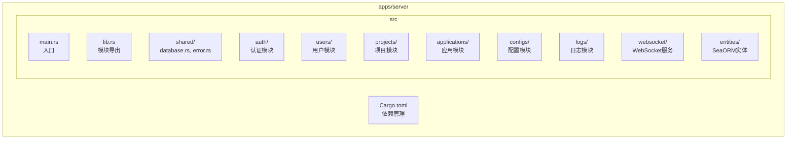
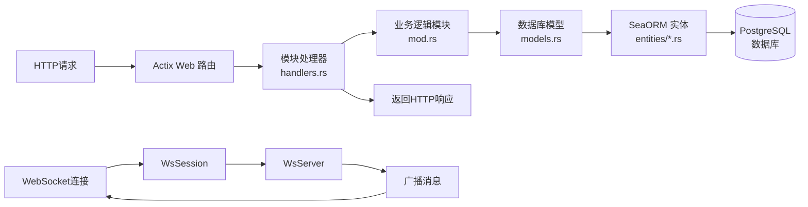
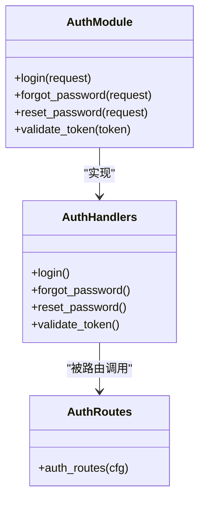
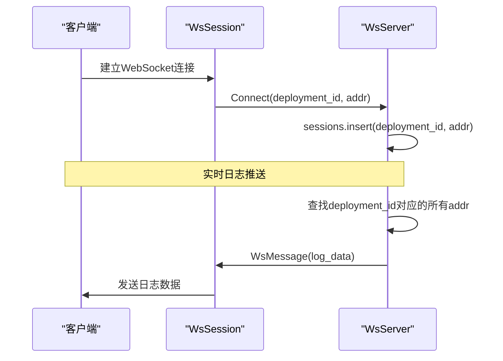
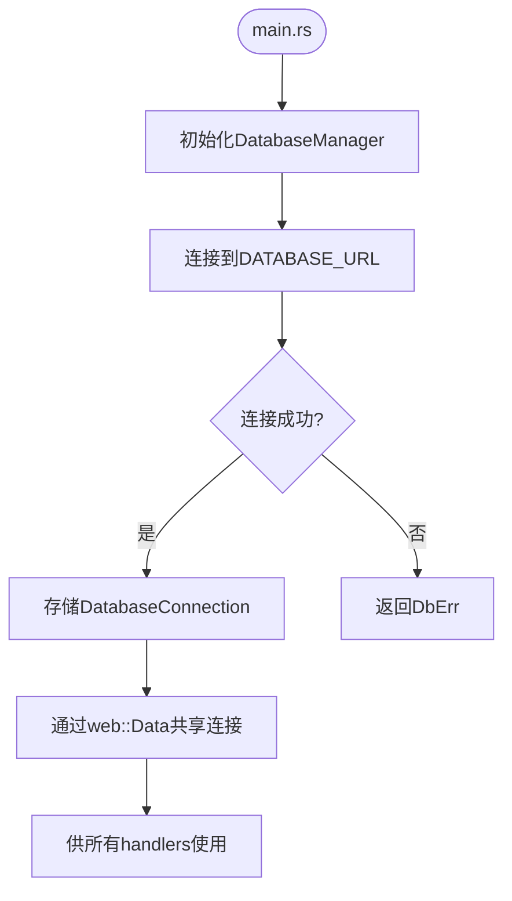
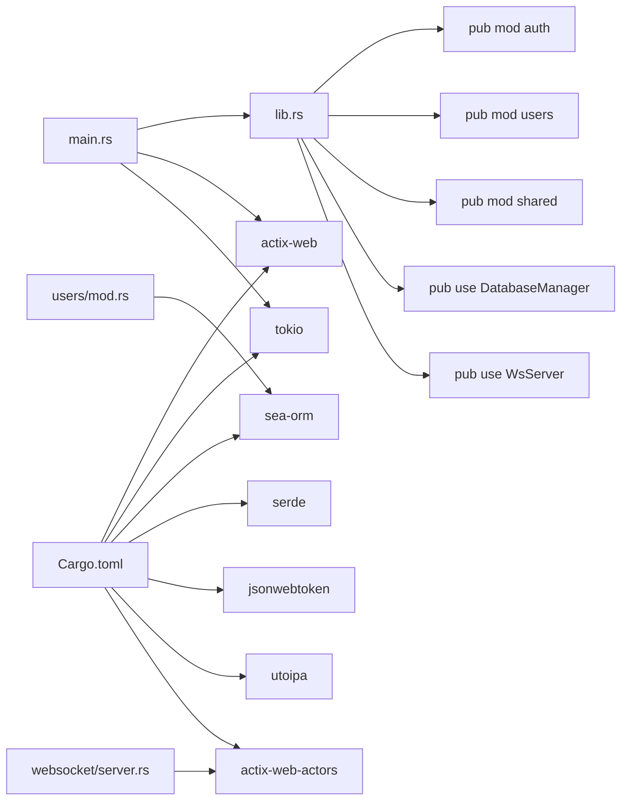

# 后端架构

<cite>
**本文档引用的文件**  
- [main.rs](file://apps/server/src/main.rs)
- [Cargo.toml](file://apps/server/Cargo.toml)
- [lib.rs](file://apps/server/src/lib.rs)
- [database.rs](file://apps/server/src/shared/database.rs)
- [error.rs](file://apps/server/src/shared/error.rs)
- [server.rs](file://apps/server/src/websocket/server.rs)
- [auth/mod.rs](file://apps/server/src/auth/mod.rs)
- [users/mod.rs](file://apps/server/src/users/mod.rs)
- [roles/mod.rs](file://apps/server/src/roles/mod.rs)
- [configs/mod.rs](file://apps/server/src/configs/mod.rs)
- [logs/mod.rs](file://apps/server/src/logs/mod.rs)
- [health/routes.rs](file://apps/server/src/health/routes.rs)
</cite>

## 目录
1. [项目结构](#项目结构)
2. [核心组件](#核心组件)
3. [架构概览](#架构概览)
4. [详细组件分析](#详细组件分析)
5. [依赖分析](#依赖分析)
6. [性能考量](#性能考量)
7. [故障排除指南](#故障排除指南)
8. [结论](#结论)

## 项目结构

后端服务位于 `apps/server` 目录下，采用 Rust 语言基于 Actix Web 框架构建。项目采用模块化设计，各业务功能（如用户、项目、应用、配置等）以独立模块形式组织在 `src` 目录下。共享功能（如数据库连接、错误处理）集中于 `shared` 模块。`entities` 目录存放 SeaORM 生成的数据库实体模型。`main.rs` 为程序入口点，负责启动 HTTP 服务器并注册所有路由。

**Diagram sources**
- [main.rs](file://apps/server/src/main.rs#L1-L160)
- [Cargo.toml](file://apps/server/Cargo.toml#L1-L35)

**Section sources**
- [main.rs](file://apps/server/src/main.rs#L1-L160)
- [Cargo.toml](file://apps/server/Cargo.toml#L1-L35)

## 核心组件

系统核心由 Actix Web 构建，采用模块化服务结构。`main.rs` 启动 HTTP 服务器，并通过 `configure` 方法注册来自 `auth`、`users`、`projects`、`applications` 等模块的路由。`lib.rs` 文件统一导出所有业务模块和共享组件，便于在 `main.rs` 中导入。`shared/database.rs` 实现了 `DatabaseManager`，负责通过 SeaORM 连接 PostgreSQL 数据库并管理连接池。`shared/error.rs` 定义了统一的 `ApiError` 错误类型，实现了 `ResponseError` trait，确保所有错误能以标准格式返回给客户端。

**Section sources**
- [main.rs](file://apps/server/src/main.rs#L1-L160)
- [lib.rs](file://apps/server/src/lib.rs#L1-L20)
- [database.rs](file://apps/server/src/shared/database.rs#L1-L25)
- [error.rs](file://apps/server/src/shared/error.rs#L1-L77)

## 架构概览

系统采用典型的分层架构，请求处理流程为：**路由 → 处理器 → 业务逻辑 → 模型 → 数据库实体**。`main.rs` 中的 `HttpServer` 注册了所有模块的路由。每个模块（如 `users`）包含 `mod.rs`、`handlers.rs`、`models.rs` 和 `routes.rs`。`routes.rs` 将 URL 路径映射到 `handlers.rs` 中的具体处理函数。处理函数调用业务逻辑（通常在 `mod.rs` 的结构体方法中实现），业务逻辑通过 SeaORM 的 `EntityTrait` 和 `ActiveModelTrait` 操作 `entities` 目录下的数据库实体进行数据持久化。

**Diagram sources**
- [main.rs](file://apps/server/src/main.rs#L1-L160)
- [users/mod.rs](file://apps/server/src/users/mod.rs#L1-L30)
- [users/handlers.rs](file://apps/server/src/users/handlers.rs#L1-L50)
- [entities/users.rs](file://apps/server/src/entities/users.rs#L1-L20)
- [server.rs](file://apps/server/src/websocket/server.rs#L1-L157)

## 详细组件分析

### 认证模块分析
`auth` 模块负责用户认证，包含登录、密码重置等功能。其结构遵循标准模块模式，`mod.rs` 导出子模块，`handlers.rs` 处理请求，`routes.rs` 定义路由。

**Diagram sources**
- [auth/mod.rs](file://apps/server/src/auth/mod.rs#L1-L2)
- [auth/handlers.rs](file://apps/server/src/auth/handlers.rs#L1-L50)
- [auth/routes.rs](file://apps/server/src/auth/routes.rs#L1-L10)

### WebSocket服务分析
`websocket` 模块基于 `actix-web-actors` 实现，用于实时日志推送与终端监控。`WsServer` 是一个 Actix Actor，管理着一个 `HashMap`，键为 `deployment_id`，值为该部署下所有客户端会话的地址（`Recipient<WsMessage>`）集合。`WsSession` 代表一个 WebSocket 连接，它在启动时向 `WsServer` 发送 `Connect` 消息进行注册，在停止时发送 `Disconnect` 消息注销。当服务器需要向特定部署的所有客户端推送日志时，可遍历该 `deployment_id` 对应的会话地址列表并发送消息。

**Diagram sources**
- [server.rs](file://apps/server/src/websocket/server.rs#L1-L157)
- [handlers.rs](file://apps/server/src/websocket/handlers.rs#L1-L30)
- [models.rs](file://apps/server/src/websocket/models.rs#L1-L20)

### 数据库连接分析
`shared/database.rs` 实现了 `DatabaseManager` 结构体，它封装了 `sea_orm::DatabaseConnection`。`new` 方法使用 `Database::connect` 异步建立与 PostgreSQL 的连接，并将其存储在 `connection` 字段中。`get_connection` 方法返回对连接的不可变引用。此连接池在 `main.rs` 中初始化后，通过 `web::Data` 共享给所有 Actix Web 处理器，实现了连接的全局共享和高效复用。

**Diagram sources**
- [database.rs](file://apps/server/src/shared/database.rs#L1-L25)
- [main.rs](file://apps/server/src/main.rs#L1-L160)

**Section sources**
- [database.rs](file://apps/server/src/shared/database.rs#L1-L25)
- [main.rs](file://apps/server/src/main.rs#L1-L160)

## 依赖分析

项目通过 Cargo 工作区（Cargo Workspace）的配置（`Cargo.toml`）管理多个 crate 依赖。`[dependencies]` 部分列出了所有外部依赖，包括：
- `actix-web`: Web 框架
- `tokio`: 异步运行时
- `sea-orm`: 异步 ORM，用于数据库操作
- `serde`: 序列化/反序列化
- `jsonwebtoken`: JWT 令牌处理
- `utoipa`: OpenAPI/Swagger 文档生成
- `actix-web-actors`: WebSocket 支持

`lib.rs` 文件通过 `pub mod` 语句将内部模块（如 `auth`, `users`, `shared`）导出，并通过 `pub use` 将 `shared::database::DatabaseManager` 和 `websocket::server::WsServer` 提升为库的公共接口，使得 `main.rs` 可以直接使用这些类型，实现了模块间的松耦合。模块间的依赖主要通过将 `DatabaseConnection` 作为参数传递给模块结构体（如 `UsersModule::new`）来实现，这是一种依赖注入（Dependency Injection）模式。

**Diagram sources**
- [Cargo.toml](file://apps/server/Cargo.toml#L1-L35)
- [lib.rs](file://apps/server/src/lib.rs#L1-L20)
- [users/mod.rs](file://apps/server/src/users/mod.rs#L1-L30)
- [server.rs](file://apps/server/src/websocket/server.rs#L1-L157)

**Section sources**
- [Cargo.toml](file://apps/server/Cargo.toml#L1-L35)
- [lib.rs](file://apps/server/src/lib.rs#L1-L20)

## 性能考量

本系统采用异步非阻塞 I/O 模型，这是其性能优势的核心。Actix Web 基于 Tokio 异步运行时，能够在一个线程上高效处理成千上万个并发连接。所有 I/O 操作（如数据库查询、文件读写、网络通信）都是异步的，不会阻塞工作线程。例如，`DatabaseManager::new` 和 `UsersModule::find_all_users` 方法都使用了 `async` 和 `.await`，使得在等待数据库响应时，线程可以去处理其他请求。SeaORM 作为异步 ORM，与 Actix Web 完美集成，避免了同步数据库调用造成的性能瓶颈。此外，连接池的使用也减少了频繁建立和断开数据库连接的开销。

**Section sources**
- [main.rs](file://apps/server/src/main.rs#L1-L160)
- [database.rs](file://apps/server/src/shared/database.rs#L1-L25)
- [users/mod.rs](file://apps/server/src/users/mod.rs#L1-L30)

## 故障排除指南

系统的错误处理策略集中在 `shared/error.rs`。`ApiError` 枚举定义了所有可能的错误类型（如 `InternalServerError`, `BadRequest`, `Unauthorized`）。通过为 `ApiError` 实现 `ResponseError` trait，可以将其自动转换为带有正确 HTTP 状态码和 JSON 响应体的 `HttpResponse`。此外，通过 `From` trait 的实现，底层错误（如 `sea_orm::DbErr`、`serde_json::Error`）会被自动转换为 `ApiError::DatabaseError` 或 `ApiError::ValidationError`，实现了错误的统一处理和向上抛出，避免了错误处理逻辑的分散。

**Section sources**
- [error.rs](file://apps/server/src/shared/error.rs#L1-L77)

## 结论

该后端系统是一个结构清晰、模块化的 Rust 服务。它利用 Actix Web 和 Tokio 提供高性能的异步 HTTP 服务，通过 SeaORM 实现与 PostgreSQL 的高效交互。模块化设计和依赖注入确保了代码的可维护性和可测试性。WebSocket 服务的集成满足了实时通信的需求。统一的错误处理和日志记录（通过 `env_logger`）为系统的稳定运行和问题排查提供了保障。整体架构体现了现代 Rust Web 服务的最佳实践。