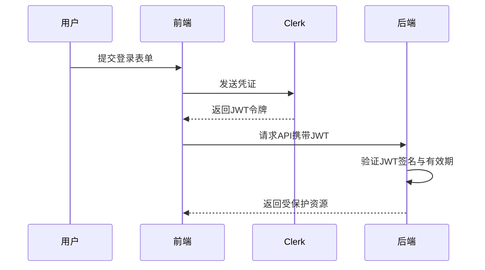
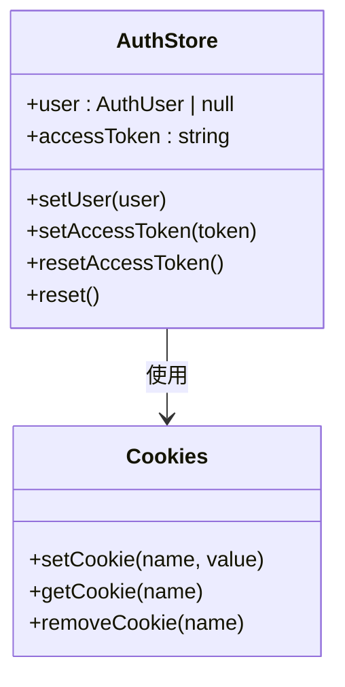
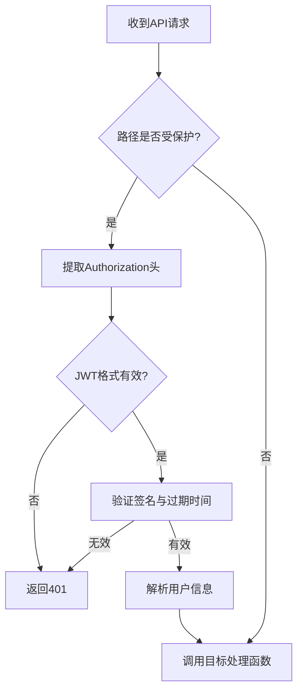
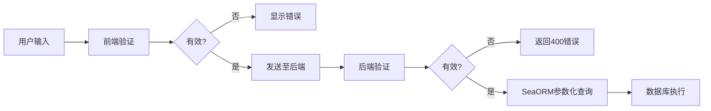
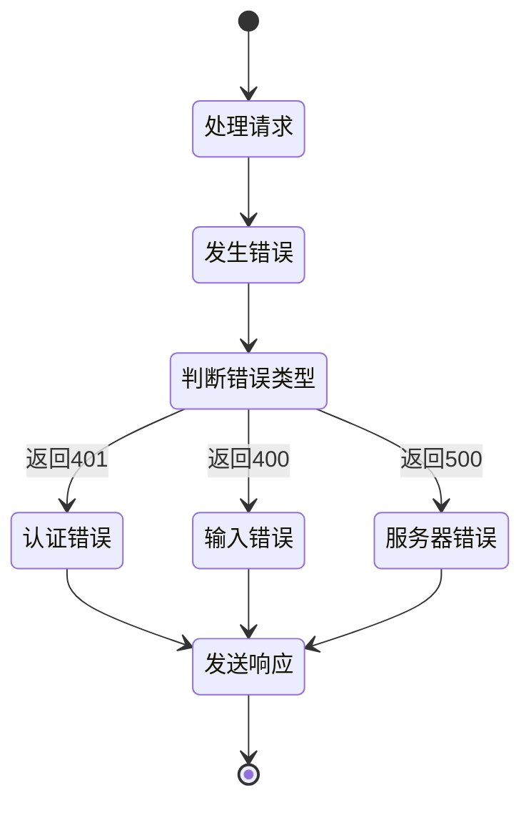

# 安全考虑

<cite>
**本文档中引用的文件**  
- [auth-store.ts](file://apps/frontend/src/stores/auth-store.ts)
- [error.rs](file://apps/server/src/shared/error.rs)
- [handlers.rs](file://apps/server/src/auth/handlers.rs)
- [routes.rs](file://apps/server/src/auth/routes.rs)
- [models.rs](file://apps/server/src/auth/models.rs)
- [001_initial_schema.sql](file://apps/server/migrations/001_initial_schema.sql)
- [lib.rs](file://apps/server/src/lib.rs)
- [websocket/server.rs](file://apps/server/src/websocket/server.rs)
- [cookies.ts](file://apps/frontend/src/lib/cookies.ts)
</cite>

## 目录
1. [简介](#简介)
2. [身份认证机制](#身份认证机制)
3. [认证状态管理与前端安全](#认证状态管理与前端安全)
4. [后端API认证与中间件](#后端api认证与中间件)
5. [密码存储与暴力破解防护](#密码存储与暴力破解防护)
6. [输入验证与注入攻击防护](#输入验证与注入攻击防护)
7. [WebSocket安全认证](#websocket安全认证)
8. [错误处理与信息泄露防护](#错误处理与信息泄露防护)
9. [安全审计建议与OWASP Top 10应对策略](#安全审计建议与owasp-top-10应对策略)
10. [结论](#结论)

## 简介
本系统采用基于Clerk的身份认证服务，结合前后端协同机制，构建了多层次的安全防护体系。系统覆盖了从用户登录、会话管理、API访问控制到数据存储安全的完整链条。本文档全面分析系统的安全机制，重点阐述认证流程、状态管理、后端验证、数据防护及错误处理策略。

## 身份认证机制

系统基于Clerk实现用户身份认证，支持标准登录流程与OAuth集成。认证成功后，系统生成JWT令牌用于后续请求的身份验证。Clerk负责管理用户凭证、多因素认证（MFA）及社交登录集成，确保认证过程的安全性与合规性。

JWT令牌包含用户身份信息（如账户号、邮箱、角色）和过期时间（exp），由服务端签名验证，防止篡改。令牌通过HTTP安全头（Authorization Bearer）在客户端与服务器间传递。

**Diagram sources**
- [auth-store.ts](file://apps/frontend/src/stores/auth-store.ts)
- [handlers.rs](file://apps/server/src/auth/handlers.rs)

**Section sources**
- [routes.rs](file://apps/server/src/auth/routes.rs)
- [models.rs](file://apps/server/src/auth/models.rs)

## 认证状态管理与前端安全

前端通过`auth-store.ts`使用Zustand状态管理库维护用户认证状态。认证信息（用户数据和访问令牌）存储在HTTP-only、Secure标记的Cookie中，有效防止XSS攻击窃取会话。

`auth-store.ts`中的`setAccessToken`方法在更新状态的同时调用`setCookie`，确保令牌持久化；`resetAccessToken`和`reset`方法在登出时清除Cookie，实现安全会话终止。

**Diagram sources**
- [auth-store.ts](file://apps/frontend/src/stores/auth-store.ts)
- [cookies.ts](file://apps/frontend/src/lib/cookies.ts)

**Section sources**
- [auth-store.ts](file://apps/frontend/src/stores/auth-store.ts)

## 后端API认证与中间件

后端使用Rust编写，通过中间件对所有受保护的API路由进行认证检查。中间件从请求头中提取JWT令牌，验证其签名、有效期和颁发者，确保请求来源合法。

认证中间件集成在路由系统中，对`/api/*`等关键路径进行统一拦截。验证失败时，返回标准化的401未授权响应，不泄露具体失败原因。

**Diagram sources**
- [lib.rs](file://apps/server/src/lib.rs)
- [handlers.rs](file://apps/server/src/auth/handlers.rs)

**Section sources**
- [lib.rs](file://apps/server/src/lib.rs)
- [handlers.rs](file://apps/server/src/auth/handlers.rs)

## 密码存储与暴力破解防护

用户密码在数据库中以哈希加盐形式存储。系统使用强哈希算法（如Argon2或bcrypt）对密码进行不可逆加密，即使数据库泄露也无法还原原始密码。

为防止暴力破解，系统实施请求限流机制。对登录接口进行IP或账户级别的速率限制（如每分钟最多5次尝试），超过阈值则临时锁定账户或增加验证难度（如CAPTCHA）。

数据库迁移文件`001_initial_schema.sql`定义了用户表结构，包含安全字段如`password_hash`、`failed_login_attempts`、`lockout_until`等，支持安全策略的实现。

**Section sources**
- [001_initial_schema.sql](file://apps/server/migrations/001_initial_schema.sql)
- [models.rs](file://apps/server/src/auth/models.rs)

## 输入验证与注入攻击防护

系统在前后端均实施严格的输入验证。前端使用表单验证库检查数据格式，后端在处理请求前再次验证所有输入参数，防止恶意数据进入系统。

SQL注入防护通过SeaORM实现。SeaORM是Rust的异步ORM框架，所有数据库查询均使用参数化查询或预编译语句，确保用户输入不会被解释为SQL代码，从根本上杜绝SQL注入风险。

**Diagram sources**
- [handlers.rs](file://apps/server/src/auth/handlers.rs)
- [models.rs](file://apps/server/src/entities/users.rs)

**Section sources**
- [handlers.rs](file://apps/server/src/auth/handlers.rs)

## WebSocket安全认证

WebSocket连接在建立时要求客户端提供有效的JWT令牌。服务器在`websocket/server.rs`中实现连接握手验证，拒绝未认证或令牌无效的连接请求。

已建立的连接与用户会话绑定，所有消息传递均在认证上下文中进行。服务器定期检查会话有效性，或在用户登出时主动关闭相关WebSocket连接，防止会话劫持。

**Section sources**
- [websocket/server.rs](file://apps/server/src/websocket/server.rs)

## 错误处理与信息泄露防护

系统在`error.rs`中定义了统一的错误处理机制。所有错误响应均使用标准化格式，仅返回必要的错误码和通用消息，避免暴露系统内部细节（如堆栈跟踪、数据库结构）。

例如，认证失败统一返回"Unauthorized"而非"Invalid password"，防止攻击者枚举有效用户名。数据库错误被转换为通用的"Internal Server Error"，不泄露SQL语句或表结构。

**Diagram sources**
- [error.rs](file://apps/server/src/shared/error.rs)

**Section sources**
- [error.rs](file://apps/server/src/shared/error.rs)

## 安全审计建议与OWASP Top 10应对策略

为持续提升系统安全性，建议定期进行安全审计，重点关注OWASP Top 10风险：

- **注入攻击**：已通过参数化查询防护
- **身份认证失效**：使用Clerk和JWT，实施强密码策略与多因素认证
- **敏感数据泄露**：确保传输加密（HTTPS）、存储加密，最小化数据暴露
- **XML外部实体（XXE）**：避免处理用户提交的XML
- **安全配置错误**：定期审查服务器与框架配置
- **跨站脚本（XSS）**：前端Cookie设置HttpOnly，输出编码
- **跨站请求伪造（CSRF）**：使用同步令牌模式（Synchronizer Token Pattern）或SameSite Cookie属性
- **访问控制失效**：基于角色的访问控制（RBAC）已在`roles.rs`和`permissions.rs`中实现
- **已知组件漏洞**：定期更新依赖库
- **日志与监控不足**：增强日志记录，设置入侵检测告警

**Section sources**
- [roles.rs](file://apps/server/src/roles/models.rs)
- [permissions.rs](file://apps/server/src/permissions/models.rs)

## 结论

本系统通过Clerk集成、JWT认证、安全状态管理、输入验证、参数化查询和统一错误处理等机制，构建了全面的安全防护体系。建议持续关注安全动态，定期进行渗透测试和代码审计，确保系统在面对新型威胁时保持韧性。