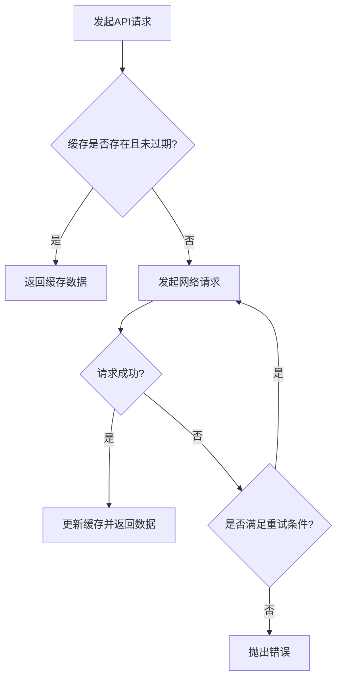
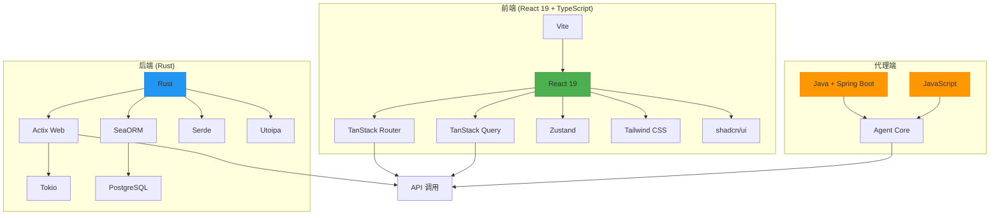

# 技术栈

<cite>
**本文档引用的文件**  
- [package.json](file://apps/frontend/package.json)
- [vite.config.ts](file://apps/frontend/vite.config.ts)
- [tsconfig.json](file://apps/frontend/tsconfig.json)
- [tsconfig.app.json](file://apps/frontend/tsconfig.app.json)
- [main.tsx](file://apps/frontend/src/main.tsx)
- [auth-store.ts](file://apps/frontend/src/stores/auth-store.ts)
- [handle-server-error.ts](file://apps/frontend/src/lib/handle-server-error.ts)
- [Cargo.toml](file://apps/server/Cargo.toml)
- [pom.xml](file://apps/agent/java/pom.xml)
- [index.js](file://apps/agent/js/src/index.js)
</cite>

## 目录
1. [简介](#简介)
2. [前端技术栈](#前端技术栈)
3. [后端技术栈](#后端技术栈)
4. [代理端技术栈](#代理端技术栈)
5. [技术选型原因与系统作用](#技术选型原因与系统作用)
6. [关键依赖版本与兼容性分析](#关键依赖版本与兼容性分析)
7. [技术栈全景图](#技术栈全景图)
8. [总结](#总结)

## 简介
aione-monihub 是一个现代化的全栈应用，采用多语言、多框架架构设计，支持高并发、可扩展的前后端分离系统。本项目从前端到后端再到代理层，均选用了当前业界领先的技术栈，以确保开发效率、运行性能和维护性。本文档详细记录了 aione-monihub 所使用的技术栈，涵盖前端、后端及代理端的技术选型、版本信息、作用机制与兼容性分析，旨在帮助新开发者快速理解开发环境要求与系统架构设计。

## 前端技术栈

aione-monihub 的前端部分基于现代 React 生态构建，采用以下核心技术：

- **React 19**：作为核心 UI 框架，提供函数式组件、Hooks 等现代开发模式，提升组件复用性与开发效率。
- **TypeScript**：提供静态类型检查，增强代码可维护性与 IDE 支持。
- **Vite**：作为构建工具，提供极速的开发服务器启动与热更新能力。
- **TanStack Router**：用于实现类型安全的路由管理，支持代码分割与预加载。
- **TanStack Query**：用于管理服务端状态，提供数据缓存、自动重试、请求去重等高级功能。
- **shadcn/ui**：基于 Radix UI 和 Tailwind CSS 的可定制组件库，提供无障碍、可访问的 UI 组件。
- **Tailwind CSS**：实用优先的 CSS 框架，结合 JIT 编译实现高效样式开发。
- **Zustand**：轻量级状态管理库，用于管理全局应用状态，如用户认证信息。

这些技术共同构成了一个高效、可维护、类型安全的前端开发环境。

**Section sources**
- [package.json](file://apps/frontend/package.json#L1-L83)
- [vite.config.ts](file://apps/frontend/vite.config.ts#L1-L22)
- [tsconfig.json](file://apps/frontend/tsconfig.json#L1-L13)
- [tsconfig.app.json](file://apps/frontend/tsconfig.app.json#L1-L32)

## 后端技术栈

后端采用 Rust 语言构建，具备高性能、内存安全和并发处理能力，主要技术栈如下：

- **Rust**：系统级编程语言，提供零成本抽象与内存安全，适合构建高并发、低延迟的服务。
- **Actix Web**：高性能异步 Web 框架，基于 Tokio 运行时，支持非阻塞 I/O，适用于高并发场景。
- **SeaORM**：Rust 的异步 ORM 框架，支持类型安全的数据库操作，简化数据访问层开发。
- **Tokio**：异步运行时，提供事件循环、任务调度和异步 I/O 支持，是 Rust 异步生态的核心。
- **Serde**：序列化框架，用于 JSON 与 Rust 结构体之间的高效转换。
- **Utoipa**：用于生成 OpenAPI（Swagger）文档，支持类型安全的 API 描述与文档自动生成。

该技术栈确保了后端服务的高性能、安全性与可维护性，适用于大规模分布式系统。

**Section sources**
- [Cargo.toml](file://apps/server/Cargo.toml)

## 代理端技术栈

代理端提供两种实现方式，满足不同部署环境与语言偏好的需求：

- **Java（Spring Boot）**：适用于企业级部署环境，利用 Spring 生态的成熟组件（如 Spring Security、Spring Data）实现稳定、可监控的代理服务。
- **JavaScript**：轻量级实现，适用于快速部署与脚本化集成，便于在 Node.js 环境中运行。

两种实现代理均能与主系统通信，执行任务调度、日志收集与状态上报等功能。

**Section sources**
- [pom.xml](file://apps/agent/java/pom.xml)
- [index.js](file://apps/agent/js/src/index.js)

## 技术选型原因与系统作用

### TanStack Query 优化 API 调用缓存
TanStack Query 在前端通过 `QueryClient` 管理服务端状态，配置了 `staleTime: 10 * 1000`（10秒），在短时间内避免重复请求。同时，通过 `retry` 策略控制失败重试次数，并在 401/403 错误时不重试，防止无效请求。其缓存机制显著减少了网络请求频率，提升了用户体验。

**Diagram sources**
- [main.tsx](file://apps/frontend/src/main.tsx#L20-L45)

### Actix Web 处理高并发请求
Actix Web 基于 Tokio 异步运行时，采用 Actor 模型处理请求，每个连接作为一个轻量级任务运行，避免线程阻塞。结合 SeaORM 的异步查询能力，可高效处理数千并发请求，适用于实时日志、监控等高吞吐场景。

## 关键依赖版本与兼容性分析

| 技术 | 版本 | 兼容性说明 |
|------|------|-----------|
| React | ^19.1.1 | 与 React DOM、Vite 插件兼容，支持最新 Hooks 与并发渲染特性 |
| TypeScript | ~5.9.2 | 与 Vite、ESLint、React 类型定义兼容 |
| TanStack React Query | ^5.85.3 | 与 React 18+ 兼容，支持 suspense、devtools |
| TanStack Router | ^1.131.16 | 支持代码分割、类型安全路由，与 Vite 深度集成 |
| Tailwind CSS | ^4.1.12 | 与 Vite、JIT 编译兼容，支持动态类名生成 |
| Zustand | ^5.0.7 | 轻量级，无依赖，与 React 18+ 完全兼容 |
| Rust | 1.70+ | 支持 async/await、泛型、生命周期检查 |
| Actix Web | 4.x | 基于 Tokio 1.x，支持 HTTP/2、WebSocket |
| SeaORM | 0.13+ | 与 Tokio、SQLx 兼容，支持 PostgreSQL、MySQL |
| Serde | 1.0+ | 广泛用于 Rust 生态，与 JSON、Bincode 等格式兼容 |
| Utoipa | 3.x | 支持 OpenAPI 3.0，与 Actix Web 集成良好 |

所有依赖均通过语义化版本控制（^ 或 ~）管理，确保在不破坏 API 的前提下自动更新补丁版本，提升安全性与稳定性。

**Section sources**
- [package.json](file://apps/frontend/package.json#L1-L83)
- [Cargo.toml](file://apps/server/Cargo.toml)

## 技术栈全景图

**Diagram sources**
- [package.json](file://apps/frontend/package.json)
- [Cargo.toml](file://apps/server/Cargo.toml)
- [pom.xml](file://apps/agent/java/pom.xml)
- [index.js](file://apps/agent/js/src/index.js)

## 总结

aione-monihub 采用现代化、高性能的技术栈，从前端到后端再到代理层，均选择了当前最先进且社区活跃的技术方案。前端通过 React 19、TanStack 生态与 Tailwind 实现高效开发；后端利用 Rust 的性能优势与 Actix Web 的高并发能力保障服务稳定性；代理端提供 Java 与 JavaScript 两种实现，满足多样化部署需求。整体架构清晰、可扩展性强，适合中大型团队协作开发与长期维护。