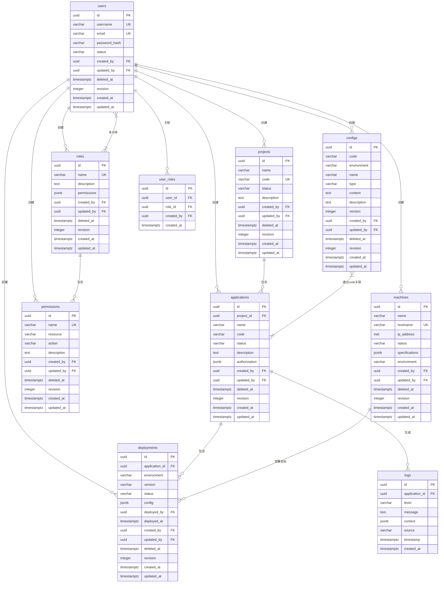

# 数据模型

<cite>
**本文档引用的文件**
- [001_initial_schema.sql](file://apps/server/migrations/001_initial_schema.sql)
- [users.rs](file://apps/server/src/entities/users.rs)
- [projects.rs](file://apps/server/src/entities/projects.rs)
- [applications.rs](file://apps/server/src/entities/applications.rs)
- [configurations.rs](file://apps/server/src/entities/configurations.rs)
- [deployments.rs](file://apps/server/src/entities/deployments.rs)
- [machines.rs](file://apps/server/src/entities/machines.rs)
- [logs.rs](file://apps/server/src/entities/logs.rs)
- [permissions.rs](file://apps/server/src/entities/permissions.rs)
- [roles.rs](file://apps/server/src/entities/roles.rs)
- [user_roles.rs](file://apps/server/src/entities/user_roles.rs)
</cite>

## 目录
1. [数据库实体关系图（ER图）](#数据库实体关系图er图)
2. [实体字段说明](#实体字段说明)
   - [用户（users）](#用户users)
   - [项目（projects）](#项目projects)
   - [应用（applications）](#应用applications)
   - [配置（configs）](#配置configs)
   - [角色（roles）](#角色roles)
   - [用户角色关联（user_roles）](#用户角色关联user_roles)
   - [权限（permissions）](#权限permissions)
   - [部署（deployments）](#部署deployments)
   - [机器（machines）](#机器machines)
   - [日志（logs）](#日志logs)
3. [Rust实体模型与SeaORM映射](#rust实体模型与seaorm映射)
4. [数据生命周期管理策略](#数据生命周期管理策略)
5. [典型查询场景与代码示例](#典型查询场景与代码示例)
6. [结论](#结论)

## 数据库实体关系图（ER图）



**图示来源**
- [001_initial_schema.sql](file://apps/server/migrations/001_initial_schema.sql)

## 实体字段说明

### 用户（users）
存储系统用户信息。

| 字段名 | 数据类型 | 约束 | 说明 |
|--------|----------|------|------|
| id | UUID | 主键，自动生成 | 用户唯一标识 |
| username | VARCHAR(255) | 非空，唯一 | 用户名 |
| email | VARCHAR(255) | 非空，唯一 | 邮箱地址 |
| password_hash | VARCHAR(255) | 非空 | 密码哈希值 |
| status | VARCHAR(50) | 非空，默认'active' | 用户状态（active/inactive） |
| created_by | UUID | 非空，外键 | 创建者ID |
| updated_by | UUID | 非空，外键 | 更新者ID |
| deleted_at | TIMESTAMPTZ | 可为空 | 软删除时间戳 |
| revision | INTEGER | 非空，默认1 | 版本号，用于乐观锁 |
| created_at | TIMESTAMPTZ | 非空，默认当前时间 | 创建时间 |
| updated_at | TIMESTAMPTZ | 非空，默认当前时间 | 更新时间 |

**节来源**
- [001_initial_schema.sql](file://apps/server/migrations/001_initial_schema.sql#L14-L26)

### 项目（projects）
表示用户管理的项目。

| 字段名 | 数据类型 | 约束 | 说明 |
|--------|----------|------|------|
| id | UUID | 主键，自动生成 | 项目唯一标识 |
| name | VARCHAR(255) | 非空 | 项目名称 |
| code | VARCHAR(100) | 非空，唯一 | 项目代码 |
| status | VARCHAR(50) | 非空，默认'active' | 项目状态 |
| description | TEXT | 可为空 | 项目描述 |
| created_by | UUID | 非空，外键 | 创建者ID |
| updated_by | UUID | 非空，外键 | 更新者ID |
| deleted_at | TIMESTAMPTZ | 可为空 | 软删除时间戳 |
| revision | INTEGER | 非空，默认1 | 版本号 |
| created_at | TIMESTAMPTZ | 非空，默认当前时间 | 创建时间 |
| updated_at | TIMESTAMPTZ | 非空，默认当前时间 | 更新时间 |

**节来源**
- [001_initial_schema.sql](file://apps/server/migrations/001_initial_schema.sql#L28-L43)

### 应用（applications）
表示项目下的具体应用。

| 字段名 | 数据类型 | 约束 | 说明 |
|--------|----------|------|------|
| id | UUID | 主键，自动生成 | 应用唯一标识 |
| project_id | UUID | 非空，外键 | 所属项目ID |
| name | VARCHAR(255) | 非空 | 应用名称 |
| code | VARCHAR(100) | 非空 | 应用代码 |
| status | VARCHAR(50) | 非空，默认'active' | 应用状态 |
| description | TEXT | 可为空 | 应用描述 |
| authorization | JSONB | 非空，默认空数组 | 授权信息（用户列表、过期时间） |
| created_by | UUID | 非空，外键 | 创建者ID |
| updated_by | UUID | 非空，外键 | 更新者ID |
| deleted_at | TIMESTAMPTZ | 可为空 | 软删除时间戳 |
| revision | INTEGER | 非空，默认1 | 版本号 |
| created_at | TIMESTAMPTZ | 非空，默认当前时间 | 创建时间 |
| updated_at | TIMESTAMPTZ | 非空，默认当前时间 | 更新时间 |

**节来源**
- [001_initial_schema.sql](file://apps/server/migrations/001_initial_schema.sql#L45-L65)

### 配置（configs）
存储应用的配置信息。

| 字段名 | 数据类型 | 约束 | 说明 |
|--------|----------|------|------|
| id | UUID | 主键，自动生成 | 配置唯一标识 |
| code | VARCHAR(100) | 非空 | 配置代码 |
| environment | VARCHAR(50) | 非空 | 环境（dev/test/prod） |
| name | VARCHAR(255) | 非空 | 配置名称 |
| type | VARCHAR(50) | 非空 | 配置类型 |
| content | TEXT | 非空 | 配置内容 |
| description | TEXT | 可为空 | 描述 |
| version | INTEGER | 非空，默认1 | 配置版本 |
| created_by | UUID | 非空，外键 | 创建者ID |
| updated_by | UUID | 非空，外键 | 更新者ID |
| deleted_at | TIMESTAMPTZ | 可为空 | 软删除时间戳 |
| revision | INTEGER | 非空，默认1 | 版本号 |
| created_at | TIMESTAMPTZ | 非空，默认当前时间 | 创建时间 |
| updated_at | TIMESTAMPTZ | 非空，默认当前时间 | 更新时间 |

**节来源**
- [001_initial_schema.sql](file://apps/server/migrations/001_initial_schema.sql#L67-L86)

### 角色（roles）
定义系统角色。

| 字段名 | 数据类型 | 约束 | 说明 |
|--------|----------|------|------|
| id | UUID | 主键，自动生成 | 角色唯一标识 |
| name | VARCHAR(255) | 非空，唯一 | 角色名称 |
| description | TEXT | 可为空 | 角色描述 |
| permissions | JSONB | 非空，默认空数组 | 权限列表（JSON格式） |
| created_by | UUID | 非空，外键 | 创建者ID |
| updated_by | UUID | 非空，外键 | 更新者ID |
| deleted_at | TIMESTAMPTZ | 可为空 | 软删除时间戳 |
| revision | INTEGER | 非空，默认1 | 版本号 |
| created_at | TIMESTAMPTZ | 非空，默认当前时间 | 创建时间 |
| updated_at | TIMESTAMPTZ | 非空，默认当前时间 | 更新时间 |

**节来源**
- [001_initial_schema.sql](file://apps/server/migrations/001_initial_schema.sql#L88-L103)

### 用户角色关联（user_roles）
实现用户与角色的多对多关联。

| 字段名 | 数据类型 | 约束 | 说明 |
|--------|----------|------|------|
| id | UUID | 主键，自动生成 | 关联唯一标识 |
| user_id | UUID | 非空，外键 | 用户ID |
| role_id | UUID | 非空，外键 | 角色ID |
| created_by | UUID | 非空，外键 | 创建者ID |
| created_at | TIMESTAMPTZ | 非空，默认当前时间 | 创建时间 |

**节来源**
- [001_initial_schema.sql](file://apps/server/migrations/001_initial_schema.sql#L105-L115)

### 权限（permissions）
定义系统权限。

| 字段名 | 数据类型 | 约束 | 说明 |
|--------|----------|------|------|
| id | UUID | 主键，自动生成 | 权限唯一标识 |
| name | VARCHAR(255) | 非空，唯一 | 权限名称 |
| resource | VARCHAR(255) | 非空 | 资源类型 |
| action | VARCHAR(100) | 非空 | 操作类型 |
| description | TEXT | 可为空 | 权限描述 |
| created_by | UUID | 非空，外键 | 创建者ID |
| updated_by | UUID | 非空，外键 | 更新者ID |
| deleted_at | TIMESTAMPTZ | 可为空 | 软删除时间戳 |
| revision | INTEGER | 非空，默认1 | 版本号 |
| created_at | TIMESTAMPTZ | 非空，默认当前时间 | 创建时间 |
| updated_at | TIMESTAMPTZ | 非空，默认当前时间 | 更新时间 |

**节来源**
- [001_initial_schema.sql](file://apps/server/migrations/001_initial_schema.sql#L117-L132)

### 部署（deployments）
记录应用部署信息。

| 字段名 | 数据类型 | 约束 | 说明 |
|--------|----------|------|------|
| id | UUID | 主键，自动生成 | 部署唯一标识 |
| application_id | UUID | 非空，外键 | 应用ID |
| environment | VARCHAR(50) | 非空 | 部署环境 |
| version | VARCHAR(100) | 非空 | 部署版本 |
| status | VARCHAR(50) | 非空，默认'pending' | 部署状态 |
| config | JSONB | 非空，默认空对象 | 部署配置 |
| deployed_by | UUID | 非空，外键 | 部署者ID |
| deployed_at | TIMESTAMPTZ | 可为空 | 实际部署时间 |
| created_by | UUID | 非空，外键 | 创建者ID |
| updated_by | UUID | 非空，外键 | 更新者ID |
| deleted_at | TIMESTAMPTZ | 可为空 | 软删除时间戳 |
| revision | INTEGER | 非空，默认1 | 版本号 |
| created_at | TIMESTAMPTZ | 非空，默认当前时间 | 创建时间 |
| updated_at | TIMESTAMPTZ | 非空，默认当前时间 | 更新时间 |

**节来源**
- [001_initial_schema.sql](file://apps/server/migrations/001_initial_schema.sql#L134-L154)

### 机器（machines）
表示部署目标机器。

| 字段名 | 数据类型 | 约束 | 说明 |
|--------|----------|------|------|
| id | UUID | 主键，自动生成 | 机器唯一标识 |
| name | VARCHAR(255) | 非空 | 机器名称 |
| hostname | VARCHAR(255) | 非空，唯一 | 主机名 |
| ip_address | INET | 非空 | IP地址 |
| status | VARCHAR(50) | 非空，默认'active' | 机器状态 |
| specifications | JSONB | 非空，默认空对象 | 规格信息（JSON） |
| environment | VARCHAR(50) | 非空 | 所属环境 |
| created_by | UUID | 非空，外键 | 创建者ID |
| updated_by | UUID | 非空，外键 | 更新者ID |
| deleted_at | TIMESTAMPTZ | 可为空 | 软删除时间戳 |
| revision | INTEGER | 非空，默认1 | 版本号 |
| created_at | TIMESTAMPTZ | 非空，默认当前时间 | 创建时间 |
| updated_at | TIMESTAMPTZ | 非空，默认当前时间 | 更新时间 |

**节来源**
- [001_initial_schema.sql](file://apps/server/migrations/001_initial_schema.sql#L156-L175)

### 日志（logs）
存储应用运行日志。

| 字段名 | 数据类型 | 约束 | 说明 |
|--------|----------|------|------|
| id | UUID | 主键，自动生成 | 日志唯一标识 |
| application_id | UUID | 可为空，外键 | 应用ID（可为空） |
| level | VARCHAR(20) | 非空 | 日志级别（INFO/WARN/ERROR） |
| message | TEXT | 非空 | 日志消息 |
| context | JSONB | 默认空对象 | 上下文信息 |
| source | VARCHAR(255) | 可为空 | 日志来源 |
| timestamp | TIMESTAMPTZ | 非空，默认当前时间 | 日志时间戳 |
| created_at | TIMESTAMPTZ | 非空，默认当前时间 | 记录创建时间 |

**节来源**
- [001_initial_schema.sql](file://apps/server/migrations/001_initial_schema.sql#L177-L187)

## Rust实体模型与SeaORM映射

系统使用SeaORM框架将Rust结构体映射到数据库表。每个实体对应一个Rust模块，定义在`entities`目录下。

### 映射机制
- 使用`#[sea_orm(table_name = "xxx")]`指定对应表名
- `#[sea_orm(primary_key)]`标记主键字段
- `#[sea_orm(unique)]`标记唯一约束字段
- `#[sea_orm(...)]`用于定义外键和关系

### 关系定义示例
#### 用户与项目关系
用户实体通过`Relation::Projects`定义一对多关系，表示一个用户可创建多个项目。

#### 用户与角色多对多关联
通过`user_roles`中间表实现：
- `users`实体通过`via()`方法指定通过`user_roles`表关联到`roles`
- `user_roles`表包含`user_id`和`role_id`外键，形成多对多关系

#### 应用与项目关系
应用实体通过`belongs_to`注解定义与项目的归属关系，`from`和`to`指定外键和主键的对应关系。

**节来源**
- [users.rs](file://apps/server/src/entities/users.rs#L1-L50)
- [projects.rs](file://apps/server/src/entities/projects.rs#L1-L42)
- [applications.rs](file://apps/server/src/entities/applications.rs#L1-L43)
- [deployments.rs](file://apps/server/src/entities/deployments.rs#L1-L35)

## 数据生命周期管理策略

### 软删除机制
所有主要实体（用户、项目、应用等）均包含`deleted_at`字段，实现软删除：
- 删除操作设置`deleted_at`为当前时间，而非物理删除
- 查询时默认过滤`deleted_at IS NULL`的记录
- 支持数据恢复功能

### 数据版本控制
- `revision`字段用于乐观锁，防止并发更新冲突
- 每次更新操作递增`revision`值
- 更新时验证`revision`匹配，确保数据一致性

### 时间戳自动更新
通过数据库触发器`update_updated_at_column`自动更新`updated_at`字段：
- 每次`UPDATE`操作自动设置`updated_at`为当前时间
- 确保时间戳的准确性和一致性

### 日志保留策略
- 日志表无`deleted_at`字段，采用物理存储
- 建议通过外部脚本定期归档或清理过期日志（如保留30天）
- `timestamp`索引支持高效的时间范围查询

**节来源**
- [001_initial_schema.sql](file://apps/server/migrations/001_initial_schema.sql#L189-L232)

## 典型查询场景与代码示例

### 查询用户及其角色
```sql
SELECT u.*, r.name as role_name 
FROM users u 
LEFT JOIN user_roles ur ON u.id = ur.user_id 
LEFT JOIN roles r ON ur.role_id = r.id 
WHERE u.id = 'user-id';
```

### 查询项目下的所有应用
```sql
SELECT * FROM applications 
WHERE project_id = 'project-id' AND deleted_at IS NULL;
```

### 查询特定应用的最近部署
```sql
SELECT d.*, u.username as deployed_by_name 
FROM deployments d 
JOIN users u ON d.deployed_by = u.id 
WHERE d.application_id = 'app-id' 
ORDER BY d.deployed_at DESC 
LIMIT 10;
```

### SeaORM查询代码示例
```rust
// 查询用户及其关联角色（通过中间表）
let user_with_roles = Users::find_by_id(user_id)
    .find_also_related(Roles)
    .all(db)
    .await?;

// 查询项目下的所有活跃应用
let apps = Applications::find()
    .filter(Column::ProjectId.eq(project_id))
    .filter(Column::DeletedAt.is_null())
    .all(db)
    .await?;
```

**节来源**
- [001_initial_schema.sql](file://apps/server/migrations/001_initial_schema.sql)
- [users.rs](file://apps/server/src/entities/users.rs)
- [applications.rs](file://apps/server/src/entities/applications.rs)

## 结论

本文档全面记录了AiOne MoniHub系统的数据模型设计。基于SQL DDL语句和Rust实体定义，详细说明了各实体的字段含义、约束条件及关系。系统采用SeaORM实现Rust与数据库的映射，支持软删除、版本控制和自动时间戳更新等数据管理策略。通过ER图直观展示了实体间的关系，为开发者提供了清晰的数据访问模式参考。