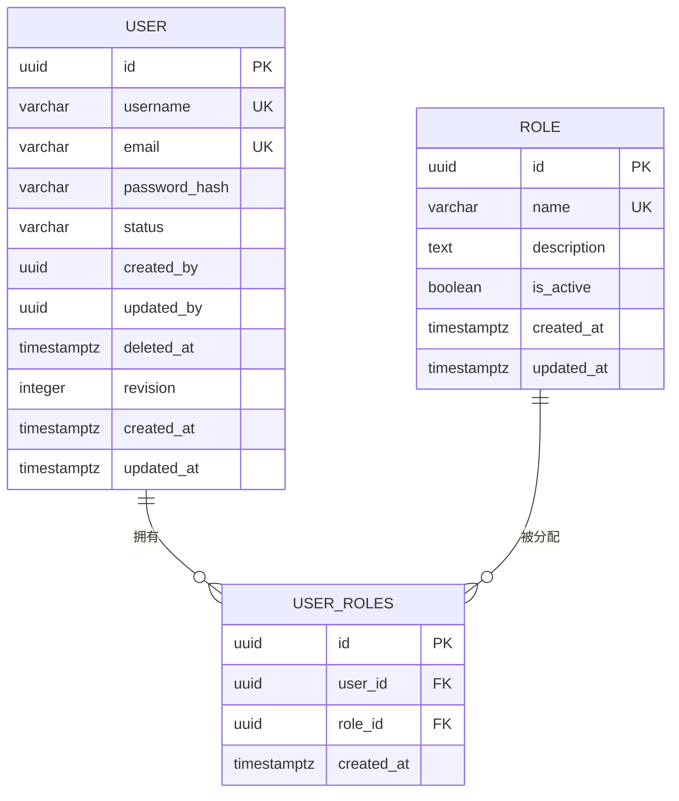
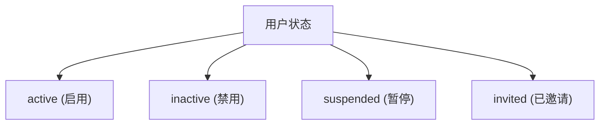
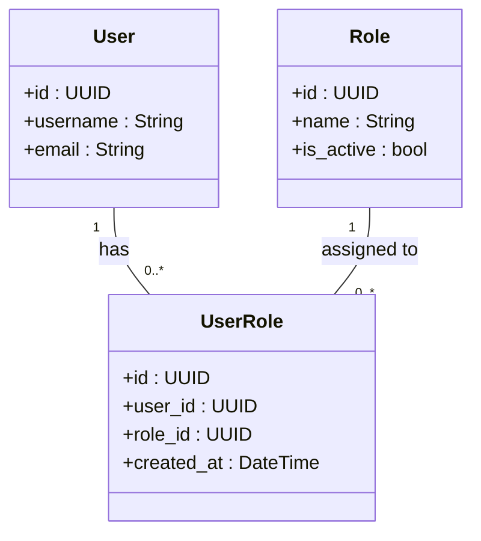

# 用户实体 (User)

<cite>
**本文档中引用的文件**  
- [001_initial_schema.sql](file://apps/server/migrations/001_initial_schema.sql)
- [users.rs](file://apps/server/src/entities/users.rs)
- [user_roles.rs](file://apps/server/src/entities/user_roles.rs)
- [roles.rs](file://apps/server/src/entities/roles.rs)
- [models.rs](file://apps/server/src/users/models.rs)
</cite>

## 目录
1. [数据模型设计](#数据模型设计)  
2. [字段说明](#字段说明)  
3. [SeaORM 实体映射](#seaorm-实体映射)  
4. [用户状态管理](#用户状态管理)  
5. [多对多角色关联](#多对多角色关联)  
6. [典型查询场景](#典型查询场景)  
7. [软删除处理](#软删除处理)

## 数据模型设计

用户实体的数据模型基于 PostgreSQL 数据库中的 `users` 表设计，采用 UUID 作为主键，支持唯一用户名和邮箱、密码哈希存储、时间戳记录以及状态管理。该表通过外键与 `user_roles` 中间表关联，实现用户与角色的多对多关系。



**Diagram sources**  
- [001_initial_schema.sql](file://apps/server/migrations/001_initial_schema.sql#L6-L30)

**Section sources**  
- [001_initial_schema.sql](file://apps/server/migrations/001_initial_schema.sql#L6-L30)

## 字段说明

| 字段名 | 数据类型 | 约束 | 说明 |
|--------|----------|------|------|
| `id` | UUID | 主键，默认生成 | 用户唯一标识符 |
| `username` | VARCHAR(255) | NOT NULL, UNIQUE | 用户名，唯一且不可为空 |
| `email` | VARCHAR(255) | NOT NULL, UNIQUE | 邮箱地址，用于登录和通信 |
| `password_hash` | VARCHAR(255) | NOT NULL | 密码的哈希值，明文密码不存储 |
| `status` | VARCHAR(50) | NOT NULL, DEFAULT 'active' | 用户状态（如 active, inactive） |
| `created_by` | UUID | NOT NULL | 创建者用户ID |
| `updated_by` | UUID | NOT NULL | 最后更新者用户ID |
| `deleted_at` | TIMESTAMPTZ | 可为空 | 软删除时间戳 |
| `revision` | INTEGER | NOT NULL, DEFAULT 1 | 版本号，用于乐观锁 |
| `created_at` | TIMESTAMPTZ | NOT NULL, DEFAULT NOW() | 创建时间 |
| `updated_at` | TIMESTAMPTZ | NOT NULL, DEFAULT NOW() | 更新时间 |

**Section sources**  
- [001_initial_schema.sql](file://apps/server/migrations/001_initial_schema.sql#L6-L30)

## SeaORM 实体映射

在 Rust 后端中，`users` 表通过 SeaORM 框架映射为 `Model` 结构体。该结构体使用 `#[sea_orm(table_name = "users")]` 注解指定对应的数据库表名，并通过字段级注解定义主键、唯一性等约束。

```rust
#[derive(EntityModel, Debug, Clone)]
#[sea_orm(table_name = "users")]
pub struct Model {
    #[sea_orm(primary_key)]
    pub id: i32,
    #[sea_orm(unique)]
    pub username: String,
    #[sea_orm(unique)]
    pub email: String,
    pub password_hash: String,
    pub is_active: bool,
    pub created_at: DateTime,
    pub updated_at: DateTime,
}
```

注意：尽管数据库使用 UUID，但当前 SeaORM 实体中 `id` 类型为 `i32`，可能存在类型不一致问题，建议统一为 `Uuid` 类型以确保兼容性。

**Section sources**  
- [users.rs](file://apps/server/src/entities/users.rs#L1-L20)

## 用户状态管理

用户状态通过 `status` 字段实现，其值为字符串类型，支持多种状态如 `active`（启用）、`inactive`（禁用）、`suspended`（暂停）等。前端在用户列表查询时可通过 `status` 参数进行过滤。

状态变更由管理员通过 API 接口触发，后端在更新时会自动记录 `updated_by` 和 `updated_at` 字段，并递增 `revision` 值以支持并发控制。



**Section sources**  
- [001_initial_schema.sql](file://apps/server/migrations/001_initial_schema.sql#L10)
- [models.rs](file://apps/server/src/users/models.rs#L5-L15)

## 多对多角色关联

用户与角色之间通过中间表 `user_roles` 实现多对多关联。每个用户可拥有多个角色，每个角色也可分配给多个用户。

### 关联表结构

| 字段 | 类型 | 约束 | 说明 |
|------|------|------|------|
| `id` | UUID | 主键 | 关联记录ID |
| `user_id` | UUID | 外键，NOT NULL | 用户ID |
| `role_id` | UUID | 外键，NOT NULL | 角色ID |
| `created_at` | TIMESTAMPTZ | NOT NULL, DEFAULT NOW() | 分配时间 |

### SeaORM 关系定义

在 `users.rs` 中通过 `Related` trait 定义了通过 `user_roles` 表关联到 `roles` 的路径：

```rust
impl Related<super::roles::Entity> for Entity {
    fn to() -> RelationDef {
        super::user_roles::Relation::Roles.def()
    }
    fn via() -> Option<RelationDef> {
        Some(super::user_roles::Relation::Users.def().rev())
    }
}
```

此设计支持通过 SeaORM 的 `find_also_related` 方法一次性查询用户及其角色信息。



**Diagram sources**  
- [users.rs](file://apps/server/src/entities/users.rs#L22-L45)
- [user_roles.rs](file://apps/server/src/entities/user_roles.rs#L1-L41)
- [roles.rs](file://apps/server/src/entities/roles.rs#L1-L54)

**Section sources**  
- [users.rs](file://apps/server/src/entities/users.rs#L22-L45)
- [user_roles.rs](file://apps/server/src/entities/user_roles.rs#L1-L41)

## 典型查询场景

### 根据邮箱查找用户（SQL）

```sql
SELECT * FROM users WHERE email = 'example@example.com' AND deleted_at IS NULL;
```

### 对应 SeaORM 查询代码片段

```rust
let user = Users::find()
    .filter(users::Column::Email.eq("example@example.com"))
    .filter(users::Column::DeletedAt.is_null())
    .one(db)
    .await?;
```

该查询用于登录验证或用户信息获取，确保只返回未被软删除的用户。

**Section sources**  
- [users.rs](file://apps/server/src/entities/users.rs#L1-L20)
- [001_initial_schema.sql](file://apps/server/migrations/001_initial_schema.sql#L6-L30)

## 软删除处理

系统采用软删除机制，通过 `deleted_at` 字段标记删除状态，而非物理删除数据。当用户被删除时，`deleted_at` 被设置为当前时间戳，后续查询需添加 `deleted_at IS NULL` 条件以排除已删除用户。

更新操作通过触发器自动维护 `updated_at` 字段：

```sql
CREATE TRIGGER update_users_updated_at 
BEFORE UPDATE ON users 
FOR EACH ROW 
EXECUTE FUNCTION update_updated_at_column();
```

此机制保障了数据可追溯性和审计能力，同时避免误删数据。

**Section sources**  
- [001_initial_schema.sql](file://apps/server/migrations/001_initial_schema.sql#L210-L212)