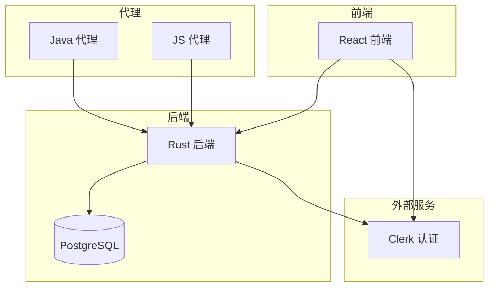

# 系统概述

<cite>
**本文档引用的文件**  
- [README.md](file://README.md)
- [apps/frontend/README.md](file://apps/frontend/README.md)
- [apps/server/README.md](file://apps/server/README.md)
- [apps/server/migrations/001_initial_schema.sql](file://apps/server/migrations/001_initial_schema.sql)
- [apps/server/src/main.rs](file://apps/server/src/main.rs)
- [apps/frontend/src/main.tsx](file://apps/frontend/src/main.tsx)
- [apps/frontend/src/routes/(auth)/sign-in.tsx](file://apps/frontend/src/routes/(auth)/sign-in.tsx)
- [apps/frontend/src/features/auth/sign-in/index.tsx](file://apps/frontend/src/features/auth/sign-in/index.tsx)
- [apps/frontend/src/features/auth/sign-in/components/user-auth-form.tsx](file://apps/frontend/src/features/auth/sign-in/components/user-auth-form.tsx)
</cite>

## 目录
1. [项目简介](#项目简介)
2. [技术架构](#技术架构)
3. [核心功能模块](#核心功能模块)
4. [系统设计目标](#系统设计目标)
5. [用户角色与使用场景](#用户角色与使用场景)
6. [代码库结构分析](#代码库结构分析)
7. [典型用户旅程](#典型用户旅程)
8. [系统上下文图示](#系统上下文图示)

## 项目简介

aione-monihub 是由 AiOne 团队开发的一款集成化监控与管理平台，旨在为企业级用户提供高效、便捷的远程应用管理解决方案。该系统支持通过 PC 或移动设备访问，实现对用户、项目、应用、配置、部署、机器、日志及权限等全方位的集中管理。平台采用现代化技术栈构建，具备高可靠性与可扩展性，适用于开发、运维及管理团队协同工作。

**Section sources**  
- [README.md](file://README.md#L1-L10)

## 技术架构

aione-monihub 采用前后端分离的全栈架构设计：
- **前端**：基于 React 19 与 TypeScript 构建，使用 Vite 作为构建工具，UI 框架采用 Shadcn UI 与 Tailwind CSS，路由系统为 TanStack Router。
- **后端**：使用 Rust 语言开发，基于 Actix Web 框架构建 RESTful API 与 WebSocket 服务，数据访问层采用 SeaORM，数据库为 PostgreSQL。
- **认证服务**：集成 Clerk 提供用户身份认证支持。
- **代理端**：支持 Java（Spring Boot）和 JavaScript 两种实现，用于连接和监控远程机器。

系统通过清晰的模块划分和现代化技术组合，确保高性能、高并发和安全性。

**Section sources**  
- [README.md](file://README.md#L15-L25)
- [apps/frontend/README.md](file://apps/frontend/README.md#L20-L35)
- [apps/server/README.md](file://apps/server/README.md#L1-L5)

## 核心功能模块

系统提供以下核心管理功能：
- **用户管理**：支持用户注册、登录、权限分配与状态管理。
- **项目管理**：创建、查看、编辑和删除项目，支持多项目隔离。
- **应用管理**：对部署的应用进行全生命周期管理，包括创建、配置、启停与监控。
- **配置管理**：集中管理不同环境下的应用配置，支持版本控制。
- **部署管理**：自动化部署流程，记录部署历史与状态。
- **机器管理**：注册和监控运行代理的服务器，查看资源使用情况。
- **日志管理**：集中收集和查询应用日志，支持按级别、时间过滤。
- **权限管理**：基于角色的访问控制（RBAC），支持细粒度权限分配。

这些功能模块共同构成一个完整的应用监控与运维平台。

**Section sources**  
- [apps/server/README.md](file://apps/server/README.md#L40-L55)
- [apps/server/migrations/001_initial_schema.sql](file://apps/server/migrations/001_initial_schema.sql#L10-L230)

## 系统设计目标

aione-monihub 的设计遵循以下核心原则：
- **高可靠性**：后端采用 Rust 语言，具备内存安全与零成本抽象特性，确保服务稳定运行。
- **可扩展性**：模块化设计，各功能组件独立开发与部署，便于横向扩展。
- **安全性**：通过 Clerk 实现安全认证，后端接口均进行权限校验，数据传输加密。
- **易用性**：前端界面简洁直观，支持暗色模式与响应式布局，提升用户体验。
- **可观测性**：提供健康检查接口与详细日志记录，便于系统监控与故障排查。

这些设计目标确保系统能够满足企业级生产环境的需求。

**Section sources**  
- [README.md](file://README.md#L1-L70)
- [apps/server/README.md](file://apps/server/README.md#L1-L120)

## 用户角色与使用场景

系统主要面向三类用户角色：
- **管理员**：负责用户管理、权限分配、系统配置与整体监控。
- **开发者**：管理所属项目中的应用，进行代码部署、配置更新与日志查看。
- **运维人员**：监控机器状态、管理部署流程、处理系统告警与故障。

典型使用场景包括：
- 开发者提交新版本代码后，通过平台触发自动化部署。
- 运维人员通过仪表盘查看应用运行状态，发现异常时查看实时日志。
- 管理员为新入职员工创建账户并分配相应项目权限。

**Section sources**  
- [README.md](file://README.md#L1-L70)

## 代码库结构分析

项目采用多包工作区结构，主要包含三大模块：
- **apps/agent**：代理端实现，包含 Java 和 JavaScript 两个子项目，负责与目标机器通信并上报数据。
- **apps/frontend**：前端应用，基于 React 19 + TypeScript 构建，包含 UI 组件、页面路由与状态管理。
- **apps/server**：后端服务，基于 Rust + Actix Web 构建，按功能划分为 users、projects、applications 等多个模块，通过 SeaORM 操作 PostgreSQL 数据库。

各模块职责清晰，通过 REST API 和 WebSocket 进行通信，形成松耦合的分布式架构。

**Section sources**  
- [README.md](file://README.md#L12-L35)
- [apps/server/README.md](file://apps/server/README.md#L60-L120)

## 典型用户旅程

以开发者为例，典型用户旅程如下：
1. **注册登录**：访问前端页面，通过 Clerk 认证登录系统。
2. **项目导航**：登录后进入仪表盘，选择目标项目。
3. **应用部署**：进入应用管理页面，上传新版本并触发部署流程。
4. **状态监控**：查看部署进度，确认服务启动成功。
5. **日志排查**：若出现异常，实时查看应用日志进行问题定位。
6. **配置更新**：根据需要修改环境配置并重新部署。

整个流程在统一平台内完成，无需切换多个工具。

**Section sources**  
- [apps/frontend/src/main.tsx](file://apps/frontend/src/main.tsx#L1-L105)
- [apps/frontend/src/routes/(auth)/sign-in.tsx](file://apps/frontend/src/routes/(auth)/sign-in.tsx#L1-L13)
- [apps/frontend/src/features/auth/sign-in/index.tsx](file://apps/frontend/src/features/auth/sign-in/index.tsx#L1-L52)
- [apps/frontend/src/features/auth/sign-in/components/user-auth-form.tsx](file://apps/frontend/src/features/auth/sign-in/components/user-auth-form.tsx#L1-L149)

## 系统上下文图示

**Diagram sources**  
- [apps/server/src/main.rs](file://apps/server/src/main.rs#L1-L160)
- [apps/frontend/src/main.tsx](file://apps/frontend/src/main.tsx#L1-L105)

**Section sources**  
- [apps/server/src/main.rs](file://apps/server/src/main.rs#L1-L160)
- [apps/frontend/src/main.tsx](file://apps/frontend/src/main.tsx#L1-L105)