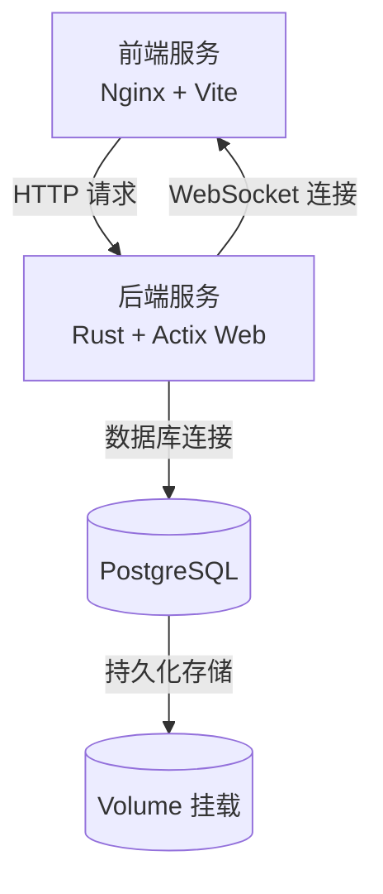
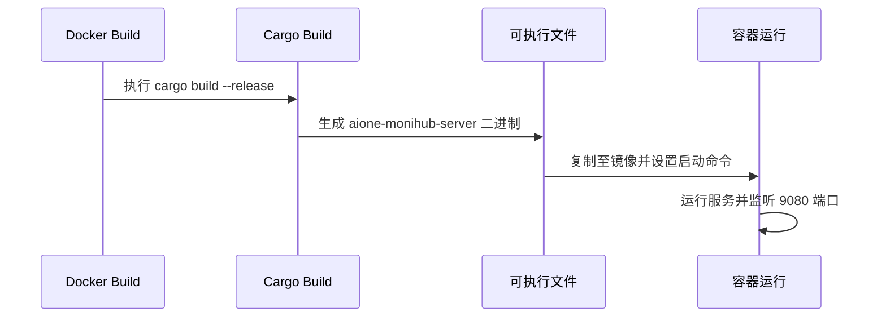

# 容器化部署

<cite>
**本文档中引用的文件**  
- [README.md](file://docker/README.md)
- [Cargo.toml](file://apps/server/Cargo.toml)
- [main.rs](file://apps/server/src/main.rs)
- [lib.rs](file://apps/server/src/lib.rs)
- [001_initial_schema.sql](file://apps/server/migrations/001_initial_schema.sql)
- [migrate.sh](file://apps/server/scripts/migrate.sh)
- [init_db.sh](file://apps/server/scripts/init_db.sh)
- [vite.config.ts](file://apps/frontend/vite.config.ts)
</cite>

## 目录
1. [简介](#简介)
2. [Docker Compose 架构概览](#docker-compose-架构概览)
3. [后端服务容器化](#后端服务容器化)
4. [前端服务容器化](#前端服务容器化)
5. [数据库服务配置](#数据库服务配置)
6. [多阶段构建优化](#多阶段构建优化)
7. [环境变量与配置管理](#环境变量与配置管理)
8. [持久化存储策略](#持久化存储策略)
9. [服务依赖与网络配置](#服务依赖与网络配置)
10. [常用操作命令](#常用操作命令)

## 简介
本文档详细说明如何使用 Docker 对 aione-monihub 项目的前端、后端和数据库进行容器化部署。基于 `docker/README.md` 中的配置，深入解析各服务的构建流程、依赖关系和运行机制，涵盖从镜像构建到服务启动的完整生命周期管理。

## Docker Compose 架构概览
aione-monihub 使用 Docker Compose 统一编排 frontend、server 和 database 三个核心服务，实现一体化部署。各服务通过自定义网络进行通信，确保隔离性与安全性。



**Diagram sources**  
- [README.md](file://docker/README.md)

## 后端服务容器化
Rust 后端服务通过 Cargo 构建系统进行编译，并打包为轻量级镜像。`Cargo.toml` 定义了项目元信息及依赖项，包括 Actix Web 框架、SeaORM ORM、Tokio 异步运行时等。

服务启动入口为 `src/main.rs`，通过 `HttpServer` 绑定 9080 端口，注册健康检查、认证、项目、用户等模块路由，并集成 Swagger UI 提供 API 文档。



**Diagram sources**  
- [Cargo.toml](file://apps/server/Cargo.toml)
- [main.rs](file://apps/server/src/main.rs)

**Section sources**  
- [Cargo.toml](file://apps/server/Cargo.toml#L1-L35)
- [main.rs](file://apps/server/src/main.rs#L128-L169)

## 前端服务容器化
前端应用基于 Vite 构建，使用 React + TypeScript 技术栈。通过 `vite.config.ts` 配置构建输出目录为 `dist`，并在生产环境中由 Nginx 容器托管静态资源。

Nginx 配置反向代理将 `/api` 路径请求转发至后端服务，实现前后端同域部署，避免跨域问题。

```mermaid
flowchart TD
A[源码 src/] --> B[vite build]
B --> C[输出 dist/]
C --> D[复制到 Nginx 镜像]
D --> E[Nginx 启动服务]
E --> F[静态资源服务]
E --> G[/api → 后端代理]
```

**Diagram sources**  
- [vite.config.ts](file://apps/frontend/vite.config.ts)

**Section sources**  
- [vite.config.ts](file://apps/frontend/vite.config.ts)

## 数据库服务配置
数据库服务基于 PostgreSQL 镜像运行，初始化脚本包括：
- `init_db.sh`：创建初始数据库和用户
- `migrate.sh`：执行 SeaORM 迁移脚本
- `001_initial_schema.sql`：定义用户、项目、应用、机器、日志等核心表结构

数据库通过卷（Volume）挂载实现数据持久化，确保容器重启后数据不丢失。

```sql
-- 示例：用户表结构
CREATE TABLE users (
    id UUID PRIMARY KEY DEFAULT uuid_generate_v4(),
    username VARCHAR(255) NOT NULL UNIQUE,
    email VARCHAR(255) NOT NULL UNIQUE,
    password_hash TEXT NOT NULL,
    status VARCHAR(50) NOT NULL DEFAULT 'active',
    ...
);
```

**Section sources**  
- [001_initial_schema.sql](file://apps/server/migrations/001_initial_schema.sql#L146-L186)
- [init_db.sh](file://apps/server/scripts/init_db.sh)
- [migrate.sh](file://apps/server/scripts/migrate.sh)

## 多阶段构建优化
为