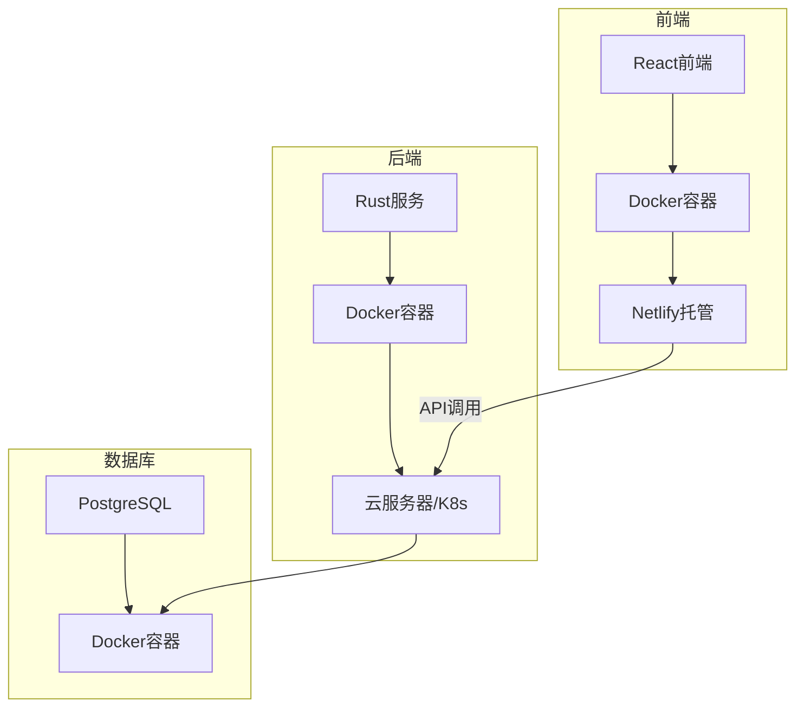
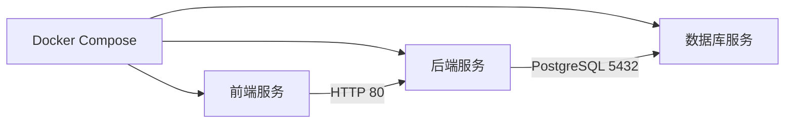
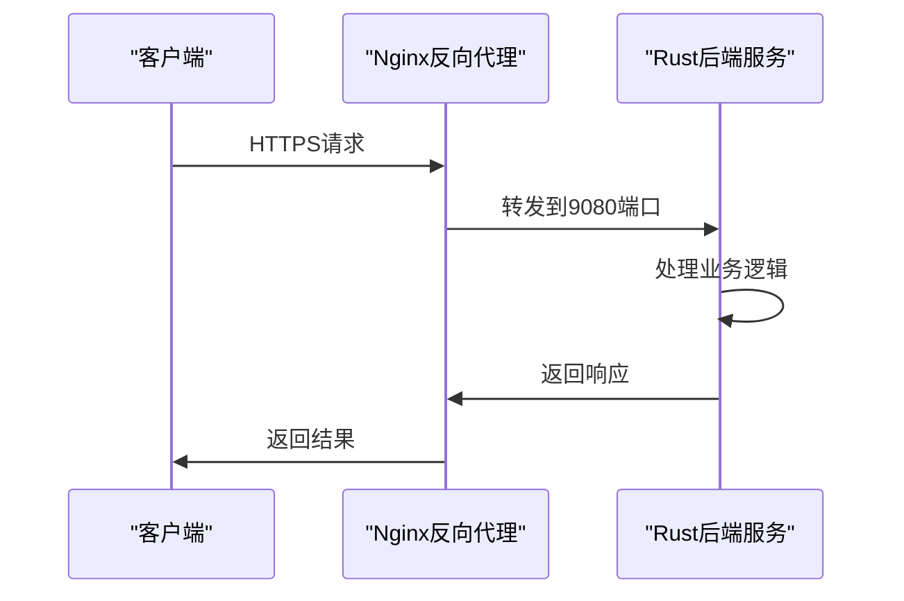
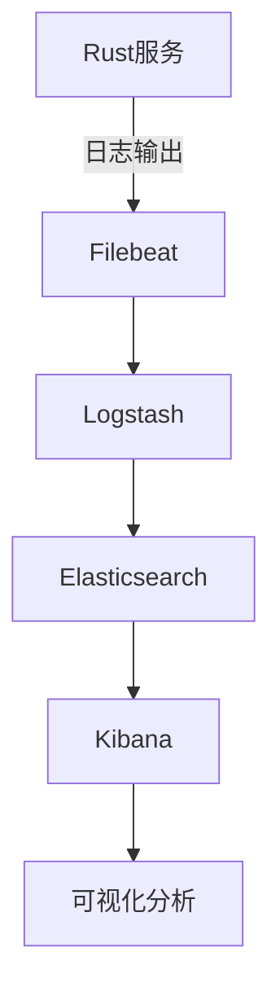
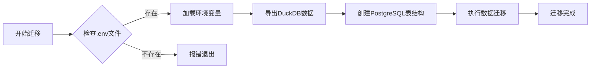
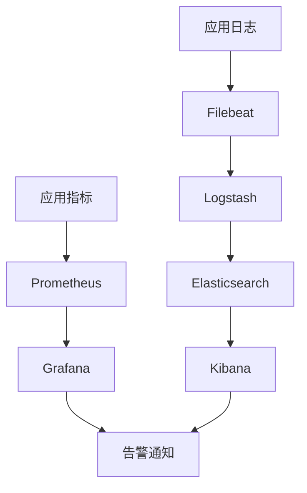

# 部署架构

<cite>
**本文档引用的文件**  
- [docker/README.md](file://docker/README.md)
- [apps/frontend/netlify.toml](file://apps/frontend/netlify.toml)
- [apps/server/scripts/migrate.sh](file://apps/server/scripts/migrate.sh)
- [apps/server/src/main.rs](file://apps/server/src/main.rs)
- [apps/server/Cargo.toml](file://apps/server/Cargo.toml)
- [apps/server/migrations/001_initial_schema.sql](file://apps/server/migrations/001_initial_schema.sql)
</cite>

## 目录
1. [部署架构概述](#部署架构概述)
2. [Docker容器化部署方案](#docker容器化部署方案)
3. [前端静态站点托管与CI/CD](#前端静态站点托管与cicd)
4. [后端Rust服务容器化](#后端rust服务容器化)
5. [生产环境配置建议](#生产环境配置建议)
6. [数据库迁移流程](#数据库迁移流程)
7. [监控与告警指标](#监控与告警指标)

## 部署架构概述

本系统采用微服务架构，前端、后端和数据库通过Docker容器化部署，支持云服务器或Kubernetes集群部署。前端通过Netlify实现静态站点托管与CI/CD集成，后端Rust服务打包为轻量级容器镜像，数据库使用PostgreSQL并通过迁移脚本管理Schema变更。



**Diagram sources**  
- [apps/frontend/netlify.toml](file://apps/frontend/netlify.toml)
- [docker/README.md](file://docker/README.md)

## Docker容器化部署方案

系统通过Docker Compose配置实现多容器编排，包含前端、后端和数据库服务。各组件通过网络隔离和环境变量进行通信，确保部署的一致性和可移植性。



**Diagram sources**  
- [docker/README.md](file://docker/README.md)

**Section sources**  
- [docker/README.md](file://docker/README.md)

## 前端静态站点托管与CI/CD

前端应用通过Netlify实现自动化部署，`netlify.toml`配置文件定义了路由重定向规则，确保单页应用（SPA）的路由正确处理。

```toml
[[redirects]]
  from = "/*"
  to = "/index.html"
  status = 200
```

该配置实现了所有路径的重定向到`index.html`，支持前端路由的客户端导航。Netlify的CI/CD流水线在代码推送到主分支时自动触发构建和部署。

**Section sources**  
- [apps/frontend/netlify.toml](file://apps/frontend/netlify.toml)

## 后端Rust服务容器化

后端Rust服务通过Cargo构建为静态二进制文件，打包进轻量级Alpine Linux容器镜像。服务监听9080端口，通过Actix Web框架提供REST API和WebSocket服务。



**Diagram sources**  
- [apps/server/src/main.rs](file://apps/server/src/main.rs#L128-L169)

**Section sources**  
- [apps/server/src/main.rs](file://apps/server/src/main.rs)
- [apps/server/Cargo.toml](file://apps/server/Cargo.toml)

## 生产环境配置建议

### 反向代理与SSL
建议使用Nginx作为反向代理，配置SSL证书（可通过Let's Encrypt免费获取），实现HTTPS加密通信。

### 负载均衡
在高可用场景下，可通过Nginx或云服务商的负载均衡器实现多实例流量分发。

### 日志收集
建议集成ELK（Elasticsearch, Logstash, Kibana）栈进行日志收集和分析，后端服务已集成日志中间件。



**Diagram sources**  
- [apps/server/src/main.rs](file://apps/server/src/main.rs#L128-L169)

## 数据库迁移流程

数据库迁移通过`migrate.sh`脚本自动化执行，包含三个主要步骤：

1. 导出DuckDB数据
2. 创建PostgreSQL表结构
3. 迁移数据到PostgreSQL

脚本首先检查`.env`文件中的数据库连接配置，然后执行SQL迁移文件`001_initial_schema.sql`创建表结构，最后运行Rust迁移工具完成数据迁移。



**Diagram sources**  
- [apps/server/scripts/migrate.sh](file://apps/server/scripts/migrate.sh)
- [apps/server/migrations/001_initial_schema.sql](file://apps/server/migrations/001_initial_schema.sql)

**Section sources**  
- [apps/server/scripts/migrate.sh](file://apps/server/scripts/migrate.sh)

## 监控与告警指标

### 关键监控指标
- **API延迟**：通过Prometheus采集HTTP请求延迟
- **错误率**：监控5xx和4xx响应状态码比例
- **资源使用率**：CPU、内存、磁盘I/O使用情况

### 采集方式
后端服务暴露`/health`端点用于健康检查，结合Prometheus和Grafana实现指标采集和可视化。日志通过结构化输出，便于ELK栈分析。



**Diagram sources**  
- [apps/server/src/main.rs](file://apps/server/src/main.rs#L128-L169)

**Section sources**  
- [apps/server/src/main.rs](file://apps/server/src/main.rs)