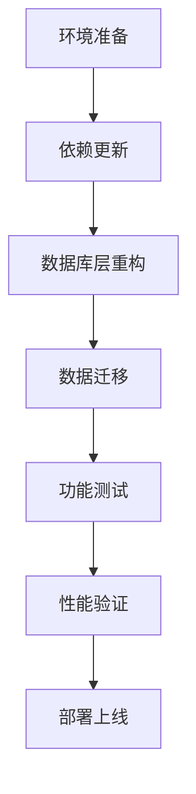

# AiOne MoniHub 数据库迁移方案：从 SQLite 到 DuckDB

## 1. 产品概述

本文档详细说明将 AiOne MoniHub 监控平台 API 服务器的数据库从 SQLite (rusqlite) 迁移到 DuckDB 的完整方案。AiOne MoniHub 是一个基于 Rust Actix-web 框架开发的监控平台，提供用户管理、项目管理、应用部署监控等核心功能。

迁移的主要目标是提升数据库性能和分析能力，同时保持现有 API 接口和数据结构的完全兼容性。DuckDB 作为一个高性能的分析型数据库，将为平台提供更强的数据处理能力和更好的查询性能。

## 2. 核心特性

### 2.1 迁移范围

本次迁移涉及以下数据模块的完整迁移：

1. **用户管理模块**：用户信息、认证数据
2. **项目管理模块**：项目基础信息、状态管理
3. **应用管理模块**：应用配置、授权信息
4. **部署管理模块**：部署环境、网络配置
5. **权限管理模块**：角色定义、权限分配
6. **日志管理模块**：操作日志、审计记录
7. **机器管理模块**：服务器信息、状态监控
8. **配置管理模块**：环境配置、版本管理

### 2.2 技术特性

| 特性类别 | SQLite (当前) | DuckDB (目标) |
|----------|---------------|---------------|
| 数据库类型 | 嵌入式关系数据库 | 嵌入式分析数据库 |
| 查询性能 | 适中 | 高性能分析查询 |
| 并发支持 | 有限 | 更好的并发处理 |
| 数据类型 | 基础 SQL 类型 | 丰富的分析类型 |
| 内存使用 | 较低 | 优化的内存管理 |
| 部署复杂度 | 简单 | 简单（嵌入式） |

### 2.3 迁移详情

| 组件 | 迁移内容 | 技术要求 |
|------|----------|----------|
| 依赖管理 | 替换 rusqlite 为 duckdb crate | 更新 Cargo.toml 依赖配置 |
| 数据库连接 | 重构连接池和初始化逻辑 | 适配 DuckDB 连接 API |
| 表结构迁移 | 保持现有表结构设计 | DDL 语句兼容性处理 |
| 数据操作层 | 重写 CRUD 操作方法 | 适配 DuckDB SQL 语法 |
| 错误处理 | 更新错误类型映射 | 统一错误处理机制 |
| 测试验证 | 完整的功能测试覆盖 | 确保 API 行为一致性 |

## 3. 核心流程

### 3.1 迁移实施流程

### 3.2 详细实施步骤

**阶段一：环境准备**
- 备份现有 SQLite 数据库
- 准备 DuckDB 测试环境
- 制定回滚方案

**阶段二：代码重构**
- 更新项目依赖配置
- 重构数据库连接层
- 适配 SQL 语句语法

**阶段三：数据迁移**
- 导出 SQLite 数据
- 转换数据格式
- 导入 DuckDB 数据库

**阶段四：测试验证**
- 单元测试验证
- 集成测试检查
- 性能基准测试

## 4. 用户界面设计

### 4.1 设计原则

由于本次迁移主要涉及后端数据库层面的变更，用户界面保持完全不变。所有现有的 API 接口、响应格式和数据结构都将保持兼容性。

- **API 兼容性**：所有现有 REST API 端点保持不变
- **数据格式**：JSON 响应格式完全一致
- **错误处理**：错误码和错误信息格式保持统一
- **性能提升**：用户将体验到更快的查询响应时间

### 4.2 监控界面增强

| 功能模块 | 当前状态 | 迁移后改进 |
|----------|----------|------------|
| 数据查询 | 基础查询性能 | 显著提升的查询速度 |
| 报表生成 | 有限的分析能力 | 增强的数据分析功能 |
| 实时监控 | 标准监控能力 | 更高效的实时数据处理 |
| 历史数据 | 基础历史查询 | 优化的时间序列分析 |

### 4.3 管理界面优化

迁移完成后，管理员将在以下方面获得改进的体验：
- 更快的用户列表加载速度
- 更高效的项目数据统计
- 更流畅的配置管理操作
- 更及时的系统状态反馈