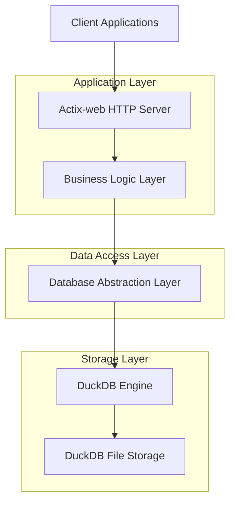
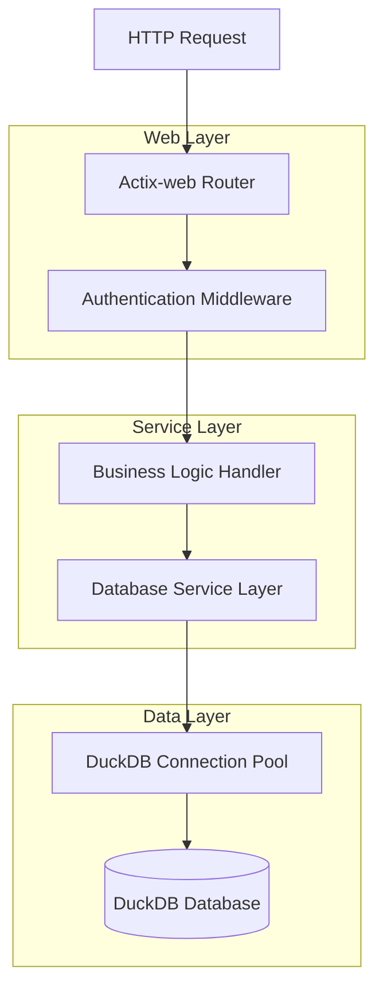
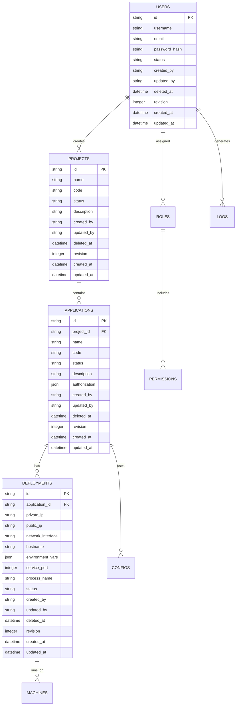

# DuckDB 迁移技术架构文档

## 1. 架构设计



## 2. 技术描述

- Frontend: 保持现有客户端不变
- Backend: Rust + Actix-web@4.0 + DuckDB
- Database: DuckDB (嵌入式分析数据库)
- 连接层: duckdb crate (Rust DuckDB 绑定)

## 3. 路由定义

所有现有路由保持不变，确保 API 兼容性：

| Route | Purpose |
|-------|----------|
| /health | 健康检查端点 |
| /api/auth/* | 用户认证相关接口 |
| /api/users/* | 用户管理接口 |
| /api/projects/* | 项目管理接口 |
| /api/applications/* | 应用管理接口 |
| /api/deployments/* | 部署管理接口 |
| /api/roles/* | 角色管理接口 |
| /api/permissions/* | 权限管理接口 |
| /api/machines/* | 机器管理接口 |
| /api/configs/* | 配置管理接口 |
| /api/logs/* | 日志管理接口 |
| /ws/* | WebSocket 连接接口 |

## 4. API 定义

### 4.1 核心 API

数据库连接管理
```rust
// 新的 DuckDB 连接初始化
pub async fn init_duckdb() -> Result<Connection, DuckDBError>
```

用户管理相关
```
POST /api/users
```

Request:
| Param Name | Param Type | isRequired | Description |
|------------|------------|------------|-------------|
| username | string | true | 用户名 |
| email | string | true | 邮箱地址 |
| password | string | true | 密码 |

Response:
| Param Name | Param Type | Description |
|------------|------------|-------------|
| id | string | 用户 ID |
| username | string | 用户名 |
| status | string | 用户状态 |

Example:
```json
{
  "username": "admin",
  "email": "admin@example.com",
  "password": "secure_password"
}
```

## 5. 服务器架构图



## 6. 数据模型

### 6.1 数据模型定义



### 6.2 数据定义语言

用户表 (users)
```sql
-- 创建用户表
CREATE TABLE users (
    id VARCHAR PRIMARY KEY,
    username VARCHAR NOT NULL,
    email VARCHAR NOT NULL,
    password_hash VARCHAR NOT NULL,
    status VARCHAR NOT NULL,
    created_by VARCHAR NOT NULL,
    updated_by VARCHAR NOT NULL,
    deleted_at TIMESTAMP,
    revision INTEGER NOT NULL,
    created_at TIMESTAMP NOT NULL,
    updated_at TIMESTAMP NOT NULL
);

-- 创建索引
CREATE INDEX idx_users_email ON users(email);
CREATE INDEX idx_users_username ON users(username);
CREATE INDEX idx_users_status ON users(status);
```

项目表 (projects)
```sql
-- 创建项目表
CREATE TABLE projects (
    id VARCHAR PRIMARY KEY,
    name VARCHAR NOT NULL,
    code VARCHAR NOT NULL,
    status VARCHAR NOT NULL,
    description VARCHAR NOT NULL,
    created_by VARCHAR NOT NULL,
    updated_by VARCHAR NOT NULL,
    deleted_at TIMESTAMP,
    revision INTEGER NOT NULL,
    created_at TIMESTAMP NOT NULL,
    updated_at TIMESTAMP NOT NULL
);

-- 创建索引
CREATE INDEX idx_projects_code ON projects(code);
CREATE INDEX idx_projects_status ON projects(status);
CREATE INDEX idx_projects_created_by ON projects(created_by);
```

应用表 (applications)
```sql
-- 创建应用表
CREATE TABLE applications (
    id VARCHAR PRIMARY KEY,
    project_id VARCHAR NOT NULL,
    name VARCHAR NOT NULL,
    code VARCHAR NOT NULL,
    status VARCHAR NOT NULL,
    description VARCHAR NOT NULL,
    authorization JSON NOT NULL,
    created_by VARCHAR NOT NULL,
    updated_by VARCHAR NOT NULL,
    deleted_at TIMESTAMP,
    revision INTEGER NOT NULL,
    created_at TIMESTAMP NOT NULL,
    updated_at TIMESTAMP NOT NULL
);

-- 创建索引
CREATE INDEX idx_applications_project_id ON applications(project_id);
CREATE INDEX idx_applications_code ON applications(code);
CREATE INDEX idx_applications_status ON applications(status);
```

部署表 (deployments)
```sql
-- 创建部署表
CREATE TABLE deployments (
    id VARCHAR PRIMARY KEY,
    application_id VARCHAR NOT NULL,
    private_ip VARCHAR NOT NULL,
    public_ip VARCHAR NOT NULL,
    network_interface VARCHAR NOT NULL,
    hostname VARCHAR NOT NULL,
    environment_vars JSON NOT NULL,
    service_port INTEGER NOT NULL,
    process_name VARCHAR NOT NULL,
    status VARCHAR NOT NULL,
    created_by VARCHAR NOT NULL,
    updated_by VARCHAR NOT NULL,
    deleted_at TIMESTAMP,
    revision INTEGER NOT NULL,
    created_at TIMESTAMP NOT NULL,
    updated_at TIMESTAMP NOT NULL
);

-- 创建索引
CREATE INDEX idx_deployments_application_id ON deployments(application_id);
CREATE INDEX idx_deployments_status ON deployments(status);
CREATE INDEX idx_deployments_hostname ON deployments(hostname);
```

角色表 (roles)
```sql
-- 创建角色表
CREATE TABLE roles (
    id VARCHAR PRIMARY KEY,
    name VARCHAR NOT NULL,
    description VARCHAR NOT NULL,
    permissions JSON NOT NULL,
    created_by VARCHAR NOT NULL,
    updated_by VARCHAR NOT NULL,
    deleted_at TIMESTAMP,
    revision INTEGER NOT NULL,
    created_at TIMESTAMP NOT NULL,
    updated_at TIMESTAMP NOT NULL
);

-- 创建索引
CREATE INDEX idx_roles_name ON roles(name);
```

权限表 (permissions)
```sql
-- 创建权限表
CREATE TABLE permissions (
    id VARCHAR PRIMARY KEY,
    name VARCHAR NOT NULL,
    description VARCHAR NOT NULL,
    resource VARCHAR NOT NULL,
    action VARCHAR NOT NULL,
    created_by VARCHAR NOT NULL,
    updated_by VARCHAR NOT NULL,
    deleted_at TIMESTAMP,
    revision INTEGER NOT NULL,
    created_at TIMESTAMP NOT NULL,
    updated_at TIMESTAMP NOT NULL
);

-- 创建索引
CREATE INDEX idx_permissions_resource ON permissions(resource);
CREATE INDEX idx_permissions_action ON permissions(action);
```

日志表 (logs)
```sql
-- 创建日志表
CREATE TABLE logs (
    id VARCHAR PRIMARY KEY,
    type VARCHAR NOT NULL,
    user_id VARCHAR NOT NULL,
    action VARCHAR NOT NULL,
    ip_address VARCHAR NOT NULL,
    user_agent VARCHAR NOT NULL,
    created_by VARCHAR NOT NULL,
    updated_by VARCHAR NOT NULL,
    deleted_at TIMESTAMP,
    revision INTEGER NOT NULL,
    timestamp TIMESTAMP NOT NULL,
    created_at TIMESTAMP NOT NULL,
    updated_at TIMESTAMP NOT NULL
);

-- 创建索引
CREATE INDEX idx_logs_user_id ON logs(user_id);
CREATE INDEX idx_logs_timestamp ON logs(timestamp DESC);
CREATE INDEX idx_logs_type ON logs(type);
```

机器表 (machines)
```sql
-- 创建机器表
CREATE TABLE machines (
    id VARCHAR PRIMARY KEY,
    name VARCHAR NOT NULL,
    type VARCHAR NOT NULL,
    status VARCHAR NOT NULL,
    deployment_id VARCHAR NOT NULL,
    application_id VARCHAR NOT NULL,
    created_by VARCHAR NOT NULL,
    updated_by VARCHAR NOT NULL,
    deleted_at TIMESTAMP,
    revision INTEGER NOT NULL,
    created_at TIMESTAMP NOT NULL,
    updated_at TIMESTAMP NOT NULL
);

-- 创建索引
CREATE INDEX idx_machines_deployment_id ON machines(deployment_id);
CREATE INDEX idx_machines_application_id ON machines(application_id);
CREATE INDEX idx_machines_status ON machines(status);
```

配置表 (configs)
```sql
-- 创建配置表
CREATE TABLE configs (
    id VARCHAR PRIMARY KEY,
    code VARCHAR NOT NULL,
    environment VARCHAR NOT NULL,
    name VARCHAR NOT NULL,
    type VARCHAR NOT NULL,
    content VARCHAR NOT NULL,
    description VARCHAR NOT NULL,
    version INTEGER NOT NULL,
    created_by VARCHAR NOT NULL,
    updated_by VARCHAR NOT NULL,
    deleted_at TIMESTAMP,
    revision INTEGER NOT NULL,
    created_at TIMESTAMP NOT NULL,
    updated_at TIMESTAMP NOT NULL
);

-- 创建索引
CREATE INDEX idx_configs_code ON configs(code);
CREATE INDEX idx_configs_environment ON configs(environment);
CREATE INDEX idx_configs_version ON configs(version DESC);
CREATE UNIQUE INDEX idx_configs_code_env_version ON configs(code, environment, version);
```