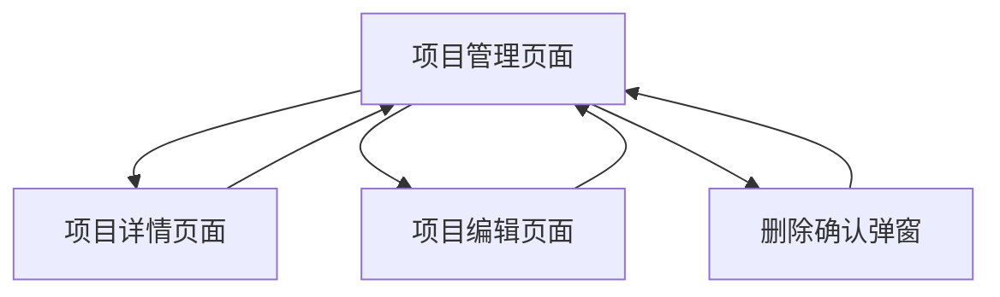

# 项目管理页面产品需求文档

## 1. 产品概述

项目管理页面是一个用于管理系统中所有项目的核心功能模块，提供项目的增删改查、搜索筛选等完整的项目生命周期管理功能。

该页面主要解决项目信息集中管理、快速检索和权限控制的需求，面向系统管理员和项目负责人使用，帮助提升项目管理效率和数据安全性。

## 2. 核心功能

### 2.1 用户角色

| 角色 | 注册方式 | 核心权限 |
|------|----------|----------|
| 系统管理员 | 系统分配 | 可查看、创建、编辑、删除所有项目 |
| 项目管理员 | 权限分配 | 可查看、创建、编辑自己管理的项目 |
| 普通用户 | 权限分配 | 仅可查看有权限的项目信息 |

### 2.2 功能模块

项目管理需求包含以下主要页面：
1. **项目管理页面**：项目列表展示、搜索筛选、分页导航
2. **项目详情页面**：项目详细信息查看
3. **项目编辑页面**：项目信息新增和编辑功能

### 2.3 页面详情

| 页面名称 | 模块名称 | 功能描述 |
|----------|----------|----------|
| 项目管理页面 | 搜索筛选区 | 支持按项目名称和状态进行筛选搜索 |
| 项目管理页面 | 项目列表表格 | 显示项目ID、名称、描述、状态、创建时间、更新时间，支持分页 |
| 项目管理页面 | 操作按钮区 | 新增项目按钮，表格行内编辑和删除按钮 |
| 项目编辑页面 | 项目信息表单 | 项目名称、描述、仓库URL、状态等字段的编辑 |
| 项目编辑页面 | 操作确认 | 保存、取消操作，删除操作需要二次确认弹窗 |

## 3. 核心流程

**系统管理员流程：**
用户登录 → 进入项目管理页面 → 查看项目列表 → 可选择新增/编辑/删除项目 → 操作确认 → 返回列表页面

**项目管理员流程：**
用户登录 → 权限验证 → 进入项目管理页面 → 查看有权限的项目 → 可编辑管理的项目 → 操作确认

**普通用户流程：**
用户登录 → 权限验证 → 进入项目管理页面 → 仅查看有权限的项目信息

## 4. 用户界面设计

### 4.1 设计风格

- 主色调：蓝色系 (#3B82F6)，辅助色：灰色系 (#6B7280)
- 按钮样式：圆角按钮，主要操作使用实心按钮，次要操作使用边框按钮
- 字体：系统默认字体，标题使用 16px-20px，正文使用 14px
- 布局风格：卡片式布局，顶部导航，左侧可选菜单
- 图标风格：使用 Lucide 图标库，简洁线性风格

### 4.2 页面设计概览

| 页面名称 | 模块名称 | UI元素 |
|----------|----------|--------|
| 项目管理页面 | 页面头部 | 标题"项目管理"，描述文字，新增项目按钮（蓝色实心） |
| 项目管理页面 | 搜索筛选区 | 项目名称搜索框，状态下拉选择器，搜索按钮 |
| 项目管理页面 | 项目表格 | 表头固定，行悬停效果，操作列包含编辑和删除图标按钮 |
| 项目编辑页面 | 表单区域 | 右侧滑出抽屉式表单，包含必填字段标识，表单验证提示 |
| 删除确认弹窗 | 确认对话框 | 警告图标，确认文字，取消（灰色边框）和确认删除（红色实心）按钮 |

### 4.3 响应式设计

桌面优先设计，支持移动端自适应。在移动端，表格采用卡片式布局，操作按钮适配触摸交互，确保良好的用户体验。