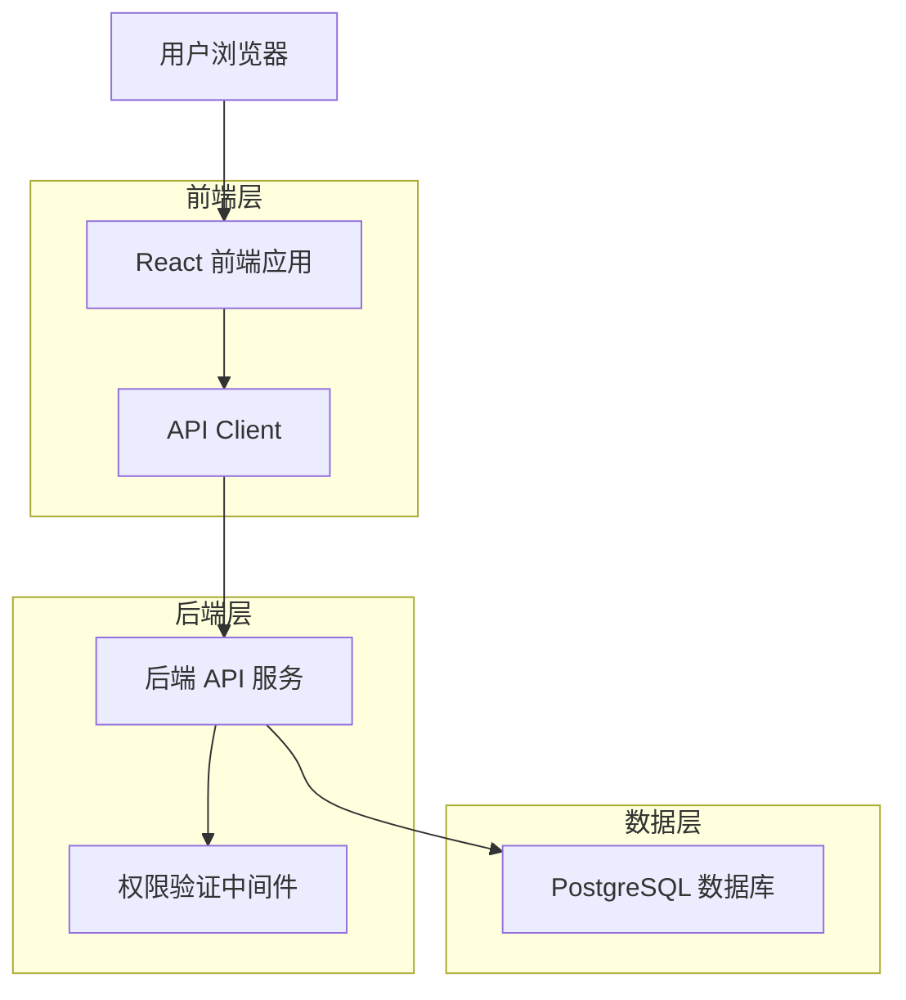
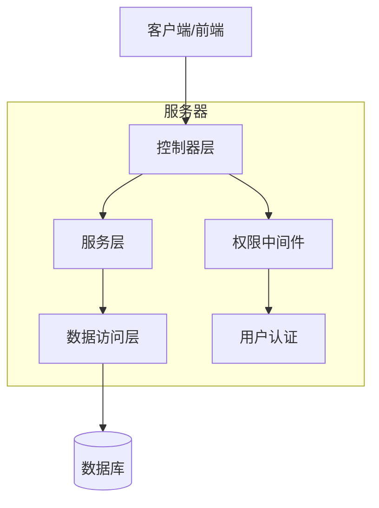
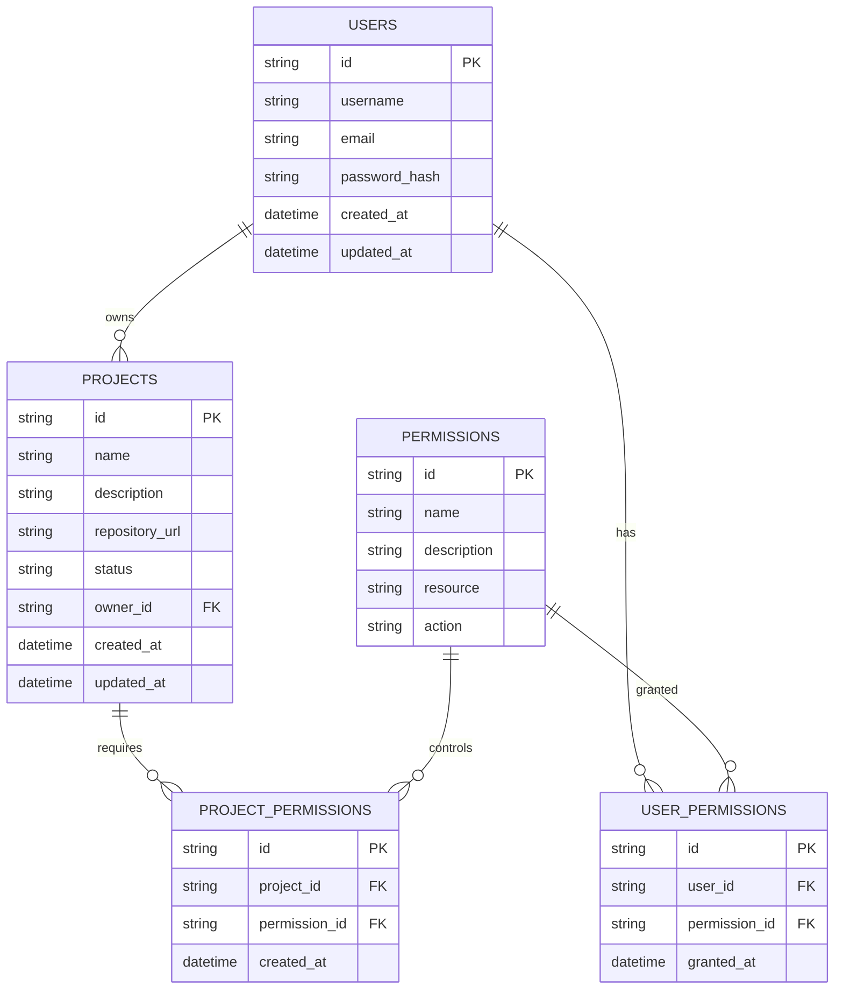

# 项目管理技术架构文档

## 1. 架构设计



## 2. 技术描述

- 前端：React@18 + TypeScript + TanStack Router + TanStack Query + Tailwind CSS + Vite
- 后端：Rust + Actix-web + SeaORM
- 数据库：PostgreSQL
- 权限控制：基于角色的访问控制 (RBAC)

## 3. 路由定义

| 路由 | 用途 |
|------|------|
| /projects | 项目管理主页面，显示项目列表和搜索功能 |
| /projects/new | 新增项目页面（可选，也可使用弹窗） |
| /projects/:id | 项目详情页面 |
| /projects/:id/edit | 编辑项目页面（可选，也可使用弹窗） |

## 4. API 定义

### 4.1 核心 API

**获取项目列表**
```
GET /api/projects
```

请求参数：
| 参数名称 | 参数类型 | 是否必需 | 描述 |
|----------|----------|----------|------|
| page | number | false | 页码，默认为1 |
| limit | number | false | 每页数量，默认为10 |
| search | string | false | 按项目名称搜索 |
| status | string | false | 按状态筛选 |

响应：
| 参数名称 | 参数类型 | 描述 |
|----------|----------|------|
| data | ProjectResponse[] | 项目列表 |
| pagination | Pagination | 分页信息 |
| timestamp | number | 响应时间戳 |
| trace_id | string | 追踪ID |

示例：
```json
{
  "data": [
    {
      "id": "1234567890",
      "name": "示例项目",
      "description": "这是一个示例项目",
      "status": "active",
      "created_at": "2024-01-01T00:00:00Z",
      "updated_at": "2024-01-01T00:00:00Z"
    }
  ],
  "pagination": {
    "page": 1,
    "limit": 10,
    "total": 1
  }
}
```

**创建项目**
```
POST /api/projects
```

请求：
| 参数名称 | 参数类型 | 是否必需 | 描述 |
|----------|----------|----------|------|
| name | string | true | 项目名称 |
| description | string | true | 项目描述 |
| repository_url | string | false | 仓库地址 |
| status | string | false | 项目状态，默认为active |

**更新项目**
```
PUT /api/projects/{id}
```

**删除项目**
```
DELETE /api/projects/{id}
```

**获取项目详情**
```
GET /api/projects/{id}
```

## 5. 服务器架构图



## 6. 数据模型

### 6.1 数据模型定义



### 6.2 数据定义语言

**项目表 (projects)**
```sql
-- 创建项目表
CREATE TABLE projects (
    id VARCHAR(255) PRIMARY KEY,
    name VARCHAR(255) NOT NULL,
    description TEXT,
    repository_url VARCHAR(500),
    status VARCHAR(50) DEFAULT 'active' CHECK (status IN ('active', 'inactive', 'archived')),
    owner_id VARCHAR(255) NOT NULL,
    created_at TIMESTAMP WITH TIME ZONE DEFAULT NOW(),
    updated_at TIMESTAMP WITH TIME ZONE DEFAULT NOW()
);

-- 创建索引
CREATE INDEX idx_projects_owner_id ON projects(owner_id);
CREATE INDEX idx_projects_status ON projects(status);
CREATE INDEX idx_projects_name ON projects(name);
CREATE INDEX idx_projects_created_at ON projects(created_at DESC);
```

**权限表 (permissions)**
```sql
-- 创建权限表
CREATE TABLE permissions (
    id VARCHAR(255) PRIMARY KEY,
    name VARCHAR(255) NOT NULL UNIQUE,
    description TEXT,
    resource VARCHAR(100) NOT NULL,
    action VARCHAR(100) NOT NULL,
    created_at TIMESTAMP WITH TIME ZONE DEFAULT NOW()
);

-- 创建用户权限关联表
CREATE TABLE user_permissions (
    id VARCHAR(255) PRIMARY KEY,
    user_id VARCHAR(255) NOT NULL,
    permission_id VARCHAR(255) NOT NULL,
    granted_at TIMESTAMP WITH TIME ZONE DEFAULT NOW(),
    FOREIGN KEY (user_id) REFERENCES users(id) ON DELETE CASCADE,
    FOREIGN KEY (permission_id) REFERENCES permissions(id) ON DELETE CASCADE,
    UNIQUE(user_id, permission_id)
);

-- 创建项目权限关联表
CREATE TABLE project_permissions (
    id VARCHAR(255) PRIMARY KEY,
    project_id VARCHAR(255) NOT NULL,
    permission_id VARCHAR(255) NOT NULL,
    created_at TIMESTAMP WITH TIME ZONE DEFAULT NOW(),
    FOREIGN KEY (project_id) REFERENCES projects(id) ON DELETE CASCADE,
    FOREIGN KEY (permission_id) REFERENCES permissions(id) ON DELETE CASCADE,
    UNIQUE(project_id, permission_id)
);

-- 初始化权限数据
INSERT INTO permissions (id, name, description, resource, action) VALUES
('perm_project_view', 'projects.view', '查看项目', 'projects', 'view'),
('perm_project_create', 'projects.create', '创建项目', 'projects', 'create'),
('perm_project_update', 'projects.update', '更新项目', 'projects', 'update'),
('perm_project_delete', 'projects.delete', '删除项目', 'projects', 'delete'),
('perm_project_manage', 'projects.manage', '管理所有项目', 'projects', 'manage');

-- 为系统管理员分配所有项目权限（假设管理员用户ID为 'admin_user_id'）
-- 注意：实际使用时需要替换为真实的管理员用户ID
/*
INSERT INTO user_permissions (id, user_id, permission_id) VALUES
('up_admin_view', 'admin_user_id', 'perm_project_view'),
('up_admin_create', 'admin_user_id', 'perm_project_create'),
('up_admin_update', 'admin_user_id', 'perm_project_update'),
('up_admin_delete', 'admin_user_id', 'perm_project_delete'),
('up_admin_manage', 'admin_user_id', 'perm_project_manage');
*/
```

**权限检查函数**
```sql
-- 创建权限检查函数
CREATE OR REPLACE FUNCTION check_user_project_permission(
    p_user_id VARCHAR(255),
    p_project_id VARCHAR(255),
    p_action VARCHAR(100)
) RETURNS BOOLEAN AS $$
DECLARE
    has_permission BOOLEAN := FALSE;
BEGIN
    -- 检查用户是否有管理所有项目的权限
    SELECT EXISTS(
        SELECT 1 FROM user_permissions up
        JOIN permissions p ON up.permission_id = p.id
        WHERE up.user_id = p_user_id 
        AND p.resource = 'projects' 
        AND p.action = 'manage'
    ) INTO has_permission;
    
    IF has_permission THEN
        RETURN TRUE;
    END IF;
    
    -- 检查用户是否是项目所有者
    SELECT EXISTS(
        SELECT 1 FROM projects
        WHERE id = p_project_id AND owner_id = p_user_id
    ) INTO has_permission;
    
    IF has_permission THEN
        RETURN TRUE;
    END IF;
    
    -- 检查用户是否有特定操作权限
    SELECT EXISTS(
        SELECT 1 FROM user_permissions up
        JOIN permissions p ON up.permission_id = p.id
        WHERE up.user_id = p_user_id 
        AND p.resource = 'projects' 
        AND p.action = p_action
    ) INTO has_permission;
    
    RETURN has_permission;
END;
$$ LANGUAGE plpgsql;
```